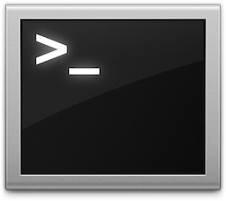

# Setup Introduction

Just like any engineer. We need tools to build what we want. Here's where we'll start with this bootcamp.

---

## Sublime Text

A text editor. Your new companion, day & night.

---

## Terminal (Bash)

Don't fear the command line.

---

## Git & GitHub

Version Control. Collaboration.

---

## Your Turn

Go to [Setup](https://github.com/lewagon/china-product/blob/master/00-kickoff/exercises/setup.md)
