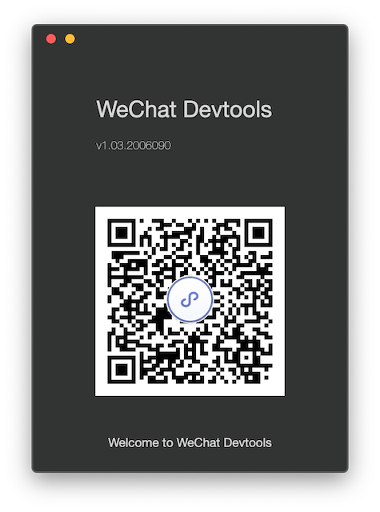
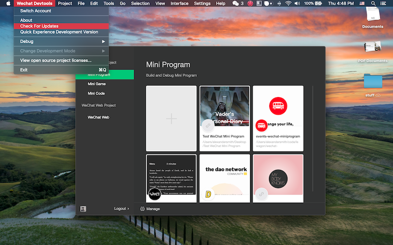

# Setup Instructions

Let's set up your workstation!

## Schedule for Today

1. **10:00 AM - 10:15 AM**: Go through a 15 min first lecture with your teacher about the tools you need to install as a developer

2. **10:30 AM - 12:00 PM**: Follow our setup guide and ask for help whenever you are stuck. It should take you all morning, and might overlap a bit into your lunch break for non-Mac users 😉

3. **1:00 PM - 1:15 PM**: Second 15 min lecture on command line basics (navigating through the filesystem, creating directories & files, launching Sublime Text from terminal, etc.)

4. **1:15 PM - 2:00 PM**: Third 45 min lecture on git commands (`git add`/`git commit`/`git push`).

5. **2:00 PM - 2:15 PM**: At the end of the git lecture, your teacher will show you the learning platform (lectures, exercises, challenges)

6. **2:15 PM - 4:00 PM**: Time to push your attempt to the first exercises of the bootcamp. This exercise is just a safety check to ensure you have correctly forked the exercise repo.

7. **4:00 PM - Finish**: Project Introductions

---

Today, we'll make sure that we have setup the following tools:

- **Sublime Text**, the text editor you will use write Ruby code (and more!)

- The **Terminal**, also called a shell, where you'll type commands.

- **git**, the version control tool you'll use to watch your code, snapshot, and thus submit your attempts to Kitt!

Glad you are here! Let's rock it 🚀🚀🚀!

---

## 1. Log onto [github.com](http://github.com)

- Give the teacher your **github name** so you can be added to [repository for exercises](https://www.github.com/lewagon/china-product).

- Your name is the part after `/` e.g. `dounan1` for `www.github.com/dounan1`

- When you have been granted access, you can move on to the next step!

## 2. Setup

Please choose your operating system (OS) and follow the associated instructions. This should take you the majority of your morning.

<table>
  <tr>
    <td>
      
    </td>
    <td>
      
    </td>
  </tr>
</table>

---

## 3. WeChat Mini Program Account

- If you have time, get your [WeChat Mini Program Developer Account](https://mp.weixin.qq.com/cgi-bin/wx?token=&lang=zh_CN) and App Id. It's your license to make apps on the WeChat platform. You can also work on getting this during the coming weeks, until WeChat Mini Program week.

- Download the [WeChat Developers Tools](https://developers.weixin.qq.com/miniprogram/dev/devtools/download.html). This should take you about 10 minutes to download, once you open up the application, scan this QR code with your WeChat.

- Once you're in, check to make sure your Dev Tools are up-to-date. If not, download the updated version as below.

---

## 4. Go to lunch and prepare for the afternoon
