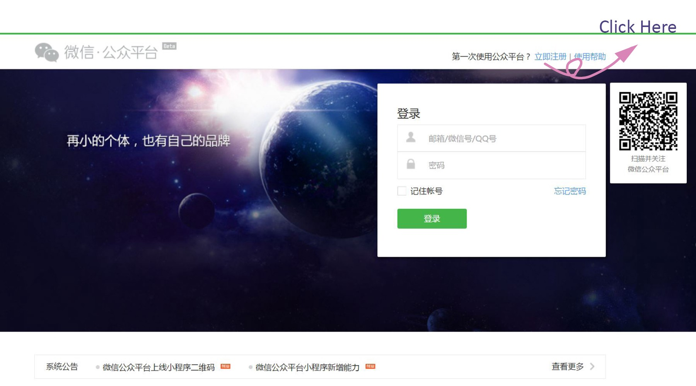

# WeChat Dev Tools Setup

To setup your WeChat Developer account that you'll use for developing WeChat Mini Programs for the camp, follow this [guide](https://medium.com/@yelin.qiu/a-complete-manual-on-wechat-mini-program-development-8fd28a85ee0d) on these steps:

1. Registration

2. Preparation before development

Starting with: Go to [mp.weixin.qq.com](http://mp.weixin.qq.com/) and click “[立即注册](https://mp.weixin.qq.com/cgi-bin/registermidpage?action=index&lang=zh_CN)” (Register Now) on the upper right corner.

Keep in mind you have to register a new account for each app that you want released to the WeChat app store (e.g. your project app). For developing camp apps, we can reuse the same account.
