# Terminal & Git

Setup Day Lecture

---

## Terminal

First, let's journey into our machine's terminal. The most direct interface we have with our computer.

---

### Terminal - What it's called

- Command Prompt

- Console

- Terminal

---

### Terminal - Basic Commands

---

### Terminal - Current Location

1. Look for the directory name before the prompt, after `➜`

2. Or print the path of the current directory

```zsh
pwd
```

---

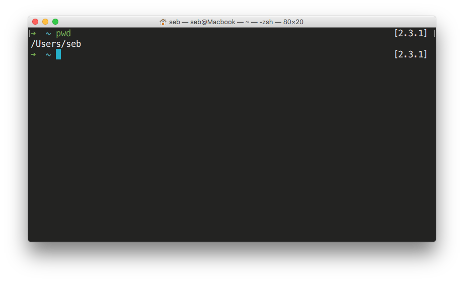

That's your `$HOME` directory.

---

### Terminal - Where Can I Go?

`ls` (or `ll`, an alias of `ls -lh`)

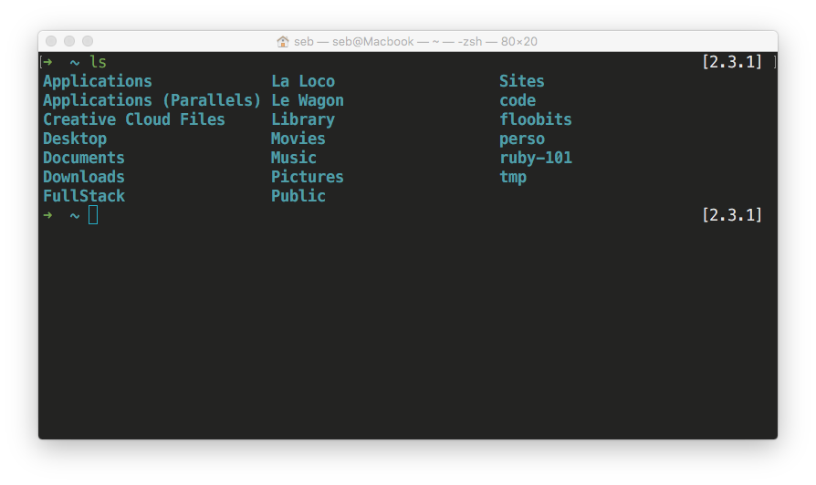

---

### Terminal - Let's Go There

cd <FOLDER_NAME>

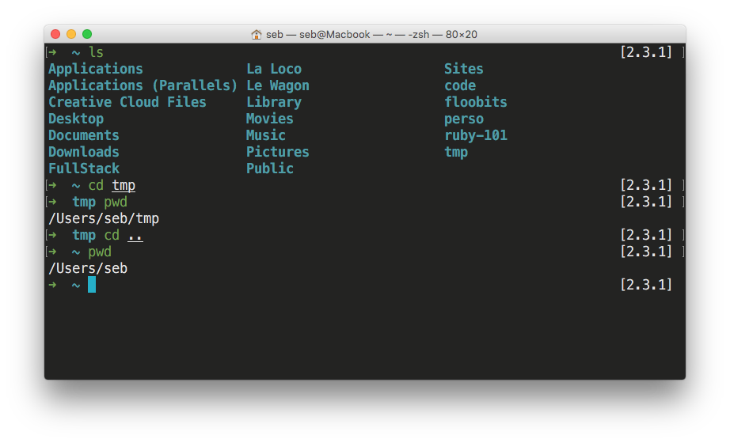

---

### Terminal - Ascending a Directory

```zsh
cd ..
```

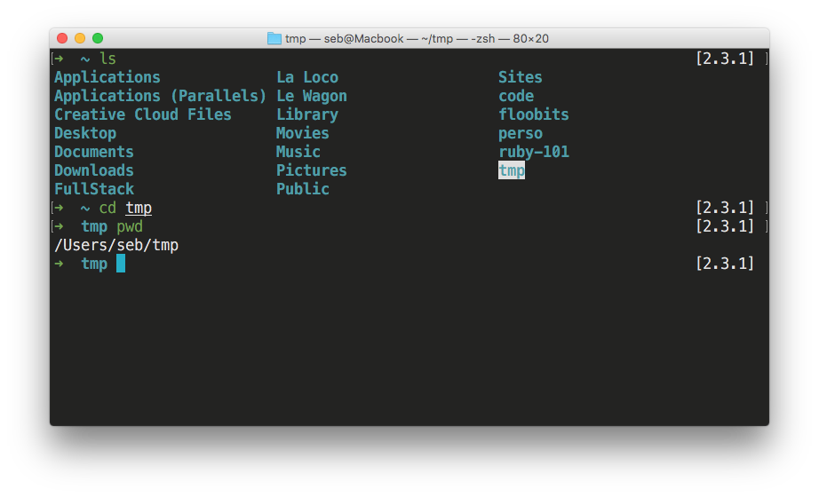

---

### Terminal - Creating a New Directory

```zsh
mkdir <NEW_FOLDER>
```

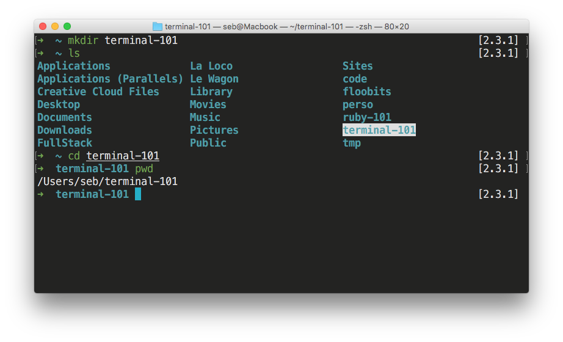

---

### Terminal - Creating a New File

```zsh
touch <FILE_NAME>
```

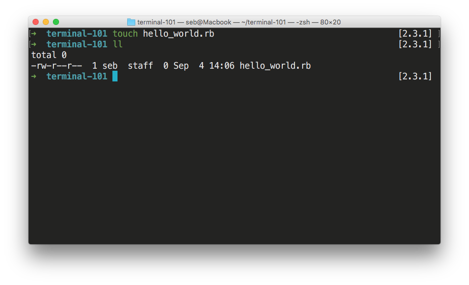

---

### Terminal - Move Files & Directories

```zsh
mv <FILE_NAME> <FOLDER_NAME>
```

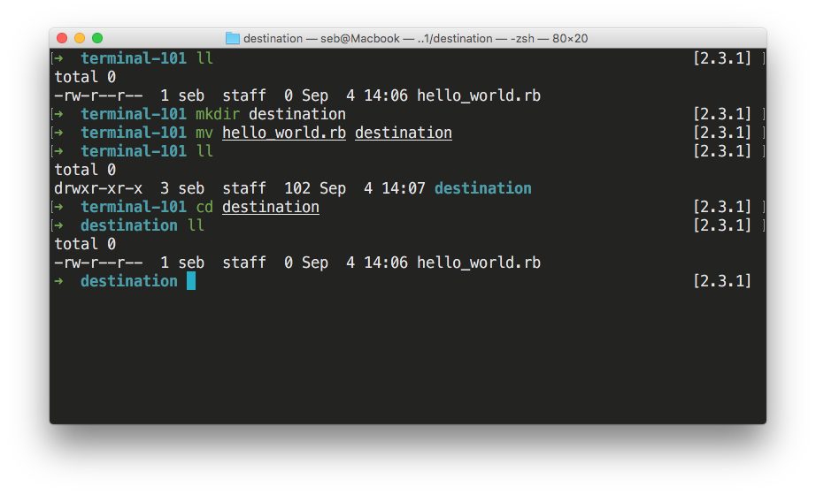

---

### Terminal - Renaming Files & Directories

```zsh
mv <FILE_NAME> <NEW_FILENAME>
```

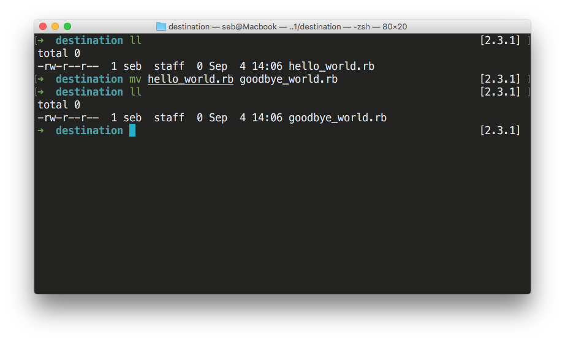

---

### Terminal - Open Current Directory in Sublime Text

Open your current directory in Sublime with **stt**

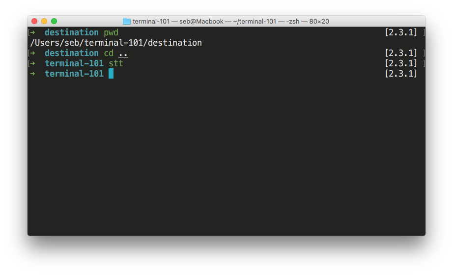

---

### Terminal - View Content of File

```zsh
cat <FILE_NAME>
```

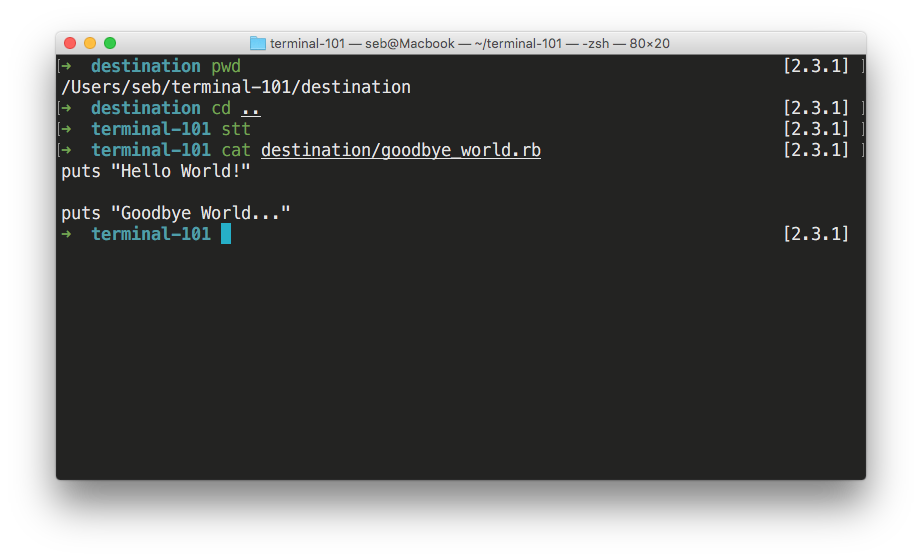

---

### Terminal - And many more

Check out this [Cheatsheet](https://github.com/lewagon/china-product/blob/master/00-kickoff/exercises/terminalcheat.md)

---

## Git

We are Knowledge Workers. We create and edit **files** (text, images, etc.)

---

### Everyday workflow

1. Create a file
2. Save it
3. Edit it
4. Save it again
5. etc.

---

### File life


---

### Manual Version Control

How most people keep track of different versions of a file

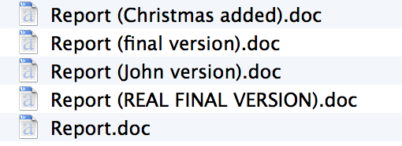

---

### Version Control

This is super annoying and time consuming... Is there anyway we can automate this?

For each document version, we need to know:

1. **When** the file was modified

2. **What** changed

3. **Why** it was modified

---

### There's more: Teams

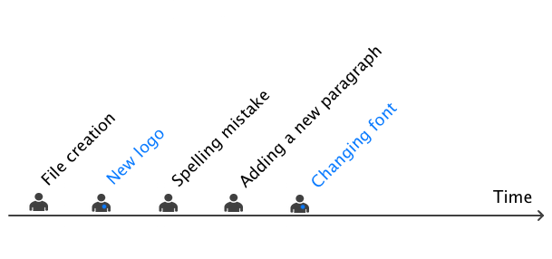

---

### That's one more question

For each document version, we need to know:

1. When the file was modified

2. What changed

3. Why it was modified

4. **Who** did the change

---

### In a nutshell

We want a tool which:

- tracks document versions

- keeps an history of document changes

- foster team work

---

### That would be


---

## Git Commands

Let's look at some basic commands to get us started

---

### Git - Initializing

```zsh
# From existing repository (on GitHub for instance)
git clone <github_ssh_clone_url>

# Or from scratch
mkdir new_project
cd new_project
git init
```

---

### Git - Status

git can tell you if your folder has some modified files (dirty)

```zsh
git status
```

---

### Git - Commit

A `commit` (a snapshot of the folder) is a 3-step job.

```zsh
# First check which files have been modified
git status

# Then, add the ones you want to the staging area.
git add <file_1_which_has_been_modified>
git add <file_2_which_has_been_modified>

# You can review your staging area
git status

# Take a snapshot of what is in the staging area.
git commit --message "A meaningful message about this change"
```

---

### Git - Diff

If `git status` tells you something changed, you can inspect exactly what changed:

```zsh
git diff
git diff <a_specific_file_or_folder>
```

---

### Git - Log

Show commit history with:

```zsh
git log

# More fancy command in your ~/.gitconfig
git lg
```

---

### Git Livecode: Initialize a Repo

Let's create a project and start tracking it

```zsh
mkdir -p ~/code/$GITHUB_USERNAME/git-101
cd ~/code/$GITHUB_USERNAME/git-101
git init
ls -a # it has created a .git hidden folder
```

---

### Git Livecode: 1st Commit

Let's create an `index.html` file and code some basic HTML content

```zsh
touch index.html
stt
# code some basic HTML content
```

---

Time to commit our work

```zsh
git status # file not staged
git add index.html
git status # file staged, ready to commit
git commit -m "Basic HTML content for home page"
git status
```

---

### Git Liveode: 2nd Commit

Let's add an image in our project

```zsh
curl https://raw.githubusercontent.com/lewagon/karr-images/master/white_logo_red_circle.png > logo.png
stt # add  to your HTML
```

---

Time to commit our work

```zsh
git status
git diff index.html # what has changed?
git add index.html
git add logo.png
git status
git commit -m "Adding logo to home page"
git status
git log # check commits history
```

---

Now push it up

```zsh
hub create
hub browse # can you see your new repo on Github?
git status # check again - anything to be pushed?
git push origin master
```

---

## Remote Repositories

Code that's stored *remotely*, meaning not on your machine.

---

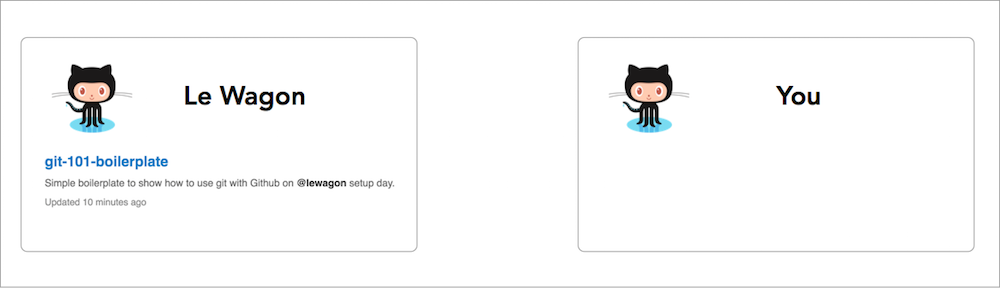

---

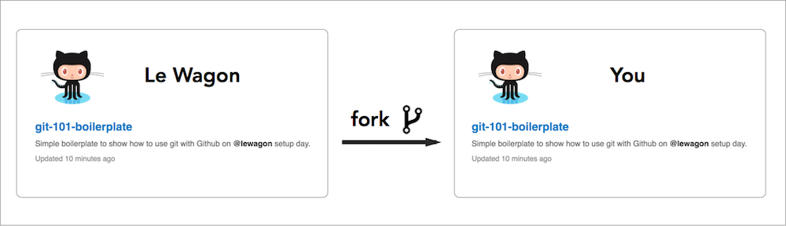

---

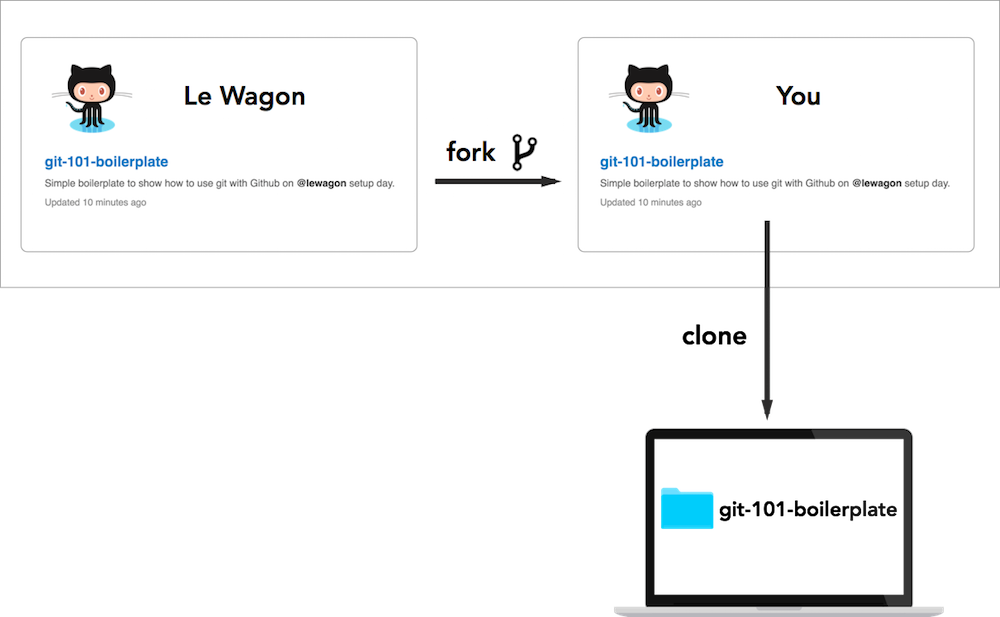

---

### Remote - Pushing Changes

Once you've committed your work, push it to Github.

```zsh
# Generic command
git push <remote> <branch>

# What we'll use
git push origin master
```

---

### Remote Livecode: Creating a New Repo

---

1. Let's make a new repo called git-101-practice (like you can for every exercise)

2. Then let's put stuff into it

```zsh
cd ~/code/$GITHUB_USERNAME
mkdir git-101-practice
cd git-101-practice
git init
git status # it's already tracked by git
```

3. Then make it sync remotely, by adding the github as a remote repo called  `origin`

```
git remote add origin git@github.com:lewagon/git-101-practice.git
```

---

### Remote Livecode: Commit and Push

Let's make a change, commit **and push**

```zsh
stt # change the HTML code
git add index.html
git commit -m "adding some custom text"
git status
git push origin master # Pushing on Github
```

Check that **project was updated on Github**.

---

## Git Advanced

In the next few weeks, we'll see how git can help us with

- Solving conflicts
- collaboration (using branches)
- production deployment (using multiple remotes)

---

## Learn.lewagon.com Demo

Let's take a quick look at the learning platform we'll be using throughout the program.

- Navigation
- Lectures
- Classmates
- Buddies
- Exercises
