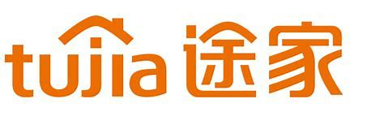
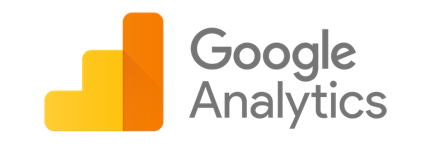
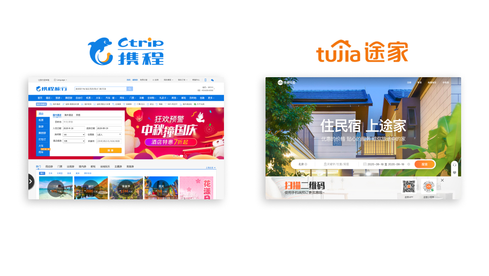
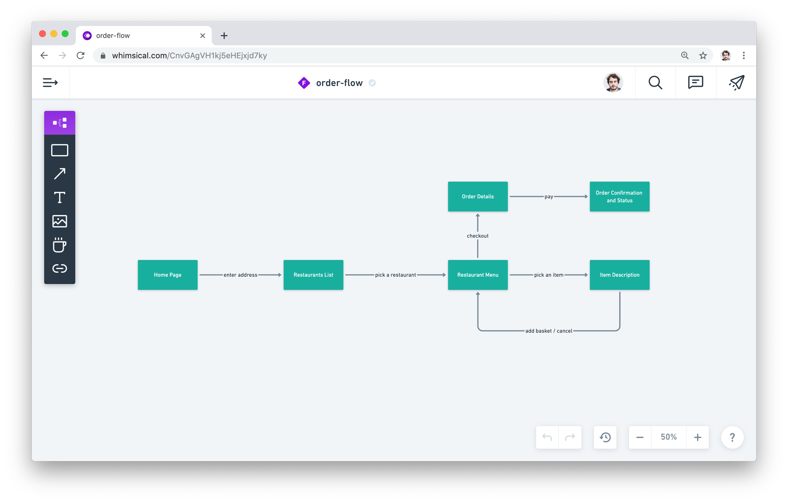

# Introduction to User Experience Design (UX)

How to create products that are meaningful and relevant for users

---

## Schedule for Tonight ⏰

- 7:00 PM **Lecture**
- 8:15 PM **Practice**
- 9:30 PM **Share**

---

## Lecture Outline

1. Product pitch
2. User flow
3. Wireframe & Prototype

---

## 1. Product Pitch

A framework to define your product

---

### A Product Pitch Should Define

- **Target Users (type > segment) 👩‍💻👨‍💻**

- **Initial need 🙏**

- **Goal 🎯**

- **Competitors 🌧️**

- **Differentiator 💪**

---

### Product Pitch Format

- **For** these users (type > segment)

- **Who need to** do this

- **And want to** achieve that

- **They choose** your product

- **Because** it allows this

- **Unlike** these competitors

---

### Let's try it

---

### Example

*途家 is a product...*

- **for**  travelers (type) around 30 years old (segment)

- **who need to** book a place

- **and want to**  live authentic experiences

- **They choose** 途家

- **Because** they can book homes from locals

- **Unlike** ctrip.cn

---

### The need is the **action** users have to complete

- It’s the *initial* trigger.
- What makes them look for a solution.

---

### The goal is the **objective** users want to reach

- It’s the result they hope to get *in the future*.
- What makes them choose *your* product.

---

### Example of *needs*

- **途家** - book a place

- **Google Analytics** - analyse website traffic & behaviours

- **Trello** - manage a pipeline (product/sales)

- **金数据** - create forms & surveys

- **Bilibili** - watch movies & series

---

### Example of *goals*

- **途家** - live authentic experiences

- **Google Analytics** - improve conversion rates 

- **Trello** - close more deals

- **金数据** - generate new leads

- **Bilibili** - be entertained

---

### Different types of users have different needs

- *travelers* need to **book a place**

- *owners* need to **rent their home**

---

### Different segments of the same type have same need but different goals

- ***UX Designers*** want to **improve conversion rates**

- ***Marketing managers*** want to **optimise their campaigns / increase traffic**

---

### Your differentiator = **Why users choose you?**

What better helps them achieve their goals compared to competition

---

---

### **Demo 💻** UX Spreadsheet

Let's build a Product Pitch / Persona / Core User Journey from lew.ag/ux-research

---

## 2. User Flow 🌊

The path taken by a typical user on a website or app to complete a task

---

### An application can have many user flows 🤔

However, today we're going to focus on just one. The ***main*** user flow.

---

### Example with 途家

- on the Home page, the User searches by preferred dates and location

- on the Index page, the User chooses a specific listing to browse further

- on the Show page, the User chooses to book this listing

- on the Confirmation page, the User completes their information and submits payment

*Easy right? Now let's make it visual.*

---

### **Demo 💻** User Flow

Let's build a customer flow using Whimsical

---

---

### Your turn 🚀

Choose an application or platform that you're familiar with. Use that platform to practice creating a Product Pitch and User Flow.

---

## 3. Moving Forward

*Too easy?* Try identifying new user segments, goals, needs, and user flows through your chosen application.