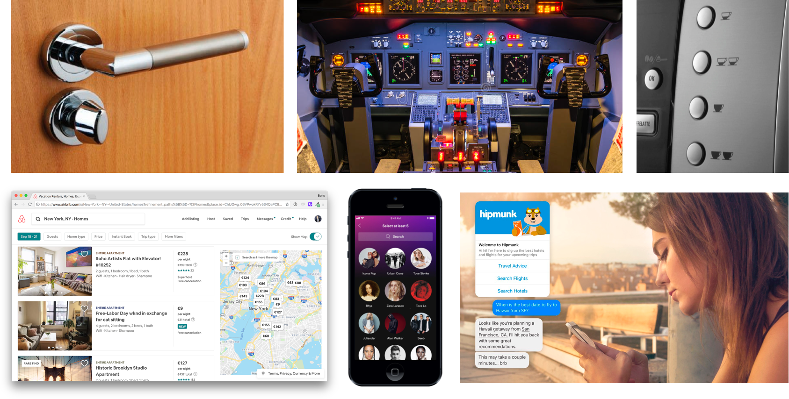

# Lecture Source

How to create products that are meaningful and relevant for users

## Introduction to UX Design

UX design is a general process for building great products. But what are the features of a good product?

1. Easy to use (**good** [**usability**](https://en.wikipedia.org/wiki/Usability)).
2. Meets real user needs.
3. Helps users achieve their goals.
4. Makes users happy, if possible 😉

### UX Origins

- People first started studying and formalizing interactions between a user and a system during the industrial age of mechanical engineering, led by Frederick Winslow Taylor and Henry Ford. At the time, Taylor & Ford’s goal was to improve productivity by optimizing interactions between workers and their machines. Of course, today’s UX is slightly different, as designers now try to optimize interactions between a user and a system to achieve **the user’s goals.**

- [Donald Norman](https://en.wikipedia.org/wiki/Don_Norman) was the first person to coin the phrase “User Experience” in the 90s.

Important areas **within** UX Design are:

- **User Research**: the area dedicated to studying **the users** (their needs, goals and behaviors) at any stage of the design process.

- **UI Design**: the area dedicated to building the **interface**, i.e. what the user can see and interact with.

#### What is User Research

At any stage of the design process (from the first interviews you make to discover what your user needs and goals are, to the tests you run to validate your prototype), **you are always learning more about your users**. This is the scope of User Research, which is a set of methods to improve your knowledge and understanding of your users. In particular, User Research focuses on the improved understanding of:

- User **needs** = what makes user look for a product initially.

- User **goals** = what users want that makes them choose your solution instead of alternatives.

- User **behaviors** = how users typically think and act.

User Research facilitates the design process and is based on lots of different observation methods:

- **Qualitative methods**: ethnographic studies, usability testing, prototyping, focus groups, etc…
- **Quantitative methods**: online surveys, web analytics, A/B testing...

### What is UI Design

User Interface design is a subset of UX focused on designing the interface of the product, i.e. the part of the product that the user **can see** and **interact with**. It’s such a big topic that companies often need dedicated UI designers who are focused exclusively on building the interface only, with other teams leading the other parts of the UX process.

#### A World of User Interfaces

UI design is a very general word since nearly everything has a user interface :)

- A door handle is a user interface.

- A Boeing’s dashboard is a user interface.

- The buttons of a coffee machine are a user interface.

- Mobile applications, web applications or chatbots are user Interfaces.

### HCI Design

In this course, we are dealing most specifically with HCI Design (Human Computer Interaction design), the part of UI dedicated to designing software interfaces like web applications or mobile applications.

### What do UI designers work on

UI design is the most visual part of UX. Here are some deliverables a UI designer will typically work on:

- **User flow**: this is a flowchart to model the user navigation on the web or mobile application to complete different tasks. For one isolated flow focused on one specific task (like signing up), designers sometimes speak about a task flow instead of a user flow.

- **Wireframe**: this is a black & white simplified mockup focused on the informational and functional part of the design.

- **Prototype**: this is an interactive wireframe that the user can click through, allowing the Design team to test if the product is intuitive, i.e. has a good usability.

- **Mockup**: this is a wireframe with the additional visual identity (fonts, colors, pictures, icons, etc…) that looks exactly like the final product when it will be developed.

### How to study UX/UI Design

😱 UX/UI is a very broad topic 😱

As you will see, UX design covers a wide range of topics. It relies on **lots of different methods**, including:

- UX personas
- User journeys
- User stories
- User flows
- Wireframing
- Prototyping
- Mockup
- Usability testing
- Behavior analytics
- A/B testing

Most of these methods also require **lots of different tools**, including:

- Sheets of paper and whiteboards 📝 (very useful tools 😉)
- Wireframing tools ([Balsamiq](https://balsamiq.com/)),
- Mockup and prototyping tools ([Sketch](https://www.sketch.com/), [Figma](https://www.figma.com/files/recent), [Invision](https://www.invisionapp.com/), [Marvel App](https://marvelapp.com/))
- User flow tools ([Draw](https://app.diagrams.net/), [Whimsical](https://whimsical.com/))
- Survey tools ([Typeform](https://www.typeform.com/))
- Web analytics tools ([Google Analytics](https://analytics.google.com/analytics/web/), [Mixpanel](https://mixpanel.com/))
- A/B testing tools ([A/B tasty](https://www.abtasty.com/))
- Heatmap tools ([Hotjar](https://www.hotjar.com/))

![](images/apps.png

This seems overwhelming, **but don’t panic** 😉! We will cover all these concepts and use all these tools on real-world problems during this course. By the end of the course, you will get the big picture and understand all these strange words.

⚠️ UX/UI is an applied topic ⚠️

UX Design must be applied to solving real-world problems encountered by real users. If we spent all our time learning UX Design concepts and theories, this would be a really boring course 😴. When it comes to applying the theory, it is important to remember that the UX design methods and tools must always be adapted to your team and your product:

- **Product**: it requires two very different approaches working on a new product that needs to be shipped fast and go to market, versus a 10-year old product that already has millions of users, lots of existing features, and on which you will be iterating more carefully.

- **Team**: again, consider the situation. Are you working in a big team with lots of resources (people and money) or in a small team with limited resources?

For instance, let’s consider these two situations:

1. Imagine **a single founder** launching his startup alone from scratch. He has to move quite fast and test his idea quickly with a prototype to validate his user needs. He does not have a live product yet, so obviously he cannot rely on lots of quantitative data or analytics. Finally, even if he must take some time to run user interviews and send surveys to understand more about his users, he does not have the time to spend two weeks on writing a detailed document to describe his typical user (what we call a UX persona).

2. Now imagine a **UX designer working at Facebook**. She works in a big team with ten other specialised designers who are experts in different fields. She has access to millions of datasets that she can use to better analyze and understand user behaviors. Given her product is **Facebook** - a product that already has a very rich user interface and tons of existing features - she will also need to take time to consider (and really analyze) what is worth building, and what her users will benefit from.

Obviously, these two people will use the UX methods and tools a bit differently!

In this course, we will design a product from scratch; putting ourselves in the situation of the single founder. Even so, we will use the same workflow and tools as professional UX/UI designers, so the approach we will see can also be applied when iterating on an existing product like in the case of the Facebook design team.

### Summary

- UX design is the process of building great products that are easy to use, that meet real user needs, that help users achieve their goals and - ideally! - make them happy.

- A very important part of UX centres on the interface, which is the role of UI Design. More specifically, designing software interfaces like web or mobile applications is a subset of UI called HCI Design (Human-Computer Interaction Design) with lots of documented methods and best practices.

- User Research helps a team better understand their user needs, goals and behaviors at every step of the design process. It uses lots of observation techniques, both qualitative and quantitative.

- UX/UI design has tons of tools and methods that can be applied differently whether you launch a first version of your product or are working in a big team on an existing product.
In both cases, the approach and the tools are still the same (they just need to be adapted). In this course, we will learn how to build a product from scratch covering all important concepts.

## What is a Product Pitch

A good product pitch can be done during a 1 minute ⏰ elevator ride (hence the name “elevator pitch”). It should define the following elements:

1. **Customer segment:** group of users you are targeting.

2. **User need:** the action they have to do that makes them look for a product.

3. **User goal:** the objective they want to achieve that makes them choose your product.

4. **Competitors:** other products that enable a user to perform the same action (i.e. meet the same need).

5. **Differentiator / Unique Value Proposition:** how your product differs from competitors and which features specifically help users achieve their goal.

### A simple canvas

Here is a canvas to describe all these elements in a straightforward way:

It is a product…

- For `this customer segment`
- Who need to `perform this action`
- And want to `achieve this goal`
- They choose `your product`
- Because `it has this differentiator / unique value proposition`
- Unlike `these competitors`

As you can see, there isn’t a unique pitch for a product, but one pitch per customer segment.

### Needs vs. Goals

People always get confused about the difference between user **needs** and user **goals**.

#### Need = the action to perform

A user need is very straightforward. It’s simply the action your users need to perform that makes them look for a solution. Example:

- find a place to stay
- create an online survey
- organize a project
- get a cab
- order some food
- communicate with their team
- analyze their website traffic

#### Goal = the objective of the user

A user goal is what the user is ultimately trying to achieve. Let’s take the example of a web analytics tool like Google Analytics used by marketers.

- Marketers **need** to analyze their website traffic and user behavior.

- Marketers do this because they **want** to increase the number of visitors and improve the conversion rate of their website.

As you can see, needs and goals are very different. Needs **initiate** the search of a product while goals are what users hope to reach **in the future**.

#### Needs and goals are specific to customer segments

Needs and goals depend on the customer segment you consider. For instance, different types of users will have different needs. Let’s take the example of Airbnb:

- Travelers need to **find a place to stay.**

- Owners need to **rent their flat.**

Within a category of users who need to do the same thing (like travelers who need to find a place to stay), there are different customer segments having different goals. Here are some examples of travelers’ customer segments and their associated goal:

- 30-year-old couples with above average income: they want to live an authentic experience.

- Students on a budget: they want to have fun without spending too much on accommodation.

Both of these customer segments will choose Airbnb, but it will be for different reasons.

## What is a User Flow

A user flow is a [flowchart](https://en.wikipedia.org/wiki/Flowchart) that describes the different screens of your product and the connections between each of them. Drawing your user flow is the first step when building your product’s UI (User Interface). In fact, you first need to determine your screens and the links between them before you actually design each of these screens in detail with a wireframe.

### User Journey vs. User Flow

People often get confused about the difference between a user journey and a user flow, but they are totally different. When designers are working on a user journey, they are still doing User Research, i.e. thinking about how their users would complete a given task. When they are working on a user flow, they are already building the User Interface (UI) so they are less focused on their user and more focused on “how their app will work”. To summarize:

- A user journey is **a description** ✍️ of the different steps your user goes through to complete a given task. It can include personal details or emotions associated with the persona going through the journey. It enables designers to focus on the elementary actions their user need to perform without thinking about their product’s interface.

- A user flow is the translation of a user journey as **a flowchart** 📐 detailing screens and connections between screens.

It’s very important to **define your user journey** before drawing the associated user flow. Designers can often forget important screens or build a flow that is not totally adapted to their user when they skip the user journey and try to draw their user flow directly.

### Task Flow or User Flow

A user flow focused on **one specific task** is called a **Task Flow**. Here are some examples of task flows and user flows:

1. The **Task Flow** of creating your account (sign-up flow).
2. The **User Flow** of managing all your booking requests, corresponding to different management tasks: answer messages, accept & decline booking requests, rate previous guests.
3. The **Task Flow** of booking a flat.
4. The entire **User Flow** of Airbnb (all possible tasks).

Of course, if we wanted to draw the entire user flow of all the possible tasks on Airbnb (login, signup, add a flat, look for a flat, answer messages, accept and decline booking requests, leave reviews, etc…) it would take a long time ⏰ and would probably not fit into this course 😬.

Here is an example of **Task Flow**:

And here is an example of User Flow:

## What is a User Journey

### Persona, task, goal and context

To build a great user journey, you must first define:

1. The **persona** who will be going through the user journey

2. The **task** your persona needs to complete. There are often lots of different tasks users can complete on a product, for instance in the case of Airbnb: book a place, edit their profile, leave a review on a previous trip, rent their own apartment, answer a question about a booking request, etc… Each of these tasks corresponds to a different user journey.

3. The **goal** your persona is trying to achieve by completing this task.

4. The **initial context**, which means the initial situation in which your persona is when starting the journey. Where is he/she? When is it? Who is he/she with? Which device does he/she use? What’s his/her initial mood?

Here is an example of **persona / task / goal / context** for a booking user journey on Airbnb (the user journey associated with the task of “booking a flat”):

### Core user journey

As you can see, a product has lots of different user journeys depending on:

- The **persona** you choose.
- The **task** you select for this persona.

Good news! For each persona, there is often a task that takes priority over the other ones. It is the task your persona will try to complete most of the time when using your app:

- Travelers try to **book a place** (Airbnb)
- Owners try to **rent their flat** (Airbnb)
- Marketers try to **create a survey** (Typeform)
- People in a hurry try to **get a cab** (Uber)
- Hungry people try to **order some food** (Deliveroo)

The user journey associated with each of these tasks can be considered the most important for the associated persona: it is what we call the core user journey of the persona.

### Steps of the journey

Once you have defined the **persona / task / goal / context** of your user journey, it’s time to describe it. A user journey is a succession of steps, i.e. actions your user is going through in order to complete the task. You can see it as a little script.

A good user journey should describe all these steps without trying to describe the interface of the product. In fact, a user journey enables designers to **focus on all the logical steps a user needs to go through to complete a task** without being distracted by the way the user interface should look like or by the features the product should have.

For each step of the user journey, it’s always interesting to add some personal details about your persona which can bring design ideas later on. Also, it can be useful to associate a feeling to each of the steps. It’s not always easy to do it but it can give some tips about how to design the user interface later on.

Here is an example of all the steps of Manu’s core user journey to book a flat on Airbnb.

### Focus on you user, not on your software!

When you detail the steps of your user journey, use human language, not computer language:

- Use verbs like **go, see, check, read, ask, confirm, book**
- Don’t use verbs like **click, scroll, browse, zoom, submit, toggle, filter**

## What is a UX Persona

### Basic info, goals, behaviors

Once you have defined the customer segments of your app, it’s time to build a UX persona for each of these segments. A UX persona is a fictional character that is created to represent a customer segment.

For instance, a good persona for Airbnb travelers should have:

- **Basic info:** profile picture, name, nickname, age, sex, nationality, city of residence, job, income, relationship status, etc…
- **Goals:** objectives when booking a place for holidays.
- **Behavior patterns:** typical behavior when booking a place online.

Obviously, when we talk about goals and behavior patterns, we just mean the ones that are **related to your user need**, i.e. what your user is trying to do with your product (i.e. “book a place” for Airbnb). Otherwise, we would have a super long and unnecessary list of all our user goals (“Change the world”, “Become rich”, 😉) in life, and all their random behavior patterns!

### What makes a great persona

A good persona has lots of personal details, you can easily identify yourself to him/her if you are in the same customer segment. Here are some tips for building great personas:

- Give enough details but not too many: your description should fit on an A4 page.
- Try to use the same vocabulary your persona would use in the real world.
- Don’t be too “cliché” and use realistic details and behaviors you got from customer interviews.

### A concept also used in Marketing

Here is the definition of a UX persona from wikipedia:

> *A persona in user-centered design and marketing is a fictional character created to represent a user type that might use a product in a similar way. Marketers may use personas together with market segmentation, where the qualitative personas are constructed to be representative of specific segments.*

As you can see, UX and Marketing can be closed sometimes. A persona is not only useful for the design process but also for the Marketing team, since customers will naturally identify themselves to a persona of their customer segment advertised on the website for instance.

### Why it is useful in UX

UX personas enable designers not to focus on what they want but to focus on what their users want. Speaking of general customer segments like “students”, “couples”, “locals” creates distance between designers and their users, whereas putting a face and a name on your users is a way to re-connect to them.

For instance, here are typical questions Typeform designers might ask themselves using their personas ☝️:

- Where does **Jonas** want to embed his survey (website, company’s Facebook page)?

- How many surveys does **Jonas** create every month?

- What’s the quickest way for **Priscilla** to share a survey with her team (Slack, email)?

- Which format is the most convenient when **Christina** wants to export customer data?

- Imagine **Jonas** is working on a very important marketing operation: what are the things he really wants to customize on the survey? Where does he want to put his logo?

Designers can also **role-play** and act as if they were their persona in specific situations. This is sometimes very efficient to discover typical user thoughts and emotions.

### Primary persona, secondary persona, anti-persona

OK, it’s pretty obvious but there are different types of personas:

- **Primary persona:** representing your primary customer segment (majority group of customers).

- **Secondary persona:** representing your secondary customer segment.

- **Anti-persona:** representing the customer segment you don’t want to have 😬. For instance, if you design a web application for adults only or if you work on a product that relies on a community of expert users.

Among other things, knowing your personas and anti-personas can help you design a better user onboarding process.
