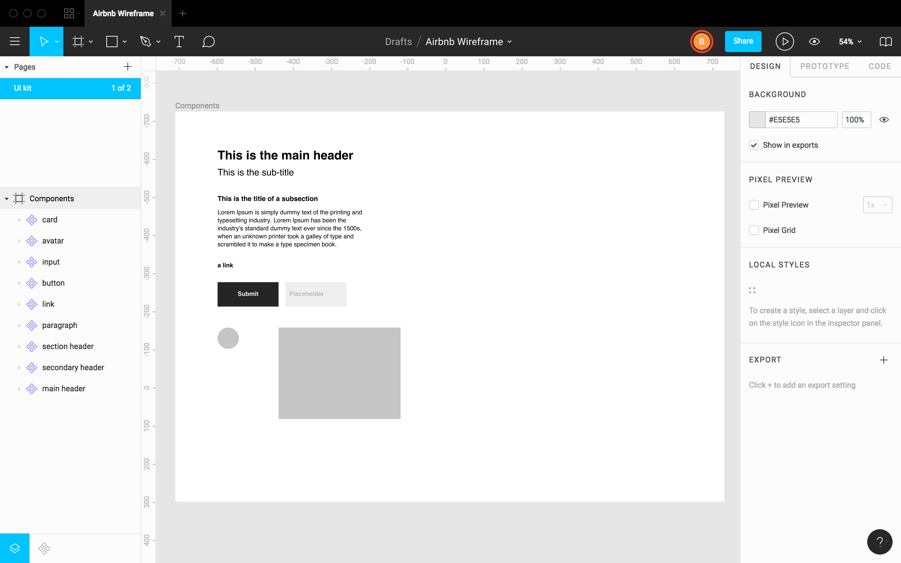
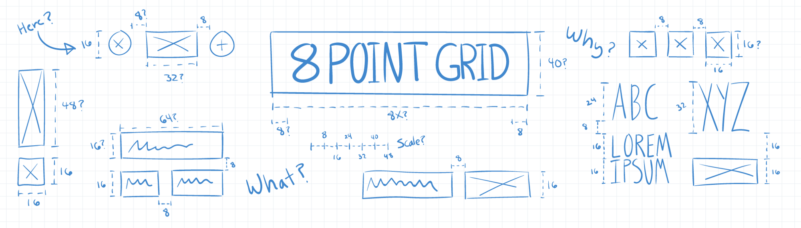
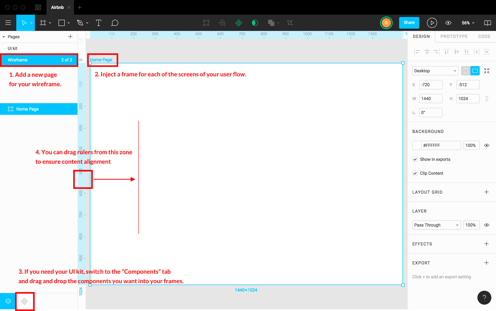
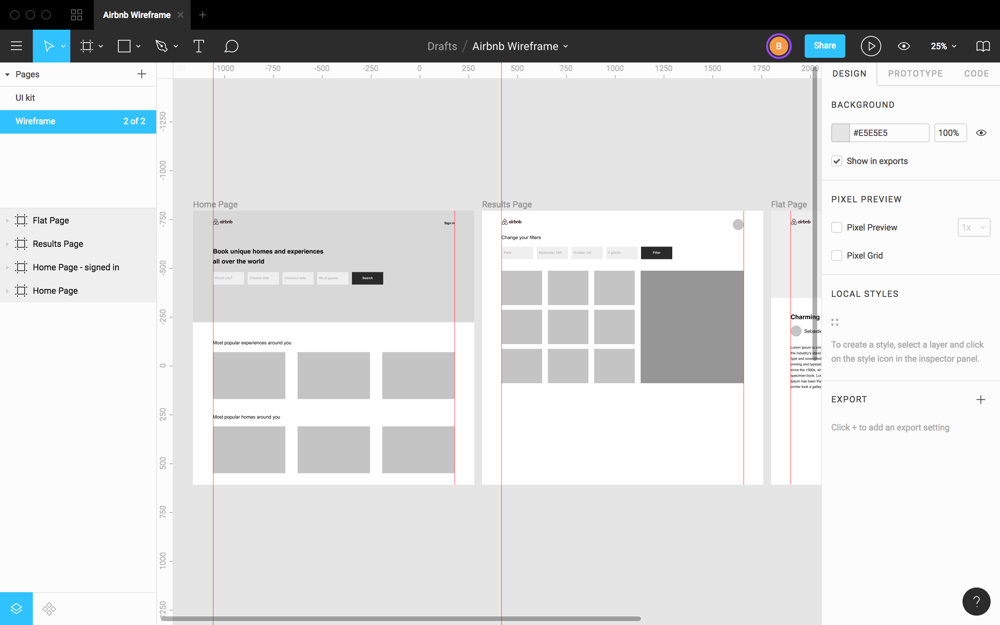

# UI Design Challenge

Work individually to create a user interface (UI) for the app you replicated on Tuesday.

## Getting started with Figma

Here are some instruction to get started:

- Start by creating a new project on Figma:

- Right away, rename your **project**: `YOUR_PRODUCT_NAME`

- Also rename the default **page** (currently called `Page 1`) to `UI kit` instead:

- Now let’s create a frame in which we will design our components. If you are working on a desktop wireframe, choose `Desktop` on the right. Of course, select a `Phone` frame if your product is a mobile app.

- Finally, rename your **Frame** to `Components`

Great. You’re ready to build your UI kit 🎉🎉!

Create [Figma Components](https://www.figma.com/blog/components-in-figma/) for:

- Headers
- Basic text
- Link
- Primary Button
- Form input
- Avatar
- Card

These components should all exist within the application that you designed on Tuesday (e.g. 饿了么
, 大众点评, iTalki).

Feel free to work on more advanced components (e.g. form, navigation menu, footer, etc…) if you feel up to the challenge. Your final UI kit should look something like this:

### Pro tip: the 8-point rule

Google design guidelines recommend using **multiples of 8 pixels** for every size, margin and space. It’s a good rule of thumb to ensure that your proportions are regulated, and that you aren’t always asking yourself “what size should I use 🤔?”. It’s a very popular rule with a lot of disciples, so there’s lots of material surrounding it online. You can read a good article about the 8-point grid [here](https://builttoadapt.io/intro-to-the-8-point-grid-system-d2573cde8632).

## Building your wireframe

If you only have one page for your `UI kit` in your Figma project, it’s time to add a second page called `Wireframe` in which you will use your UI kit to build your app wireframe.

Here are some tips about how to use Figma:

Your turn! Build the wireframe of the different screens of your core user flow. Your final wireframe should look like this:

## Pimp your UI Kit

### Add fonts

Find **two different fonts** on Google Fonts (one for headers and links and another one for basic text) and integrate them into your UI kit. To learn how to install and use a Google font, don’t forget to read the lecture source.

### Add colors

Find at least **two colors (primary/secondary)** and integrate them into the components of your UI kit, e.g. change the color of links, headers, buttons, etc.

Feel free to be creative in your choices 🎨!

### Add pictures

Using the resources we recommended in the lecture slides and lecture notes, add pictures to your components (i.e. banner, cards, etc.)

### Add icons

Does your app have any icons? If so, look through the lecture source to find an icon set that works.

## All Done

Congrats for finishing your prototype 👏👏👏! Have the instructor check your work and provide feedback.
