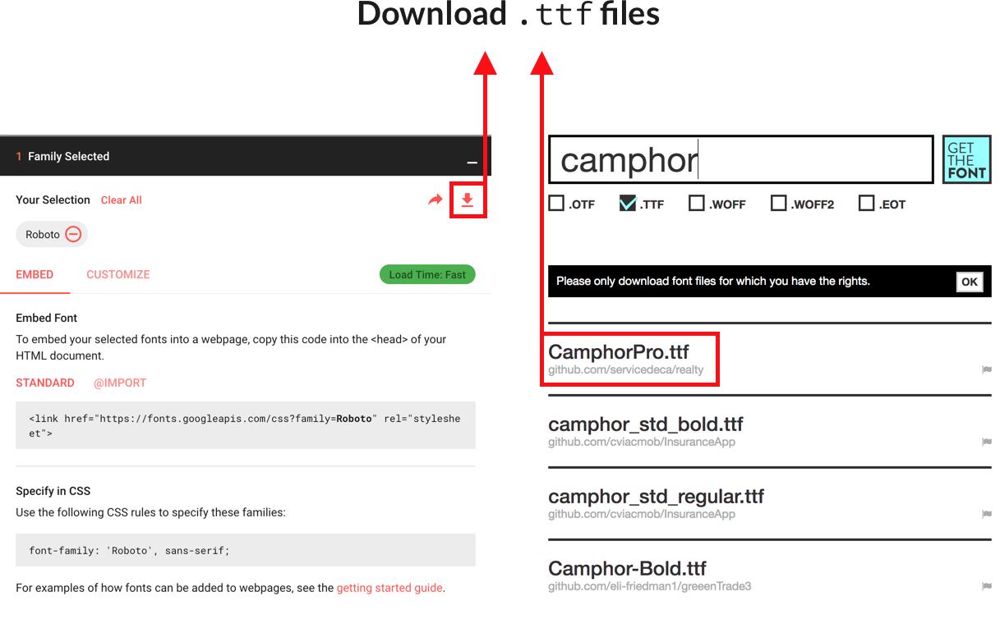

# Lecture Source

## Installing Design Tools

1. Create an account on [Figma](https://www.figma.com/), the tool we will use to build wireframes, prototypes and mockups.

2. Install [Figma Desktop app](https://www.figma.com/downloads/) either for macOS or Windows. It will be way faster than the web version and you will be able to work without wifi (e.g. in the train. 😉)

## What is Atomic Design

Atomic Design focuses on building a User Interface by **combining elementary design components** instead of designing each new page from scratch - a very inefficient approach that often leads to a lack of consistency in the design. You can think of Atomic Design as Lego: designers start by building their different **Lego bricks** and then combine these bricks to build their User Interface.

### Atoms & Molecules

UI designers generally refer to the following design elements:

- **Atoms**: the smallest bricks of your interface: headers, texts, labels, icons, links, avatars, buttons, form inputs, pictures, etc...

- **Molecules**: more structured components combining different atoms: forms, cards, hero sections, navbars, etc...

### Components

When designers want to refer to a general collection of these without differentiating between atoms and molecules, they will use the word **components** or **UI components** (components used to build the User Interface).

Also, components specifically designed for web interfaces are often referred to as **web components**.

## What is a UI kit

Designers often **build component libraries (atoms & molecules)** that they can re-use on any project. This is what we call a UI Kit. A UI kit is simply a graphic library of atoms and components.

### Building your wireframe from a UI kit

Once their UI kit has been created, designers use it to build their wireframes or mockups.

### Tons of UI kits on the web

If you search for “UI kit” on Google, you will find plenty of results corresponding to different categories:

1. **Web wireframe kit**: minimal components (black & white, without details or visual identity) designed for building web interfaces.

2. **Mobile wireframe kit**: minimal components (black & white, without details or visual identity) designed for building mobile interfaces.

3. **Web mockup kit** or **Mobile mockup kit**: in these kits, components already have a lot of details and a visual identity with colors, fonts, pictures, etc…

4. **Specialized mockups**: some UI kits are tailor-made for specific apps like e-commerce websites, calendar mobile apps, desktop chats, etc...

### Wireframe kit examples

You can find some free wireframe kits on [Figma's Community](https://www.figma.com/community/wireframes).

### General UI kit examples

You can find some [free wireframe kits on Sketchappsources](https://www.figma.com/community/ui_kits).

### WeChat Mini Program Kit 🚀

You can also find Le Wagon's own WeChat Mini Program UX Kit [here](https://www.figma.com/community/file/892976858322777290).

## Reources for colors and fonts

### Tools and tips for fonts

#### Where to find fonts

Here are some resources to install cool fonts:

- For free fonts, check out [Google Fonts](https://fonts.google.com/)

- For paid fonts, you can download them without paying on [getthefont.com](https://www.getthefont.com/). Of course, you are not allowed to use these paid fonts for commercial purposes, but if you just want to do some quick tests on your mockup before actually buying the fonts (fonts can be pretty expensive sometimes 💵💵💵), it’s worth doing.

#### How to install fonts

Here is a guide to install a new desktop font

1. Search for the font you want (paid or free), like `Roboto`, `Lato`, `Avenir`, `Camphor`, etc...

2. Download the desktop files, i.e. the `.ttf` files. For your information, fonts also have file formats adapted for the web like `.woff`.

3. Once downloaded, double-click on each `.ttf` file to install the font on your computer.

4. Restart all open apps that might have font menus such as **Keynote**, **PowerPoint**, **Word**, **Figma**, etc..

5. Yay 🎉🎉🎉! You can now use your new font in any of these apps, e.g. for building a presentation, a mockup, a word document, etc...

#### How to use fonts

Here are some very good resources for using fonts like a real pro:

1. Start by [reading this guide](https://www.pierrickcalvez.com/journal/a-five-minutes-guide-to-better-typography) which gives the basic rules and tricks for good typography.

2. To find combinations of Google fonts that work well together, you can check [this resource](https://fontpair.co/) or [this one](https://digitalsynopsis.com/design/best-google-fonts-combinations-typeface-pairings/).

3. Finally, if you feel like fancy, you can check this cool [font map by Ideo](http://fontmap.ideo.com/).

### Tools and tips for colors

There are tons of color scheme websites:

- [Colorhunt](https://colorhunt.co/)

- [Coolors.co](https://coolors.co/)

- [Colorbox.io](https://www.colorbox.io/)

It’s essential to have a colorpicker, so you can quickly copy any colors you see online that you like:

- [Colorzilla Chrome extension](https://chrome.google.com/webstore/detail/colorzilla/bhlhnicpbhignbdhedgjhgdocnmhomnp?hl=en) (free)

- [Sip for Mac](https://sipapp.io/) (paid)

### How to use colors

Here are some basic tips:

- Don’t use too many colors: for instance, **choose one strong color for your primary buttons & logo** and add a **secondary color for less important buttons and links**.

- Be careful with color schemes: color schemes are great but beginners often don’t know how to use them. They end up applying the color scheme in the wrong way.

- Instead of using a color scheme, get inspiration from websites you like and use a colorpicker to copy/paste the colors and apply them to your website.

## Resources for icons and pictures

Here are some cool resources for **icons** and **illustrations**:

- [Nucleoapp](https://nucleoapp.com/)

- [Undraw](https://undraw.co/illustrations)

- [Orion](https://orioniconlibrary.com/)

Here are some cool **HD photo stocks**:

- [Unsplash](https://unsplash.com/)

- [Gratisography](https://gratisography.com/)

- [Duotone](https://duotone.shapefactory.co/) to add a duotone effect to your picture

## Getting better in UI Design

UI Design looks easy but it takes a lot of time and experience to master it. Here are some good resources to get started:

1. First, you need to **master classic UI patterns**. For instance, here is a non-exhaustive list of classic design patterns and how to use them built by the [BBC designers](https://www.bbc.co.uk/gel/guidelines/category/design-patterns#All)

2. Second, you need to avoid [common mistakes](http://blog-en.tilda.cc/articles-website-design-mistakes)

3. Last, you need to know the [practical tips that change everything](https://medium.com/refactoring-ui/7-practical-tips-for-cheating-at-design-40c736799886).

We really recommend you to follow [steveschoger](https://twitter.com/steveschoger?lang=en) on Twitter. He posts lots of design tips very actionable for beginners.
