## Today's objectives

- Learn HTML / CSS basics
- Code your profile page [like this](https://papillard.github.io/my-profile/)
- Put it online with [Github Pages](https://pages.github.com/)

## Lecture Boilerplate

https://github.com/lewagon/html-demo

```
cd ~/code/$GITHUB_USERNAME
git clone git@github.com:lewagon/html-demo.git
cd html-demo
rm -rf .git
stt
```

------

## Front-end languages

The languages **your browser speaks**


------


It's a **markup** language (== structure)

\--

## HTML

Your page has different contents


## HTML

HTML tags help you **identify** content


## HTML

Hence, **browser default styles** will apply


## HTML

And you will also be able to apply **your own style rules** if you want

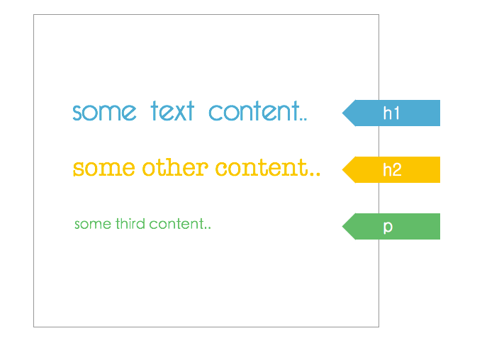

## HTML Skeleton

```
<!DOCTYPE html>


<!-- end of file -->
```

## HTML Skeleton

```
<!DOCTYPE html>
<html>


</html>
<!-- end of file -->
```

## HTML Skeleton

```
<!DOCTYPE html>
<html>
  <head>

    <!-- Page's intelligence = meta tags -->

  </head>
  <body>

    <!-- Page's content = displayed on the page -->

  </body>
</html>
<!-- end of file -->
```

## HTML Skeleton - head

```
<!DOCTYPE html>
<html>
  <head>
    <title>Page Title. Maximum length 60-70 characters</title>
    <meta name="description" content="Page description. No longer than 155 characters.">
    <meta charset="utf-8">
  </head>
  <body>

  </body>
</html>
<!-- end of file -->
```

## HTML Skeleton - head & Google

```
<head>
  <!-- Google result text-->
  <title>Coding Bootcamp Le Wagon | Europe's Best Coding Bootcamp</title>
  <!-- Google result description-->
  <meta name="description" content="Le Wagon is Europe’s best coding bootcamp for creative people & entrepreneurs. Learn to code in 9 weeks with our fullstack coding bootcamp.">
</head>
```

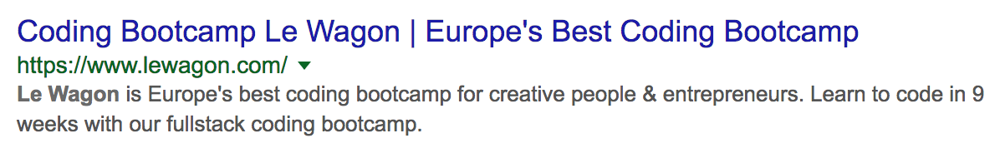

## HTML Skeleton - head & Facebook

```
<head>
  <meta property="og:title" content="Le Wagon - The French innovative coding school">
  <meta property="og:image" content="facebook-card.jpg">
  <meta property="og:description" content="Le Wagon is the best French coding school for entrepreneurs. Checkout by yourself the projects of our students. You will be impressed.">
  <meta property="og:site_name" content="Le Wagon"/>
</head>
```


## HTML Skeleton - head & Twitter

```
<head>
  <meta name="twitter:card" content="summary_large_image">
  <meta name="twitter:site" content="@Lewagonparis">
  <meta name="twitter:title" content="Le Wagon - The French innovative coding school">
  <meta name="twitter:description" content="Le Wagon is the best French coding school for entrepreneurs. Checkout by yourself the projects of our students. You will be impressed.">
  <meta name="twitter:creator" content="@Lewagonparis">
  <meta name="twitter:image:src" content="http://twitter-card.jpg">
</head>
```

## HTML Skeleton - body

```
<!DOCTYPE html>
<html>
  <head>
    <meta charset="utf-8">
    <title>Hello world</title>
  </head>
  <body>
    <h1>Hello buddies!</h1>
  </body>
</html>
<!-- end of file -->
```

## Basic syntax

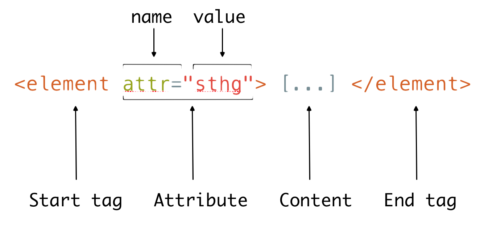

## Example

```
<a href="https://www.lewagon.com" target="_blank">
  Le Wagon
</a>
```

Result: [Le Wagon](https://www.lewagon.com/)

### Quizz

- What is the name of the tag?
- What is the content?
- What are the 2 attributes (name and value)?

## Titles

```
<h1>[...]</h1>  <!-- Only one per page! SEO important -->

<h2>[...]</h2>
<h3>[...]</h3>
<h4>[...]</h4>
<h5>[...]</h5>
<h6>[...]</h6>
```

## Paragraphs

```
<p>
  Lorem ipsum dolor sit amet, consectetur adipisicing elit.
  Veritatis laboriosam mollitia autem at ab omnis iure quis
  asperiores inventore eos nam aut iusto officiis deserunt
  nihil, sequi tempore impedit quae?
</p>
```

## Emphasize

```
<p>
  You can emphasize <em>some words</em>,
  and even <strong>more if needed</strong>
</p>
```

## Lists

```
<h2>Shopping List</h2>
<ul>
  <li>Milk</li>
  <li>Butter</li>
</ul>

<h2>World Cup 2018</h2>
<ol>
  <li>France</li>
  <li>Croatia</li>
  <li>Belgium</li>
  <li>England</li>
</ol>
```

## Images

```

```

## Forms

```
<form>
  <input type="email">
  <input type="password">
  <input type="submit" value="Log in">
</form>
```

## Much more

- [codeguide.co](http://codeguide.co/)
- [MDN reference](https://developer.mozilla.org/en/docs/Web/HTML/Element)

## Live-code

Let's add some HTML content to our profile page!


------


## Web without CSS ?

- Cut the `<head>` on [medium.com](https://medium.com/) with Chrome dev tool.
- This is how a website looks like without CSS 😬

## Linking stylesheet to HTML page


\--

## CSS syntax


\--

## CSS vocabulary


\--

## Example


## Colors

```
color: #FF530D;
color: rgb(255, 83, 13);
color: rgba(255, 83, 13, 1.0);
```

x

## Colors - Tips

```
body {
  color: rgb(10, 10, 10);
}
```

- **RGB** stands for **R**ed **G**reen **B**lue
- each value is between 0 and 255
- for same values of R, G and B, you are on the grey scale


\--

## Text vs Background

## 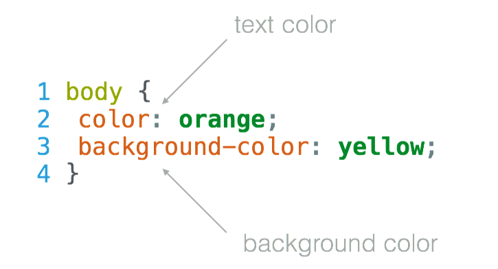

## Background image


\--

## Font - family

## 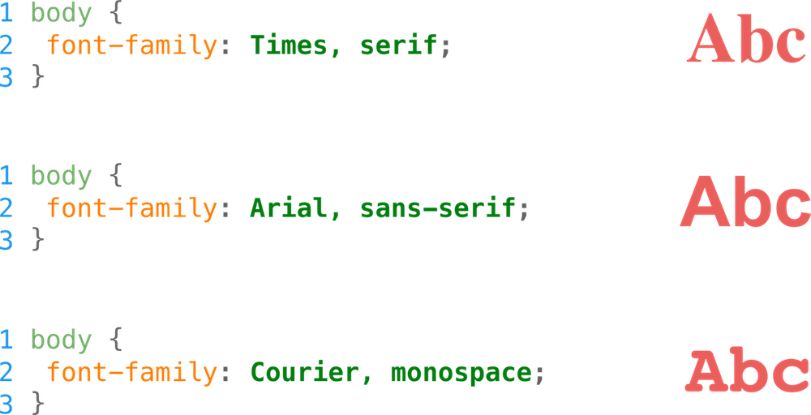

## Fonts - size and spacing

## 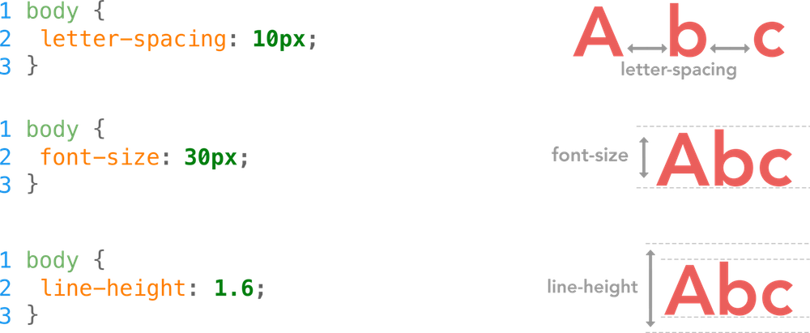

## Fonts - decoration

## 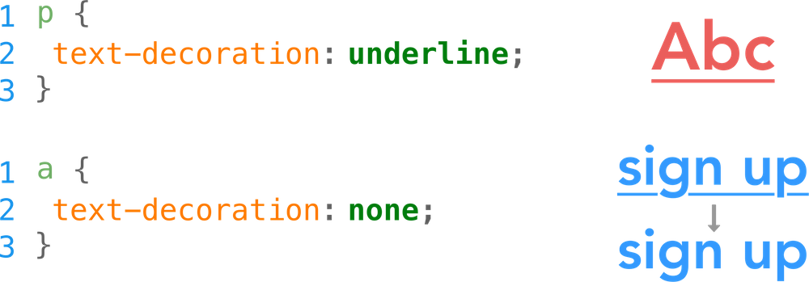

## Fonts - alignment

## 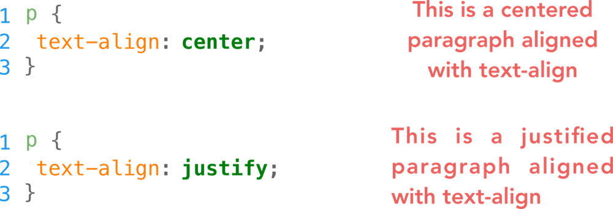

## Fonts - weight

## 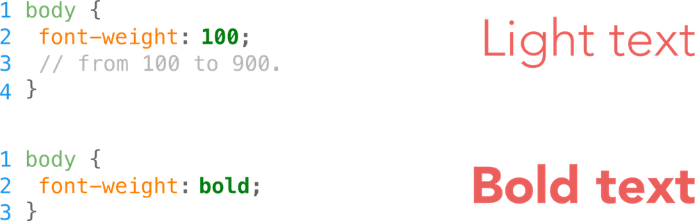

## Fonts - Google fonts

Make your shopping on [Google fonts](http://www.google.com/fonts).

- **Open-Sans** 👉 `<body>`
- **Raleway, Montserrat, Varela Round, etc...** 👉 `<h1>`, `<h2>`, `<h3>`

## Fonts - Font Awesome

[Font Awesome](https://fontawesome.com/) is a font of icons, really useful!

```
<!-- cdn link to paste in your <head> -->
<link rel="stylesheet" href="https://use.fontawesome.com/releases/v5.0.10/css/all.css">
```

## Small tips

Use the inspector, then copy the `css` in Sublime.

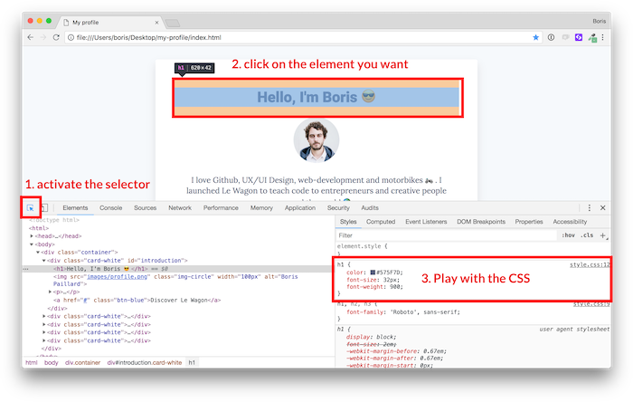

## Live-code

Let's design our fonts and colors using [Google fonts](https://fonts.google.com/).

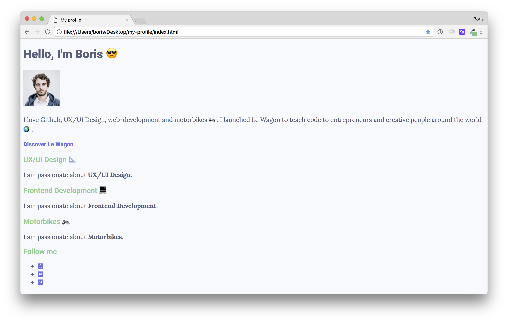

------

## Div and box model

## Real life...


## ... is made of `<div>`


## Box model


## Box model - border

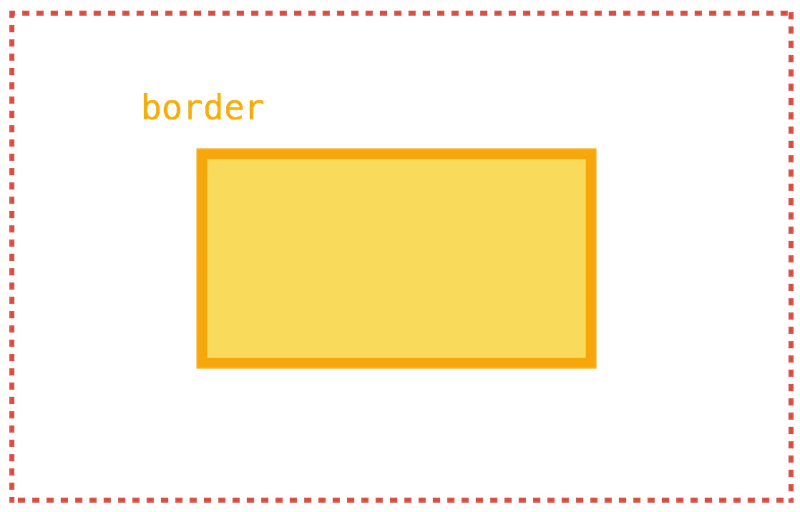

## Borders

```
div {
  border: 1px solid red;
}
/* or */
div {
  border-top: 1px solid red;
  border-right: 2px dotted black;
  border-bottom: 1px dashed green;
  border-left: 2px dotted black;
}
```

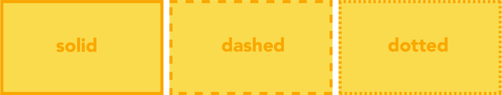

## Border radius

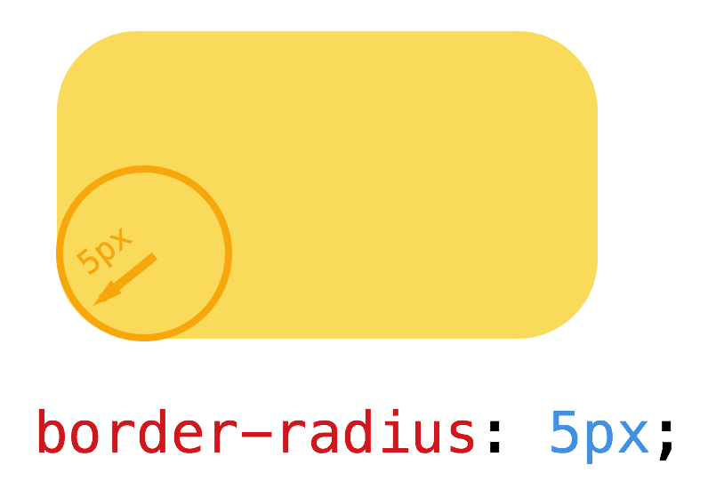

\--

## Border radius


\--

## Box shadow

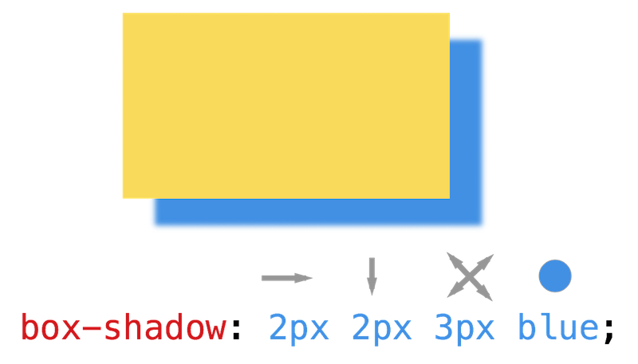

## Units

```
/* Absolute */
p {
  width: 50px;
}

/* Relative to parent */
p {
  width: 50%;
}

/* Relative to font size */
p {
  width: 2em;
}
```

## Div design tips

```
background: white;                         /* White background */
padding: 30px;                             /* Internal space */
border-radius: 4px;                        /* Small radius */
box-shadow: 0 10px 30px rgba(0,0,0,.1);    /* Light shadow */
```

#### Result:

Lorem ipsum dolor sit amet, consectetur adipisicing elit. Eos voluptatibus, quis iure vel aliquam veritatis architecto fugiat necessitatibus? Quidem error explicabo nemo maiores voluptatem odio delectus ad, esse reprehenderit animi.

## Div centering technique

```
width: 300px;        /* Set the width */
margin: 0 auto;      /* Set automatic margins on right/left */
```

#### Result:

Lorem ipsum dolor sit amet, consectetur adipisicing elit. Eos voluptatibus, quis iure vel aliquam veritatis architecto fugiat necessitatibus? Quidem error explicabo nemo maiores voluptatem odio delectus ad, esse reprehenderit animi.

## Live-code

Let's **add some div** in our HTML and play with the box model with Chrome Dev tool.

------

## id and class

\--

## How do you style only the logo?


\--

## Name your tag with `id`

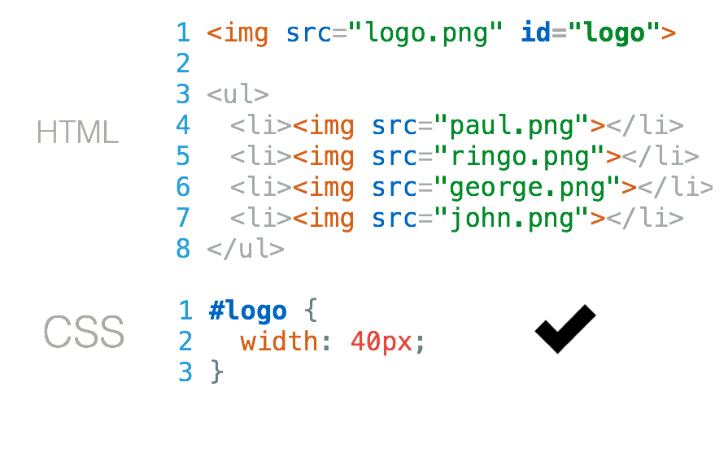

\--

## How do you style your staff pictures?

## 

## Name your tags with `class`

## 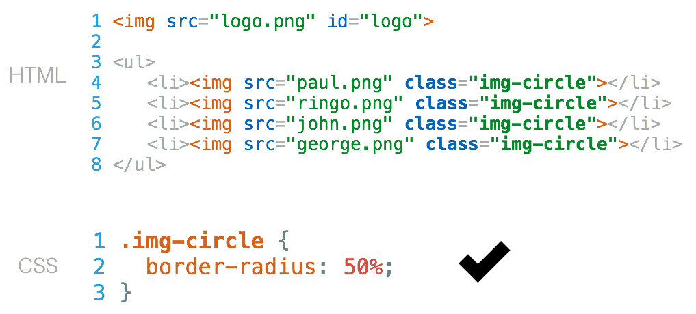

## id or class?

## 

## Combine (1)

## 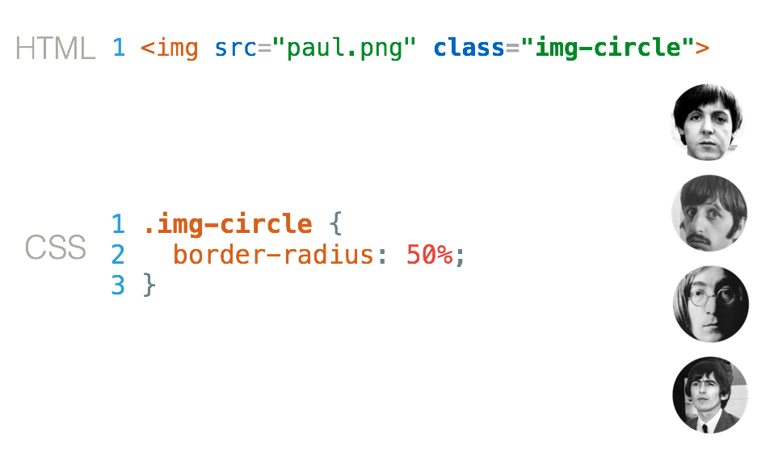

## Combine (2)

## 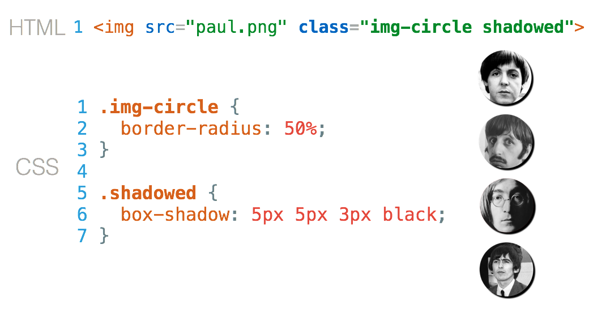

## Combine (3)


\--

## Class naming - quizz

Which one is **more explicit** (tells what it does)?


- `.btn-red` or `.btn-signup`?
- `.background-blue` or `.background-home`?
- `.img-user` or `.img-circle`?


Change your mindset => **think graphical**

\--

## Class naming - convention

```
.component-shape
/* Examples*/
.text-center
.text-justify
.btn-red
.btn-green
.btn-big
.list-inline
.form-horizontal
.img-rounded
.img-circle
```

------

## Selectors Summary

## Element Selector

```
<!-- index.html -->
[...]
<body>
  <h1>Hello World</h1>
</body>
```

combined with
`css/* style.css */h1 {color: red;font-weight: bold;}`
makes the `h1` elements red and bold.

## Class Selector

```
<!-- index.html -->
[...]
<body>
  <p>This paragraph is not justified</p>
  <p class="text-justify">This one is</p>
  <p class="text-justify">This one also</p>
</body>
```

combined with

```
/* style.css */
.text-justify {
  text-align: justify;
}
```

will make only the second and third paragraphs justified.

## Id Selector

```
<!-- index.html -->
<body>
  <div id="banner">
    <h1>Le Wagon</h1>
    <p>We bring tech skills to creative people</p>
  </div>
</body>
```

combined with

```
/* style.css */
#banner {
  background-image: url("example.jpg");
  background-size: cover;
}
```

will put an image background on the **unique** div with `id="banner"`.

## Descendant Selectors

```
<!-- index.html -->
<body>
  <div id="banner">
    <h1>Le Wagon</h1>
    <p>We bring tech skills to creative people</p>
  </div>
</body>
```

combined with

```
/* style.css */
#banner h1 {
  color: white;
}
```

`h1` **children** of the element `id="banner"` will be white.

## Direct Children

```
<!-- index.html -->
<body>
  <ul id="navigation">
    <li><a href="#">Home</a></li>
    <li><a href="#">Team</a></li>
    <li><a href="#">Contact</a></li>
  </ul>
</body>
```

combined with

```
/* style.css */
#navigation > li > a {
  color: blue;
}
```

`a` **direct children** of `li` **direct children** of `id="navigation"` will be blue.

## Grouping

```
/* style.css */
h1, h2, h3 {
  font-weight: bold;
}
```

is a shortcut syntax for

```
/* style.css */
h1 {
  font-weight: bold;
}
h2 {
  font-weight: bold;
}
[...]
```

## Pseudo Classes

```
/* style.css */
a {
  color: red;
  text-decoration: none;
}

a:hover {
  text-decoration: underline;
}
```

will make links underlined when the mouse hovers over them.


See [other pseudo classes](https://developer.mozilla.org/en/docs/Web/CSS/Pseudo-classes)

## Quizz #1

```
<!-- index.html -->
<body>
  <p class="text-red">
    Lorem ipsum dolor sit amet, consectetur adipisicing elit.
  </p>
</body>
```

combined with

```
/* style.css */
p {
  color: black;
}
.text-red {
  color: red;
}
```

## Quizz #2

```
<!-- index.html -->
<body>
  <p id="bio" class="text-red">
    Lorem ipsum dolor sit amet, consectetur adipisicing elit.
  </p>
</body>
```

combined with

```
/* style.css */
.text-red {
  color: red;
}
#bio {
  color: green;
}
```

## Specificity of Selectors

```
p {                 /* least specific */
  color: black;
}
.text-red {         /*        ↓       */
  color: red;
}
#bio {              /* most specific  */
  color: green;
}
```

Check out the [specificity calculator](http://specificity.keegan.st/)

## Live-code

Let's **finish our live-code** and get this [final result](https://papillard.github.io/my-profile/)!

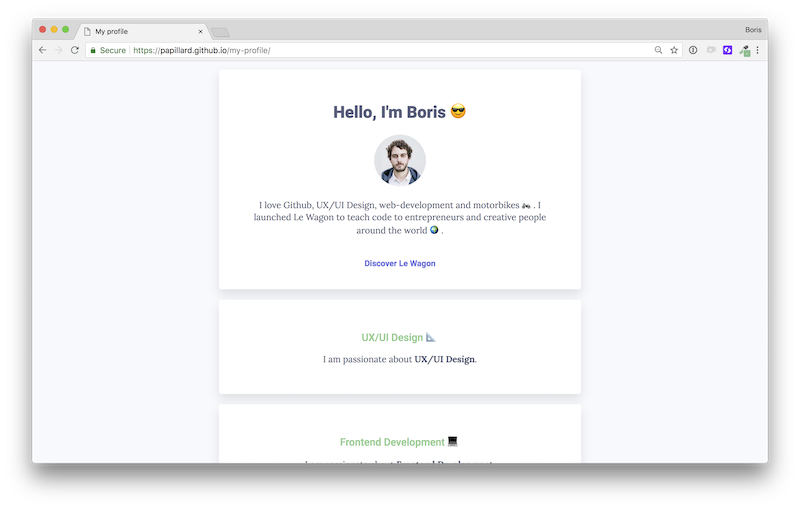

## Let's build your profile!
