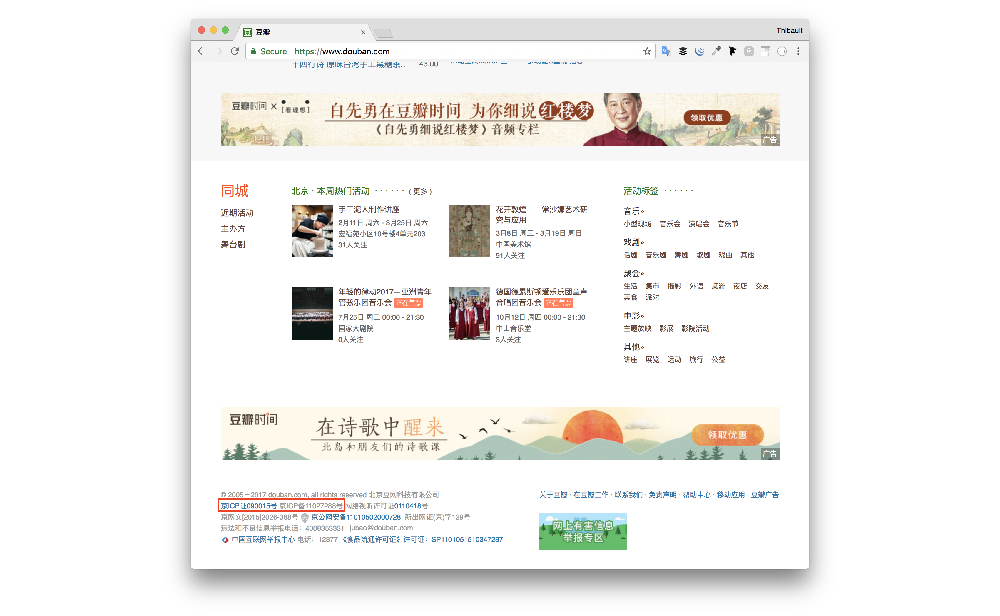
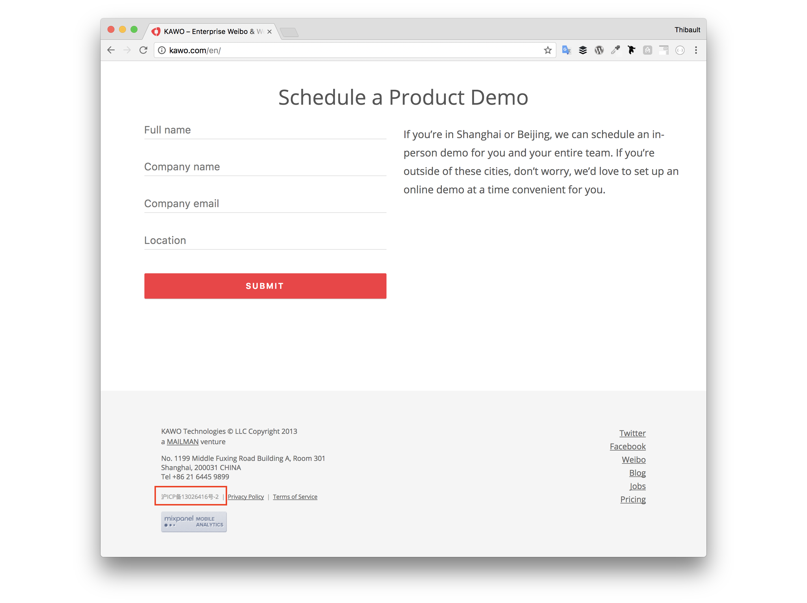
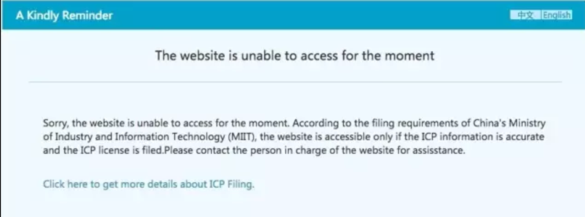
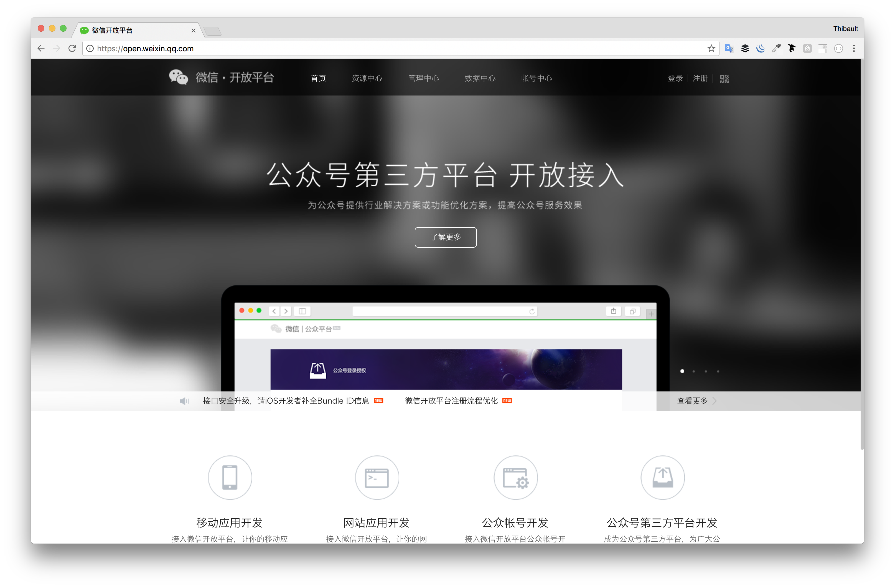
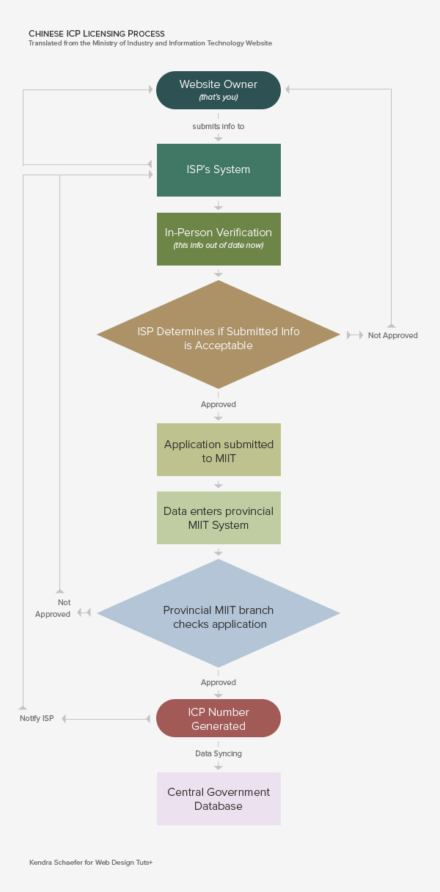
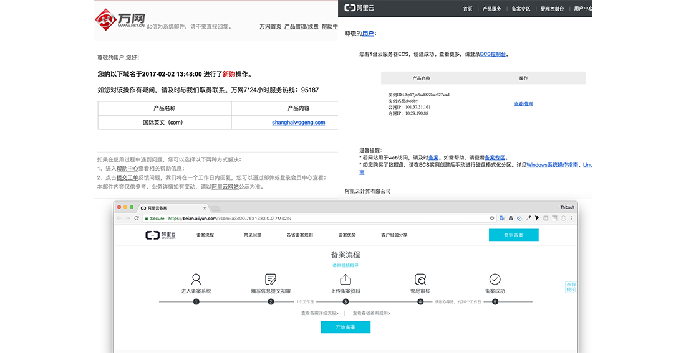
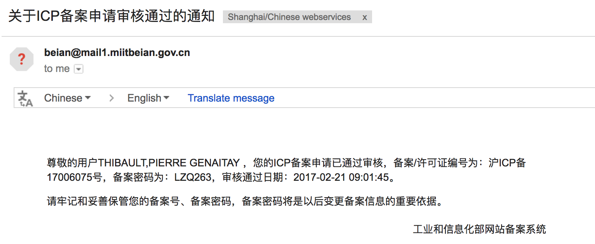

## ICP Beian - WTF?

- What
- Why
- How

------

## What

“ICP Beian” stands for the process of obtaining the Business ICP registration number that allows you to host your website on **a Mainland Chinese server.**

- ICP stands for “Internet Content Provider”
- 备案(Bei An) means “registration/filing”.

## Do I Need ICP Beian?

### YES #1

## Do I Need ICP Beian?

### YES #2

------

## Who?

Ministry of Industry and Information Technology ([MIIT](https://en.wikipedia.org/wiki/Ministry_of_Industry_and_Information_Technology))

------

## How?

**Requirements**

1. You rent a Mainland China server.
2. You own a Domain name.
3. You have a Chinese Company business license.
4. You fill in all applications forms - in Chinese only!

## How?

😕

## How?

### 😙 https://beian.aliyun.com/

## How?

## How?

- **ICP licenses** are tied to both a **particular IP** and a **particular domain name** registered in China
- You must provide both server **IP and domain** during the Bei An registration process.

## Timing

- 😏 Officially: 30 business days
- 😅 In reality: 3-4 days

## Cost!

- By yourself: it's free!
- By an agent: about from 2K to 10K RMB

------

## KEY TAKEAWAYS

- By law, a website hosted on China server MUST obtain ICP Beian.
- No ICP Beian, No Alipay/WeChat pay.
- Your company should be registered in China

### For more details

[Read this tutorial](https://webdesign.tutsplus.com/articles/chinese-icp-licensing-what-why-and-how-to-get-hosted-in-china--cms-23193) 🚀

