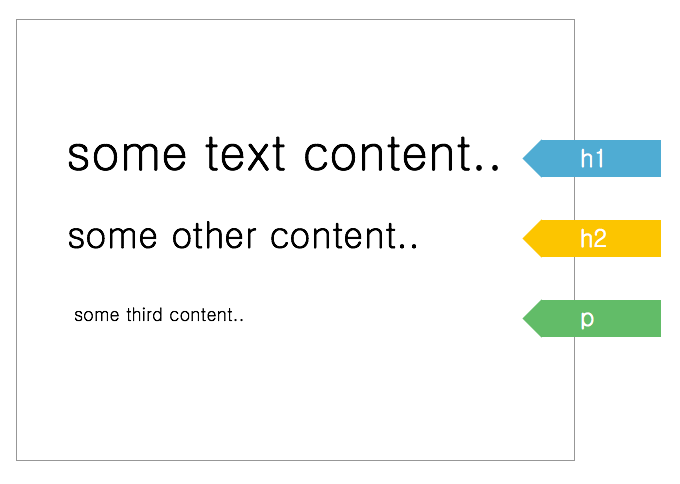
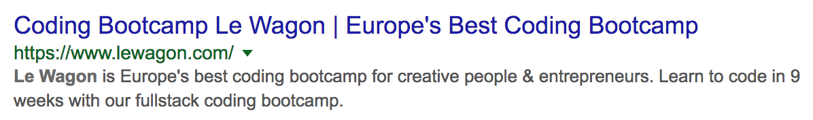
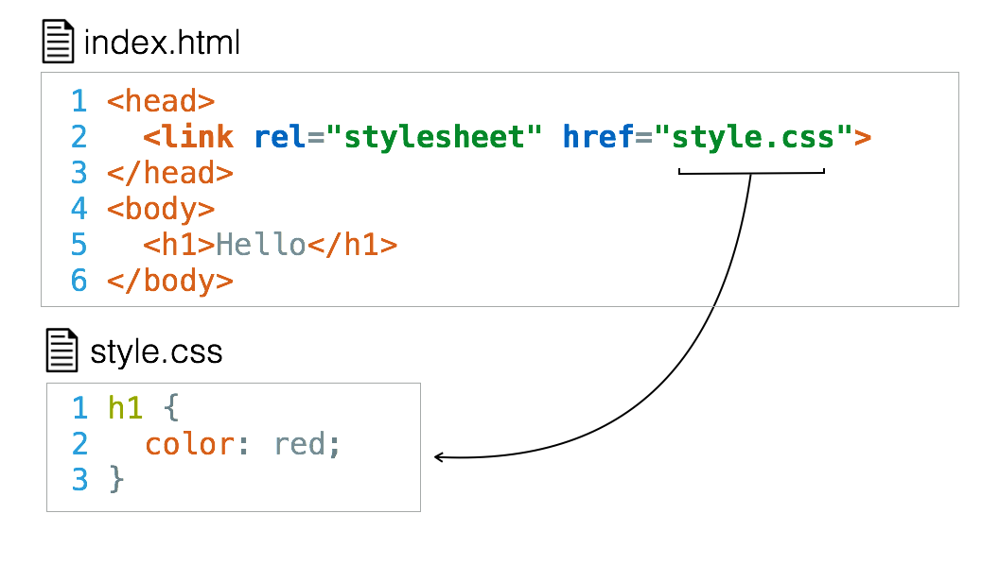
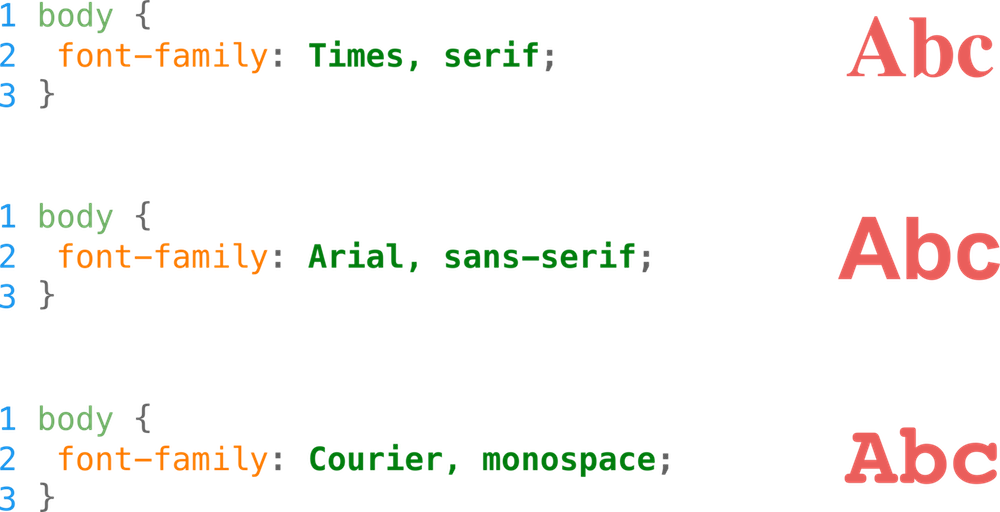
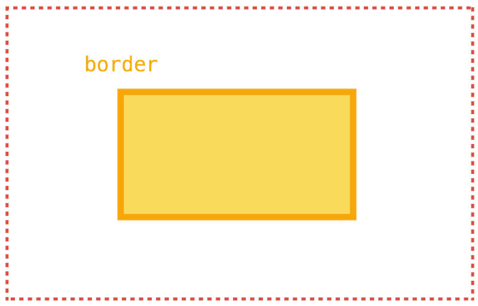
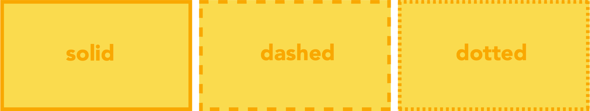
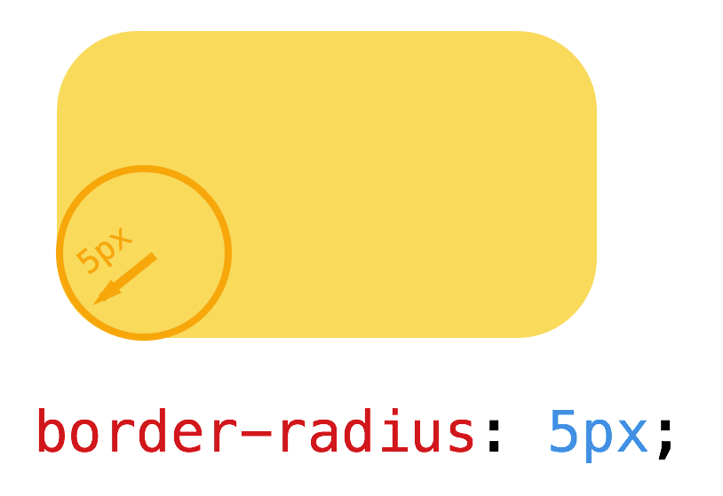
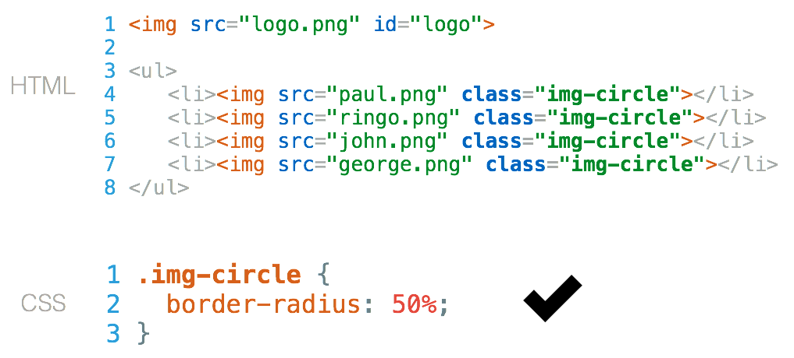
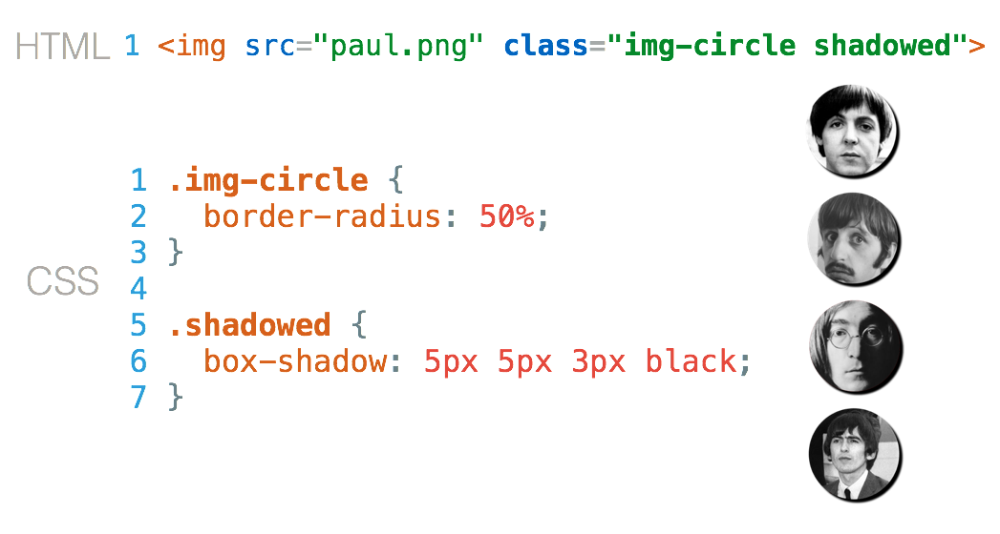

## Today's objectives

- Learn HTML / CSS basics
- Code your profile page [like this](https://papillard.github.io/my-profile/)
- Put it online with [Github Pages](https://pages.github.com/)

---

## Lecture Boilerplate

[https://github.com/lewagon/html-demo](https://github.com/lewagon/html-demo)

```bash
cd ~/code/$GITHUB_USERNAME
git clone git@github.com:lewagon/html-demo.git
cd html-demo
rm -rf .git
stt
```

---

## Front-end languages

The languages **your browser speaks**


---


It's a **markup** language (=== structure)

---

## HTML

Your page has different contents


---

### HTML Content

HTML tags help you **identify** content


---

### HTML in Your Browser

Hence, **browser default styles** will apply



---

### HTML with CSS

And you will also be able to apply **your own style rules** if you want


---

### HTML Skeleton

```html
<!DOCTYPE html>


<!-- end of file -->
```

---

```html
<!DOCTYPE html>
<html>


</html>
<!-- end of file -->
```

---

```html
<!DOCTYPE html>
<html>
  <head>

    <!-- Page's intelligence = meta tags -->

  </head>
  <body>

    <!-- Page's content = displayed on the page -->

  </body>
</html>
<!-- end of file -->
```

---

### HTML Head

```html
<!DOCTYPE html>
<html>
  <head>
    <title>Page Title. Maximum length 60-70 characters</title>
    <meta name="description" content="Page description. No longer than 155 characters.">
    <meta charset="utf-8">
  </head>
  <body>

  </body>
</html>
<!-- end of file -->
```

---

### HTML Head - Google Tags

```html
<head>
  <!-- Google result text-->
  <title>Coding Bootcamp Le Wagon | Europe's Best Coding Bootcamp</title>
  <!-- Google result description-->
  <meta name="description" content="Le Wagon is Europe’s best coding bootcamp for creative people & entrepreneurs. Learn to code in 9 weeks with our fullstack coding bootcamp.">
</head>
```



---

### HTML Head - Facebook Tags

```html
<head>
  <meta property="og:title" content="Le Wagon - The French innovative coding school">
  <meta property="og:image" content="facebook-card.jpg">
  <meta property="og:description" content="Le Wagon is the best French coding school for entrepreneurs. Checkout by yourself the projects of our students. You will be impressed.">
  <meta property="og:site_name" content="Le Wagon"/>
</head>
```


---

### HTML Head - Twitter Tags

```html
<head>
  <meta name="twitter:card" content="summary_large_image">
  <meta name="twitter:site" content="@Lewagonparis">
  <meta name="twitter:title" content="Le Wagon - The French innovative coding school">
  <meta name="twitter:description" content="Le Wagon is the best French coding school for entrepreneurs. Checkout by yourself the projects of our students. You will be impressed.">
  <meta name="twitter:creator" content="@Lewagonparis">
  <meta name="twitter:image:src" content="http://twitter-card.jpg">
</head>
```

---

### HTML Body

```html
<!DOCTYPE html>
<html>
  <head>
    <meta charset="utf-8">
    <title>Hello world</title>
  </head>
  <body>
    <h1>Hello buddies!</h1>
  </body>
</html>
<!-- end of file -->
```

---

### HTML Basic Syntax


---

### HTML Basic Syntax Example

```html
<a href="https://www.lewagon.com" target="_blank">
  Le Wagon
</a>
```

Result: [Le Wagon](https://www.lewagon.com/)

### HTML Quiz

- What is the name of the tag?
- What is the content?
- What are the 2 attributes (name and value)?

---

### HTML Tags - Headers

```html
<h1>[...]</h1>  <!-- Only one per page! SEO important -->

<h2>[...]</h2>
<h3>[...]</h3>
<h4>[...]</h4>
<h5>[...]</h5>
<h6>[...]</h6>
```

---

### HTML Tags - Paragraphs

```html
<p>
  Lorem ipsum dolor sit amet, consectetur adipisicing elit.
  Veritatis laboriosam mollitia autem at ab omnis iure quis
  asperiores inventore eos nam aut iusto officiis deserunt
  nihil, sequi tempore impedit quae?
</p>
```

---

### HTML Tags - Emphasize

```html
<p>
  You can emphasize <em>some words</em>,
  and even <strong>more if needed</strong>
</p>
```

---

### HTML Tags - Lists

```html
<h2>Shopping List</h2>
<ul>
  <li>Milk</li>
  <li>Butter</li>
</ul>

<h2>World Cup 2018</h2>
<ol>
  <li>France</li>
  <li>Croatia</li>
  <li>Belgium</li>
  <li>England</li>
</ol>
```

---

### HTML Tags - Images

```html

```

---

### HTML Tags - Forms

```html
<form>
  <input type="email">
  <input type="password">
  <input type="submit" value="Log in">
</form>
```

---

### HTML Resources

- [codeguide.co](http://codeguide.co/)
- [MDN reference](https://developer.mozilla.org/en/docs/Web/HTML/Element)

---

### HTML Livecode

Let's add some HTML content to our profile page!


---

## CSS


---

### CSS - What is it

- Cut the `<head>` on [medium.com](https://medium.com/) with Chrome dev tool.
- This is how a website looks like without CSS 😬

---

### CSS - Linking to HTML Doc



---

### CSS - Syntax


---

### CSS - Vocabulary


---

### CSS - Example


---

### CSS - Adding Colors

```css
color: #FF530D;
color: rgb(255, 83, 13);
color: rgba(255, 83, 13, 1.0);
```

---

### CSS - Color Tips

```css
body {
  color: rgb(10, 10, 10);
}
```

- **RGB** stands for **R**ed **G**reen **B**lue
- each value is between 0 and 255
- for same values of R, G and B, you are on the grey scale


---

### CSS - Text vs Background


---

### CSS - Adding a Background Image


---

### CSS - Fonts



---

### CSS - Text Size and Spacing


---

### CSS - Text Decoration


---

### CSS - Text Alignment


---

### CSS - Font Weight


---

### CSS - Google Fonts

Make your shopping on [Google fonts](http://www.google.com/fonts).

- **Open-Sans** 👉 `<body>`
- **Raleway, Montserrat, Varela Round, etc...** 👉 `<h1>`, `<h2>`, `<h3>`

---

### CSS - Font Awesome

[Font Awesome](https://fontawesome.com/) is a font of icons, really useful!

```html
<!-- cdn link to paste in your <head> -->
<link rel="stylesheet" href="https://use.fontawesome.com/releases/v5.0.10/css/all.css">
```

---

### CSS - Tips

Use the inspector, then copy the `css` in Sublime.


---

### CSS - Fonts & Colors Livecode

Let's design our fonts and colors using [Google fonts](https://fonts.google.com/).

---


---

### CSS - Div and Box Model

---

### CSS - In Real Life


---

### CSS - Lot's of Boxes


---

### CSS - Box Model


---

### CSS - Borders



---

### CSS - Borders Syntax

```css
div {
  border: 1px solid red;
}
/* or */
div {
  border-top: 1px solid red;
  border-right: 2px dotted black;
  border-bottom: 1px dashed green;
  border-left: 2px dotted black;
}
```



---

### CSS - Border Radius



---

### CSS - Border Radius Syntax


---

### CSS - Box Shadow


---

### CSS - Units

```css
/* Absolute */
p {
  width: 50px;
}

/* Relative to parent */
p {
  width: 50%;
}

/* Relative to font size */
p {
  width: 2em;
}
```

---

### CSS - Design Tips

```css
background: white;                         /* White background */
padding: 30px;                             /* Internal space */
border-radius: 4px;                        /* Small radius */
box-shadow: 0 10px 30px rgba(0,0,0,.1);    /* Light shadow */
```

---

### CSS - Centering

```css
width: 300px;        /* Set the width */
margin: 0 auto;      /* Set automatic margins on right/left */
```

### CSS - Structuring Livecode

Let's **add some div** in our HTML and play with the box model with Chrome Dev tool.

---

## ID & Class

---

### ID & Class - Example

How do we style only the logo?


---

### ID & Class - Example Solution


---

### ID & Class - Example 2


---

### ID & Class - Solution 2



---

### ID & Class - Example 3

What do you think? ID or Class?


---

### ID & Class - Solution


---

### ID & Class - Advanced Solution



---

### ID & Class - Combined Solution


---

### ID & Class - Quiz

Which one is **more explicit** (tells what it does)?

- `.btn-red` or `.btn-signup`?
- `.background-blue` or `.background-home`?
- `.img-user` or `.img-circle`?

Change your mindset => **think graphical**

---

### ID & Class - Naming Convention

```css
.component-shape
/* Examples*/
.text-center
.text-justify
.btn-red
.btn-green
.btn-big
.list-inline
.form-horizontal
.img-rounded
.img-circle
```

---

### ID & Class - Selectors

---

### ID & Class - Element Selectors

```html
<!-- index.html -->
[...]
<body>
  <h1>Hello World</h1>
</body>
```

combined with

```css
/* style.css */
h1 {color: red;font-weight: bold;}
```

makes the `h1` elements red and bold.

---

### ID & Class - Class Selectors

```html
<!-- index.html -->
[...]
<body>
  <p>This paragraph is not justified</p>
  <p class="text-justify">This one is</p>
  <p class="text-justify">This one also</p>
</body>
```

combined with

```css
/* style.css */
.text-justify {
  text-align: justify;
}
```

will make only the second and third paragraphs justified.

---

### ID & Class - ID Selectors

```html
<!-- index.html -->
<body>
  <div id="banner">
    <h1>Le Wagon</h1>
    <p>We bring tech skills to creative people</p>
  </div>
</body>
```

combined with

```css
/* style.css */
#banner {
  background-image: url("example.jpg");
  background-size: cover;
}
```

will put an image background on the **unique** div with `id="banner"`.

---

### ID & Class - Descendent Selectors

```html
<!-- index.html -->
<body>
  <div id="banner">
    <h1>Le Wagon</h1>
    <p>We bring tech skills to creative people</p>
  </div>
</body>
```

combined with

```css
/* style.css */
#banner h1 {
  color: white;
}
```

`h1` **children** of the element `id="banner"` will be white.

---

### ID & Class - Direct Children Selectors

```html
<!-- index.html -->
<body>
  <ul id="navigation">
    <li><a href="#">Home</a></li>
    <li><a href="#">Team</a></li>
    <li><a href="#">Contact</a></li>
  </ul>
</body>
```

combined with

```css
/* style.css */
#navigation > li > a {
  color: blue;
}
```

`a` **direct children** of `li` **direct children** of `id="navigation"` will be blue.

---

### ID & Class - Grouping Selectors

```css
/* style.css */
h1, h2, h3 {
  font-weight: bold;
}
```

is a shortcut syntax for

```css
/* style.css */
h1 {
  font-weight: bold;
}
h2 {
  font-weight: bold;
}
[...]
```

---

### ID & Class - Psuedo Selectors

```css
/* style.css */
a {
  color: red;
  text-decoration: none;
}

a:hover {
  text-decoration: underline;
}
```

will make links underlined when the mouse hovers over them.

See [other pseudo classes](https://developer.mozilla.org/en/docs/Web/CSS/Pseudo-classes)

---

### ID & Class - Quiz 2

```html
<!-- index.html -->
<body>
  <p class="text-red">
    Lorem ipsum dolor sit amet, consectetur adipisicing elit.
  </p>
</body>
```

combined with

```css
/* style.css */
p {
  color: black;
}
.text-red {
  color: red;
}
```

---

### ID & Class - Quiz 3

```html
<!-- index.html -->
<body>
  <p id="bio" class="text-red">
    Lorem ipsum dolor sit amet, consectetur adipisicing elit.
  </p>
</body>
```

combined with

```css
/* style.css */
.text-red {
  color: red;
}
#bio {
  color: green;
}
```

---

### ID & Class - Selector Specificity

```css
p {                 /* least specific */
  color: black;
}
.text-red {         /*        ↓       */
  color: red;
}
#bio {              /* most specific  */
  color: green;
}
```

Check out the [specificity calculator](http://specificity.keegan.st/)

---

### ID & Class - Livecode

Let's **finish our live-code** and get this [final result](https://papillard.github.io/my-profile/)!


---

## Let's build your profile 🚀
