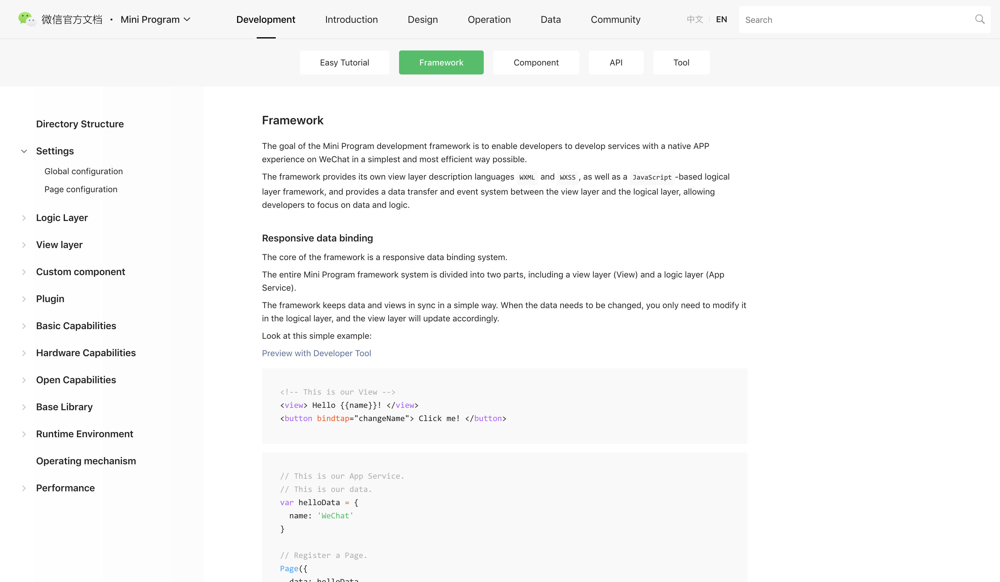
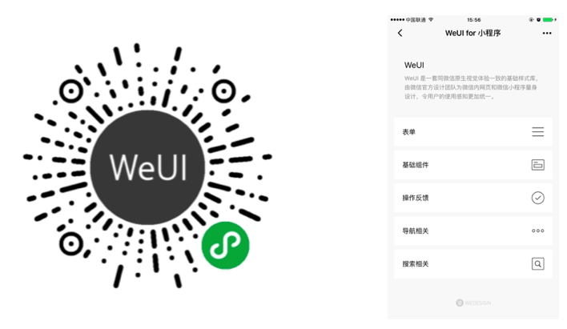
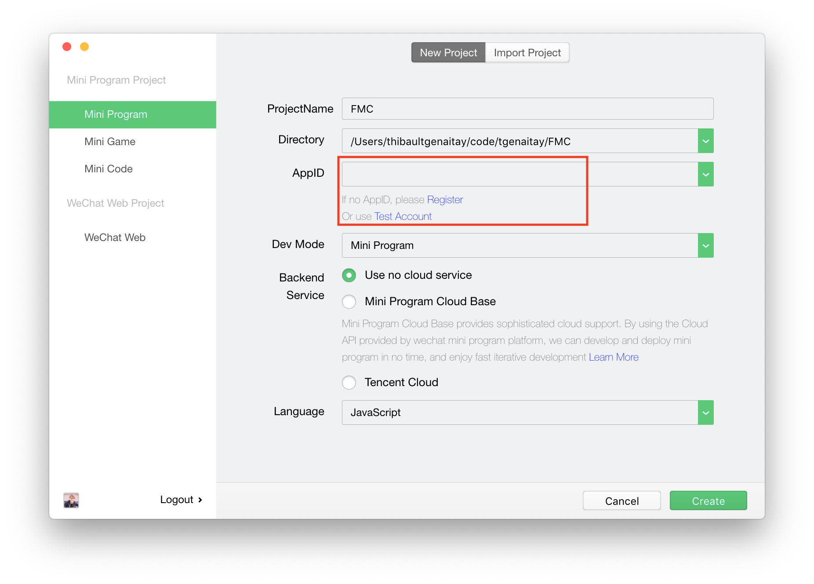
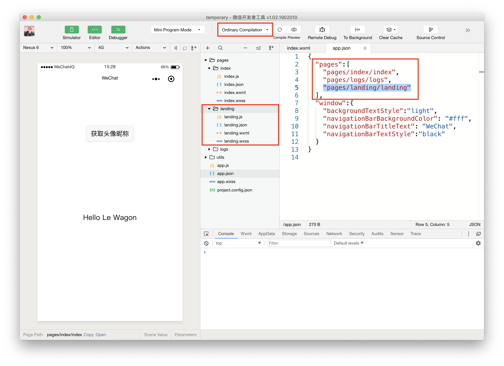

### Assets

### WeChat MP Documentation

[Your new best friend, bookmark it!](https://developers.weixin.qq.com/miniprogram/dev/index.html)



### WeUI for 小程序

(Scan QR with WeChat)
<https://github.com/Tencent/weui-wxss>


------

### Agenda

We will build 1 WeChat app in this course

#### ["F*** My Code"](https://www.fmylife.com/)

------

### Let's setup a Mini Program!

We'll use WeChat's developer tools moving forward.

[Download the stable build now](https://developers.weixin.qq.com/miniprogram/dev/devtools/download.html)



Setup with a tourist appID


Quick tour

### Code structure 🤔

There are 4 file types in a WeChat mini program project:

- `.wxml` same as HTML
- `.wxss` same as CSS
- `.js` logic
- `.json` configuration

### Your app is ruled by the following files:

- `app.js` Mini Program functions
- `app.json` Mini Program configuration
- `app.wxss` Global CSS stylesheet

### How to create a new page

Mandatory page files (`.wxml`, `.wxss`, `.js`, and `.json`) can be generated by adding a new route inside `app.json`



Tip: You can customize the startup page with a new compilation mode.

### WXML syntax (same same but different)


### JSON files for configuration

- Customize your app (Eg: app/page title, navigation bar color)
- Setup tabs
- Setup components

[See all options here](https://developers.weixin.qq.com/miniprogram/dev/framework/config.html)

### Live code 1: Landing page 💪

We'll use the [Banner Component from Le Wagon UI](https://uikit.lewagon.com/documentation#banner).

### Live code 2: Stories page 💪

Save time using [Le Wagon's card component](https://uikit.lewagon.com/documentation#card_product) (but no need of a product image).

------

Not challenging enough?
It was just the beginning...

------

## Let's make our pages alive!

Framework notions:

- Life cycle
- Data stores
- Data binding
- Logic control

### Look at the JS structure

- 1 main function: **Page({...})** or **App({...})**
- 1 data store: **data: {key: value}** or **globalData: {key: value}**
- Lifecycle functions: **onLoad**, **onLaunch**,...
- Custom functions

### What is the life cycle of an app?

We can **console.log** the name of each function to see in which order they are called. Try with `onLoad`, `onShow`, `onReady` ... see the difference.

Life cycle functions = trigger code at specific time in the application


### Example

We can create functions and trigger them in the onReady life cycle method

```
//index.js
Page({
  testFunction: function() {
    console.log('test')
  },
  onReady: function() {
    this.testFunction()
  }
})
```

To access the function, do not forget the syntax: `this.functionName()`

### Where do we store data?

1. **local data**: lives only inside a page
2. **global data**: shared across the whole app
3. **cache**: persists in your user's phone
4. **server**: through APIs!

### View local data inside WXML

We can store data inside a JS file and access it in WXML. This is called **data binding**.

```
//index.js
Page({
    data: { name: 'Allen' }
})
<!-- index.wxml -->
<text> My name is {{name}}</text>
```

WXML allows much more than HTML: it's a **"templating language"**!

### setData({ })

We can update some value in our local data storage

```
//index.js
Page({
    data: { text: "Original data" },
    testFunction: function() {
        console.log(this.data.text)
        this.setData({
            text: 'F My Code!'
        })
    },
    onReady: function() {
        this.testFunction()
  }
})
<!-- index.wxml -->
<text> {{text}}</text>
```

### this.data

We can access the local data inside our JS code

```
//index.js
Page({
    data: { text: "original data" },
    onReady: function() {
        console.log(this.data.text)
  }
})
```

### Triggering a function (example 1)

We can trigger a function from our page `.wxml` file by adding the **bindtap** argument to an element

```
//index.js
Page({
    testFunction: function() {
        console.log('Trigger testFunction from Button')
  }
})
<!-- index.wxml -->
<button bindtap="testFunction">OK</button>
```

### Triggering a function (example 2)

```
//index.js
Page({
  myToast: function() {
      wx.showToast({
          title: 'SUCCESS'
        })
    }
})
<!-- index.wxml -->
<button bindtap="myToast">Show Success Toast</button>
```

[showToast API documentation](https://developers.weixin.qq.com/miniprogram/dev/api/wx.showToast.html)

### WXML is an advanced view layer

We can use special attributes on `<view>` and `<block>`

1. **wx:for** control attribute: bind an array
2. **wx:if** conditional attribute: bind a statement

### wx:for

Example 1: Simple version (`item` is default)

```
<!-- index.wxml -->
<view wx:for="{{['Restaurant 1','Restaurant 2','Restaurant 3']}}">
    <view>{{item}}</view>
</view>
```

Example 2: Full version with custom index and item

```
<view wx:for="{{['Restaurant 1','Restaurant 2','Restaurant 3']}}"
wx:for-index="index" wx:for-item="restaurant">
  <view>{{index}}: {{restaurant}}</view>
</view>
```

### wx:for

We can also take the data directly from the page’s data!

```
//index.js
Page({
  data: {
    thingsIcoded:
    [
        { module: "Programming", name: "Black Jack" },
        { module: "OOP", name: "Food Delivery" },
        { module: "Databases", name: "Hacker News" },
        { module: "Front", name: "Chatroom" },
        { module: "WeChat", name: "FMC" }
    ]
  },
})
<!-- index.wxml -->
<view wx:for="{{thingsIcoded}}" wx:for-item="thing">
  <view>
    {{thing.module}} | {{thing.name}}
  </view>
</view>
```

### wx:if

We can use **wx:if** to hide or show card components

```
<view wx:if="{{true}}">...</view>
<view wx:if="{{false}}">...</view>
```

### wx:if

The logic can be directly in the WXML file

```
<view wx:if="{{true}}">Fuck My Code 1</view>
<view wx:if="{{1 === 1}}">Fuck My Code 2</view>
<view wx:if="{{1 === 2}}">Fuck My Code 3</view>
```

### wx:if

We can also take statements directly from the page's data object

```
//index.js
Page({
    data: {
        trueStatement: true,
        falseStatement: false
    }
})
<!-- index.wxml -->
<view wx:if="{{trueStatement}}">Fuck My Code 1</view>
<view wx:if="{{falseStatement}}">Fuck My Code 2</view>
```

### Live code 3: Improve the view (add multiple cards) 💪

We want to show more than one story in the **stories page** without repeating the same WXML markup.

------

### Global Data

Because storing in pages is too mainstream

- Every Javascript page can access the **globalData** object from `app.js`
- But WXML cannot access directly your **globalData**...

```
//app.js
App({
  globalData: {
    userInfo: { nickName: "salmon", gender: 1 }
  }
})
//index.js
let app = getApp()

Page({
  data: { userInfo: app.globalData.userInfo }
})
<!-- index.wxml -->
<view>Hello {{userInfo.nickName}}</view>
```

### Where to store your data?

#### Follow these guidelines..

- Data for authentication 👉 **cache**
- Data used everywhere in the app (ex: userId) 👉 **global Data**
- Data relevant only to the page 👉 **local Data page.js**

### Live code 4: Create a Post Page 💪

We'll use a form to add new FMC stories in a global data storage.

#### Congratulations, you're a mini program developer!
