# Elema (or Meituan) Waimai

## Core User Journey

### Restaurant Index


### Meals Index


 


### Orders


Time to build a Food Delivery App.

The software is designed for **one restaurant only **(have you heard of 三只松鼠?). No need to cater (no pun intended 😉) for a multi-restaurant one (e.g. you don't need a `restaurant` table).

So just for this challenge, we'll skip restaurants index and use meals as the landing page. You can add multiple restaurants functions yourself by following the previous Dianping exercise. 

We'll also focus on the **core pages and user interactions**, and dive into the **orders and order management system**. In later courses, you learn to make a full ecommerce store with store layouts, shopping carts, and discounts.


### Order Management


Deliverers and managers share the order index view. An order is **opened** by the customer.  The manager marks it **ready** for pickup. Customer waits as the deliverer is **delivering,** then marks it **delivered**. So the order states are "Opened," "Ready," "Delivering," and "Delivered."

Other states like "Cancelled" and "Paid" can be added too this way but for our exercise, we'll keep it simple to just three states mentioned above.


The main components are:

- **Employees** (restaurant managers, delivery people)
- **Customers** of the restaurant
- **Meals** that can be ordered
- **Orders** made by customers, and assigned to a given delivery guy.

## 1 - We need Backend (as a Service) !

Before diving into our app code . We first need a set of API endpoints made by our BaaS.  Review Restful APIs principles from the first DB lecture for inspiration.

Based on the user journey above, we design the schema to model the data and the relationships.

### Data schema:


The key to the design is that a `user` can have many `meals` through `orders`, and that a `meal` can be ordered by many `users`. This many-to-many relationship is like the `review` joint table from the previous exercise (Dianping).

In this case `order` is our **joint table** and the central part of the app that ties all the other data (and functions) together.


To make this app, follow this strategy of:

1. working on the BaaS tables

2. getting data in the JS file with the SDK

3. showing data in the view file

4. add user interactions in views

5. handle interactions with JS, such as:

   - get user input
   - send data to BaaS
   - change page data to update view or show new interactions
   - navigate to another page


Once your tables are implemented, test them with the BaaS SDK! Make sure your user actions work before moving on to the next feature.


Remember when at a good spot, always `commit` and `push`!


Then let's move to the app.


## 2 - (Meal)


### List all meals

Here are the **user actions** we want to implement:

- `List` all meals available in the restaurant
- `Add` a new meal


Starting with the index page in the previous exercise app (Dianping), substitute meals in place of restaurants.

When displaying price, remember to divide number cents by 100:
```xml
<view class="p">{{meal.price / 100}} Kuai</view>
```

Tweak the styling to make it look like a store!

Done? Good! Time to `commit` and `push` to your repo at every finished stage (e.g. code has to be fully working, though features are not fully completed). Good to get in the habit.


### Adding a new meal


Keeping on the strategy of following the template of the previous exercise, we use the new page to create a meal. Using the `meal` table for the data, modify the view, and js file correspondingly.


Forms take every input as string. So how do we get a number for the price? Use `parseInt` like so:

```js
// making meal data from form input in new.js
let data = {
  name: name,
  price: Number.parseInt(price),
  photo: photo,
}
```


## 3 - Customer

We need to keep a list of all our customers. Each customer has a name and an address.

We already have a `user` table in the BaaS ( stored as `_userprofile` and accessed with `User` object from the SDK). When a new customer signs up, the BaaS will create a user record for him.


## 4 - Employee

The restaurant has two types of employees, **managers** and **delivery guys**. They're both still `User` objects. We don't use the app to create them. The BaaS can add these directly through the JS SDK. Employees are then managed in the built-in CRM on the BaaS dashboard:

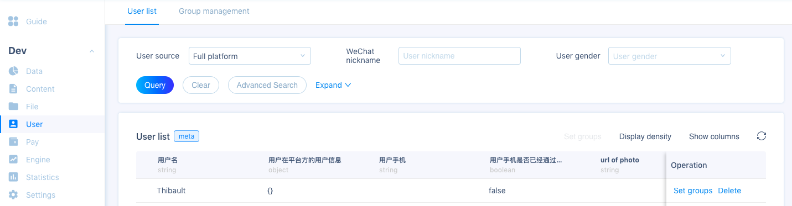


Manually add employees. You're given this exported spreadsheet (called a CSV file):

```csv
username,password,role
Paul,secret,manager
John,secret,deliverer
```

Remember how you registered a user with WeChat console?

```js
// in the WeChat IDE JS console
wx.BaaS.auth.register({ username: username, password: password }).then(user => { console.log(user)})
```


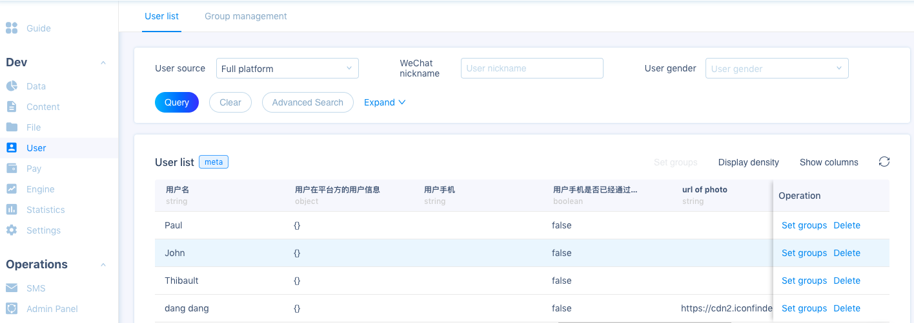


Add the `role` (string) column to the  `_userprofile` table:

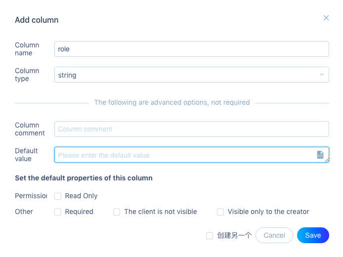


Then the roles can be set by editing the table rows (or through the SDK - like how we set user's photo in the previous exercise). Later this `role` will be used to customize the app for each type of user!


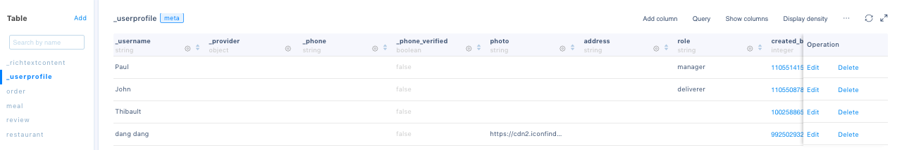

For now, check that we can sign up, log in, and log out of the app using the `user` page from the previous app!


## 5 - (`Order`) Time to link all the tables!

An order is taken for a **customer**, containing a **meal** (to simplify things, let's say that an order can only contain **one meal**) and is then assigned to a given **delivery guy**. Finally, the `order` table needs to record whether or not the meal has been delivered.

Here's where our tables link up. First, create the `order` table on the BaaS.

According to the schema order has `address` (string), `state` (string), `customer` (pointer), `deliverer` (pointer), and `meal` (pointer).

`state` should have a `default value` of  `opened` - the initial state when an order is created.

The two pointers are foreign keys to the `_userprofile` table, and the second pointer to the `meal` table. You can see that it's ok to have two pointers to the same table because a user can have many roles.


### Creating an order

We can put a customized order button on the meal cards on the `index` page:

```xml
<!-- index.wxml -->
<view data-id="{{meal.id}}" class="order" bindtap="orderMeal">Order</view>
```

```css
<!-- index.wxss -->
.order {
  background-color: transparent;
  border: 1px solid rgba(0, 0, 0, 0.4);
  text-align: center;
  padding: 10px;
  border-radius: 10%;
  margin-top: 30px;
  width: 62px;
  margin-left: auto;
  margin-right: auto;
}
```

Then following steps similar to creating a meal in the section above:

```js
//index.js in Page
orderMeal: function (event) {
  const data = event.currentTarget.dataset;
  let id = data.id

  let newOrder = {
    // To be figured out in the next step
  }

  let Order = new wx.BaaS.TableObject('order')
  let order = Order.create()
  order.set(newOrder).save().then(res => {
   // to be figured out in following steps
  })
}
```

Don't forget to remove `bindtap` on the `card-product` element from previous exercise if still there.

The customer is the currently logged in user.

In `onLoad` of `index.js`, check for `currentUser` with `wx.BaaS.auth.getCurrentUser()` like in previous exercise. Then `page.setData({ currentUser: user })` where user is either the returned logged in `user`, or `null`.

We can then check if `user` is `null` and redirect to the `user` page to log in.

```js
//index.js in orderMeal function
const data = event.currentTarget.dataset;
let meal_id = data.id
let currentUser = this.data.currentUser

if (!currentUser) {
  wx.switchTab({
    url: '/pages/user/user' // logged in
  });
} else {
  // create order
}


```

Do we need to specify order `state`? Its `default value` configured in the BaaS will be set on creation, so can skip it!


#### Address

We check WeChat for user's addresses - leveraging WeChat's built-in API. You will see more built-in functions later in the course.


```js
wx.chooseAddress({
  success (res) {
    console.log(res.userName)
    console.log(res.postalCode)
    console.log(res.provinceName)
    console.log(res.cityName)
    console.log(res.countyName)
    console.log(res.detailInfo)
    console.log(res.nationalCode)
    console.log(res.telNumber)
  }
})
```

Gets for example

```
John Doe
510000
Guangdong Sheng
Guangzhou Shi
Haizhu Qu
397 Xingang Middle Rd, KeCun
510000
020-81167888
```


So we select fields we need inside the `else` block in `orderMeal` function's create order code:

```js
//index.js in orderMeal function "else" block, replace "// create order"
wx.chooseAddress({
  success(res) {

    let address =
      res.userName + " " + //receiver name, might be different than who's ordering
      res.provinceName + " " +
      res.cityName + " " +
      res.countyName + " " +
      res.detailInfo

    let newOrder = {
      meal: meal_id,
      customer: currentUser.id.toString(),
      address: address
    }

    let Order = new wx.BaaS.TableObject('order')
    let order = Order.create()
    order.set(newOrder).save().then(res => {
      // to be figured out in the next step
    })
  }
})
```
Subtle but important: we save the `order` after the address responds `success` , in its handler function

This is again because **async processes** like requesting for addresses needs waiting, and we only create the order if the address request comes back successfully.

What does the user want to see after an order? Probably the order state so he can check the order! So we go to the orders page.  `reLaunch` is used here so they cannot go back in history after ordering - a standard practice.

```js
order.set(newOrder).save().then(res => {
  wx.reLaunch({
    url: '/pages/user/user' // show list of orders
  });
})
```


Now we show all the orders in the user dashboard:

### List all orders (user dashboard)

When you run the food delivery app, you can see all the meals. But to order a meal, or see your dashboard (in `/pages/orders/orders`), you need to **sign in**.


The dashboard that you then see should be **dependent on your role**.


Customer dashboard:

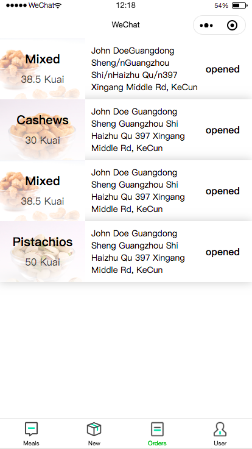


Manager dashboard:

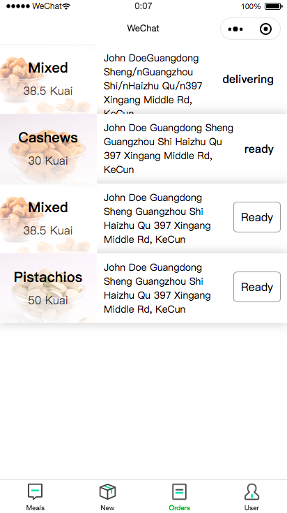


Deliverer dashboard:

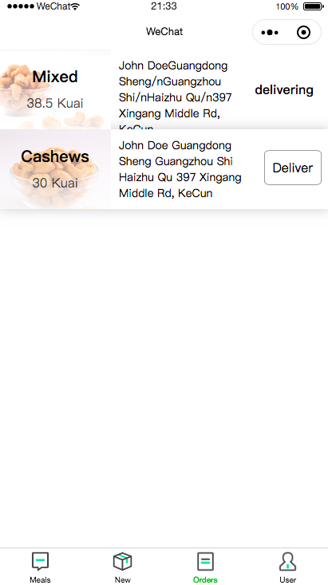


We can implement a **login** system that shows one of the three order ** dashboards** depending on the user role: one dashboard for the **manager**, another dashboard for the **delivery guy**, and for the **customer**.

This is possible because each login creates a different **session** for different users.


Let's go through the user journey for each of the roles to finish the app.

To help development, we use login forms created in the previous exercise from the user page.


### Customer journey


The following **user stories** for customers are to be implemented in the app:

- As a customer, I can log in
- As a customer, I can view all the meals
- As a customer, I can order a meal
- As a customer, I can view all my orders


All but the last story is **already made** according to instructions above. Now we **just create the customer dashboard** to show all his orders.


Define a new page at `pages/orders/orders`

```js
//app.json defining pages
"pages": [
  "pages/index/index",
  "pages/new/new",
  "pages/orders/orders",
  "pages/user/user"
]
```

Create a tab bar order item with a new icon (e.g. on iconfont.cn)

```js
//app.json in tab bar json
{
  "pagePath": "pages/orders/orders",
  "text": "Orders",
  "iconPath": "/images/orders.png",
  "selectedIconPath": "/images/orders.png"
},
```


Now load data from the order table and show on its index page.


Each order should show image of the *meal* and *price** *delivery address* with *receiver name*, and the *order state*:

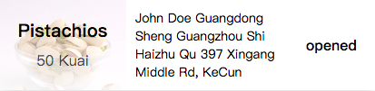


Use the `expand` function to include meal info with the order query, like we did for a previous exercise:

```js
//order.js in onLoad
Order.expand(["meal"]).find().then(page.getRequestData)
```

`getRequestData` sets the page data to the request response - the same function from previous exercise. 

Try to create the cards **without looking at the solutions below**. See how far you get! It'll make a difference when you **do your own projects** without solutions later on.

Iterate over the `orders`

```xml
<block wx:for="{{orders}}" wx:for-item="order">
  <view class="card-product">
    <view class="card-product-infos" style="background-image: linear-gradient(rgba(255,255,255,0.3), rgba(255,255,255,0.9)), url('{{order.meal.photo}}'); background-size: cover;">
      <view class="h2">{{order.meal.name}}</view>
      <view class="p">{{order.meal.price / 100}} Kuai</view>
    </view>
    <view class="address">
      {{order.address}}
    </view>
    <view class="state"> {{order.state}} </view>
    <!-- <view data-id="{{order.id}}" class="order" bindtap="orderorder">Order</view> -->

  </view>
</block>
```

Then add style - just to get you started - feel free to improve on the design!

```css
/* pages/orders/orders.wxss */

.card-product {
  overflow: hidden;
  height: 100px;
  background: white;
  box-shadow: 0 0 15px rgba(0, 0, 0, 0.2);
  display: flex;
}

.card-product-infos {
}

.card-product-infos .h2 {
  font-size: 20px;
  font-weight: bold;
  text-align: center;
  width: 100px;
}

.card-product-infos .p {
  font-size: 16px;
  line-height: 1.4;
  opacity: 0.7;
  margin-top: 8px;
  text-align: center;
}

.card-product .state {
  margin: auto;
  font-weight: bold;
  text-align: center;
  padding-right: 20px;
}

.card-product .address {
  font-size: 14px;
  padding: 10px;
}

.card-product .card-product-infos {
  padding: 20px;
  margin-left: auto;
  margin-right: auto;
}

.order {
  background-color: transparent;
  border: 1px solid rgba(0, 0, 0, 0.4);
  text-align: center;
  padding: 10px;
  border-radius: 10%;
  margin-top: 30px;
  width: 62px;
  margin-left: auto;
  margin-right: auto;
}
```


Let's test it! Make an order and Do you see the order?

Now log out - do you still see the order? **Only you** should see your **own** order!

For this, we modify the ACL for the `order` table by clicking the "..." on the top right and "Edit table"


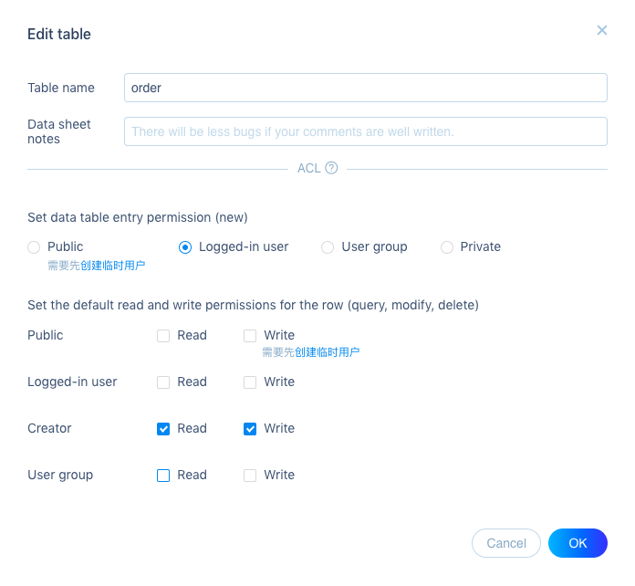


By setting read and write permission to just the creator, users can only see their own orders.

Answer "OK" when prompted about permissions applying to only new data.  Delete any old orders created during testing. 


Dive deeper: What is ACL? 
> ACL (Access Control List), also known as access control list, is an access control method based on an access control list. Each object corresponds to a serial body. The access control list describes the individual access controls for each object and records the permissions of all subjects that can access the object.

In other words, the ACL decides who can see, or alter the data. Your file system uses it too  (e.g. in command line when you type ls -l , permissions are coded as the `drwxr-xr-x` before the file names). It's a basic principle of data security. 👮‍♂️💪 


Lastly, users have to log in to see the orders dashboard. Remember how to check if there's a [user logged in](https://doc.minapp.com/js-sdk/account.html#获取-currentuser-对象)? 

Hint: use same code from `user.js` :

```js
// index.js in onLoad()
const page = this
wx.BaaS.auth.getCurrentUser().then(user => {
  // user 为 currentUser 对象

  console.log(user)
  page.setData({
    currentUser: user
  })

}, error => {
  console.log(error)
  page.setData({
    currentUser: null
  })
})
```


It doesn't make sense to just show nothing, so add a redirect to user login page in the `error` handling function:

```js
wx.switchTab({
  url: '/pages/user/user' // logged in
});
```


Note: This code is actually repeated on many of our pages. When we learn WeChat Login later on in the course, we will move this code to `app.js` where code for all the pages goes.


Finished? Great work :) Remember to `commit` and `push`.


### Employee journey


The following **user stories** are to be implemented for employees (managers and deliverers):

- As an employee, I can log in
- As a manager, I can view all the meals
- As a manager, I can add a meal
- As a manager, I can edit a meal
- As a manager, I can view all the orders
- As a manager, I can mark an "opened" order form a customer "ready" to pickup for a delivery guy
- As a delivery guy, I can view my "ready" orders for pickup
- As a delivery guy, I can mark a "ready" order as "delivering"
- As a customer, I can mark a "delivering" order as "delivered"

First three meal stories are already implemented. We start with either the order stories, and then do the edit meal story. 


#### Orders

The manager is an employee who sees *all orders*, with meal (image, name, and price), delivery address, and receiver 


Let's make Paul (and John) an employee in the Baas. in the "User" left menu, click on the "Group management" tab bar at the top. Then click "Add a group"


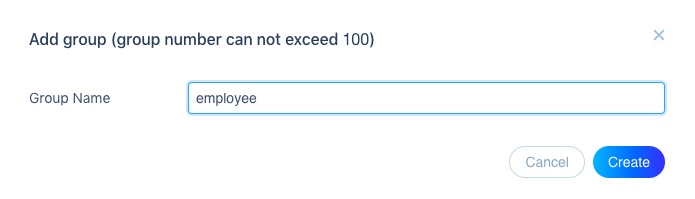


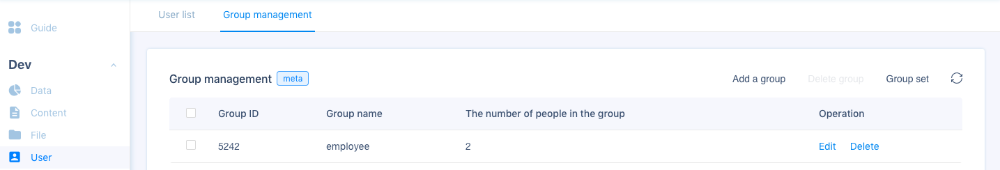


Then back to "User list" tab bar, and click "Set groups" under "Operation" column to the right of Paul's data. 

Select the `employee` group created in the previous step, and save.

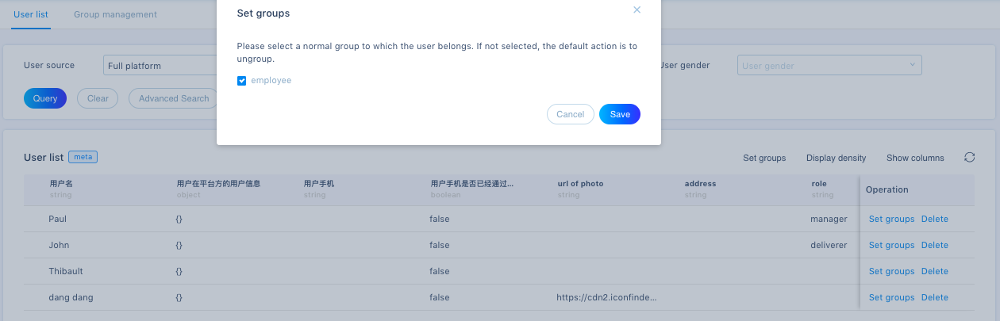


Now log out the previous user, and **log in as Paul** to look at all the orders for his restaurant.

Hmm, nothing is showing on the orders page? Remember ACL? Now we need to add manager group permissions by editing the order table:

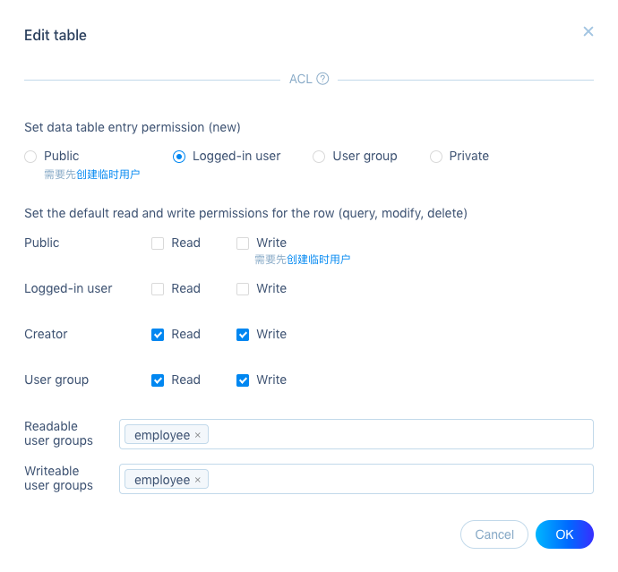

 

Check both `Read` and `Write` after "User group" and scroll down to enter `employee` for both user groups. 

Do the same for **any orders created already** by editing each of the orders.

Now Paul should see all the orders on the orders page.


Next, instead of showing 'Opened' state, let the **manager** click on an `open` order to set its state to `ready`

We need a button, but how to show it only for the manager and not other users? 


We need to know the role of the user! Remember we set the the page data to the `currentUser` when loading the orders page. Now we can look at this page data in `AppData` part of the WeChat IDE:


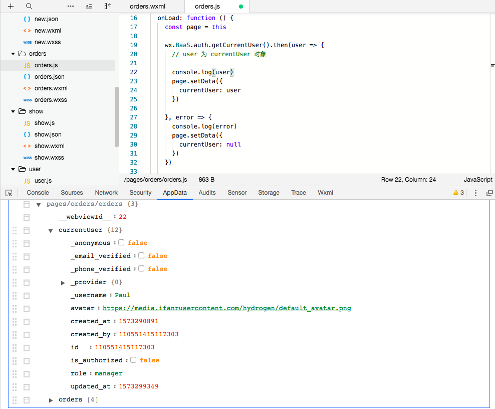

You can see the fields of the user provided by the `auth.getCurrentUser` SDK call, right before the orders objects (provided by the query to the orders table). The `role` field is there too. 

Additional knowledge: Because we added this custom `role` field to users,  can also use the user object returned by the SDK to [access the customized user fields](https://doc.minapp.com/js-sdk/account.html#获取用户自定义字段):

```js
wx.BaaS.auth.getCurrentUser().then(user => {
  console.log(user.get('role')) //  => manager
})
```

Type the above into the console, and you should see the `role` field! Might be handy down the road.


Now we show the "ready" button just for managers with the *conditionals view logic*:

```xml
<!--pages/orders/orders.wxml-->
<!-- in the order card -->
<view wx:if="{{currentUser.role == 'manager'}}" data-id="{{order.id}}" class="button" bindtap="readyOrder">Ready</view>
<view wx:else class="state"> {{order.state}} </view>
```

What does `bindtap` do? How does it work with `data-id`? You'll need to use these next!

Don't forget to style the button to make it look like one!


How do we want to handle the button click to set the `state` to `ready`? 

Create the `readyOrder` function in `orders.js` to catch the click event and grab the `id` from its `data`.

```js
//orders.js in Page()

// binded to clicking on the order 'ready' button
readyOrder(event) {
  const data = event.currentTarget.dataset;
  const id = data.id;

  console.log(id);
},
```

You should see the order `id` in console. 

Now we can update its state. Look at the `bindEditProfile` function in `user.js` and the [documentation](https://doc.minapp.com/js-sdk/schema/update-record.html) for updating records if you need.

```js
//orders.js in readyOrder()
let tableName = 'order'
let Order = new wx.BaaS.TableObject(tableName)
let order = Order.getWithoutData(id)

order.set("state", "open").update().then(res => {
  wx.reLaunch({
    url: '/pages/orders/orders',
  })
})
```

Here we relaunch at the same page to reload orders after the change. Works but can be faster! As a challenge, see if you can reload without relaunching. Hint: how can you use the data inside the update response? 


Lastly we show the "ready" button only for "opened" orders. How do you modify the button logic? 

Solution:

```js
wx:if="{{currentUser.role == 'manager' && order.state == 'opened'}}"
```

This shows the state for others orders:


We're ready to move to **meals delivery stories**.

The deliverer *sees all `ready` orders* with same information as for managers. It includes the delivery address (but not the pickup address because there's only one restaurant).

Challenge your understanding:
> Think about an app with multiple restaurants, how would deliverer know where to go?
>Answer: Pickup address can be added as another field on the order model! The manager would set the address for his restaurant, then added to the order when created.


Let's **login as John** the **deliverer** employee. Check if the orders are showing for him? If not, why?

Remember that deliverers and managers both can read and write all orders according to group permissions on the order table ACL for employees. Make sure John is also added to `employee` user group in User > Group management. 


But wait,  deliverers should see *only orders* that are `ready` and `delivering` as these are their focus!

Remember [querying](https://doc.minapp.com/js-sdk/schema/query.html) with the SDK from previous classes? 

We can check the state of the order in the `Order.find()` call with a `Query` object set to match a condition. 

What are the query conditions for our orders? Hint: it checks if the `state` field is **in a list** of two strings. 

Solution:

```js
query.in('state',  ['ready', 'delivering'])
```


How do query order?

```js
var query = new wx.BaaS.Query()
var Order = new wx.BaaS.TableObject('order')

query.in('state',  ['ready', 'delivering'])

Order.setQuery(query);
```


Only for deliverers?

```js
var query = new wx.BaaS.Query()
var Order = new wx.BaaS.TableObject('order')

const isDeliverer = page.data.currentUser.get('role') == 'deliverer';

if (isDeliverer) {
  query.in('state', ['ready', 'delivering']);
  Order.setQuery(query);
}    
```


So combining into existing order query, and make it a new function called `loadOrder`

```js
//orders.js in Page() after onLoad()
loadOrder: function() {
  const page = this;

  let tableName = 'order'

  let Order = new wx.BaaS.TableObject(tableName)
  var query = new wx.BaaS.Query()

  const isDeliverer = page.data.currentUser.get('role') == 'deliverer';

  if (isDeliverer) {
    query.in('state', ['ready', 'delivering']);
    Order.setQuery(query);
  }

  Order.expand(["meal"]).find().then(page.getRequestData)
}	
```


Now call `loadOrder` after we get the `currentUser` in `onLoad`. Why after? Because it depends on the role of the `currentUser` that has to be set first like so:

```js
//orders.js in Page()
onLoad: function () {
  const page = this;

  wx.BaaS.auth.getCurrentUser().then(user => {
    // user 为 currentUser 对象

    console.log(user)  
    page.setData({
      currentUser: user
    })

    page.loadOrder();
  }, error => {
  //...
```


Now we see only the actionable orders for the deliverer:

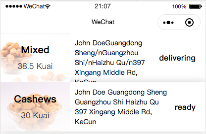


When the **deliverer** updates a `ready` order, set state to `delivering`. We make a button like we did before for the manager's orders dashboard, but now for the `ready` state . Now we're checking for more than one condition, what kind of "if" do we need? 

Hint: `wxml` also has `if`, `else if`, `else` - called `view conditionals`:

```xml
<!--pages/orders/orders.wxml in the "card-product" -->

<view wx:if="{{currentUser.role == 'manager' && order.state == 'opened'}}" data-id="{{order.id}}" class="button" bindtap="readyOrder">Ready</view>
<view wx:elif="{{currentUser.role == 'deliverer' && order.state == 'ready'}}" data-id="{{order.id}}" class="button" bindtap="deliverOrder">Deliver</view>
<view wx:else class="status"> {{order.state}} </view>
```


Now create the function `deliverOrder` that's called when button is clicked. Hint, it's very similar to the `readyOrder` function:

```js
//orders.js after readyOrder()
// binded to clicking on the order 'deliver' button
deliverOrder(event) {
  const page = this;
  const data = event.currentTarget.dataset;
  const id = data.id;

  console.log(id);

  let tableName = 'order'
  let Order = new wx.BaaS.TableObject(tableName)
  let order = Order.getWithoutData(id)

  order.set("state", "delivering").update().then(res => {
    wx.reLaunch({
      url: '/pages/orders/orders',
    })
  })
},
//...
```


The deliverer now mark his order on the way.  


Finally, the customer can mark an order `delivered` when it's received:

Log in as your first user the  **customer** again, and add a "delivered" button to the orders view. 

Everyone except the deliverers can mark a `delivering` order delivered. What is the view condition then?

Solution:

```xml
<view wx:if="{{currentUser.role == 'manager' && order.state == 'opened'}}" data-id="{{order.id}}" class="button" bindtap="readyOrder">Ready</view>
<view wx:elif="{{currentUser.role == 'deliverer' && order.state == 'ready'}}" data-id="{{order.id}}" class="button" bindtap="deliverOrder">Deliver</view>
<view wx:elif="{{currentUser.role != 'deliverer' && order.state == 'delivering'}}" data-id="{{order.id}}" class="button" bindtap="deliveredOrder">Delivered</view>
<view wx:else class="status"> {{order.state}} </view>
```


Don't forget to create the function `deliveredOrder` that's called when button is clicked. 

Hint, it's very again similar to the `readyOrder` function. 

```js
//orders.js after deliveringOrder()
// binded to clicking on the order 'delivered' button
deliveredOrder(event) {
  const page = this;
  const data = event.currentTarget.dataset;
  const id = data.id;

  console.log(id);

  let tableName = 'order'
  let Order = new wx.BaaS.TableObject(tableName)
  let order = Order.getWithoutData(id)

  order.set("state", "delivered").update().then(res => {
    wx.reLaunch({
      url: '/pages/orders/orders',
    })
  })
},
```


By now you might've realized that this function can be refactored to be used for all the order state buttons! You can explore how to do that on your own.


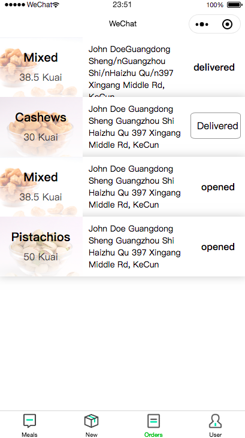


Now the order life-cycle is complete! Don't forget to `commit` and `push`. 


#### Managing Meals

Only managers should be able to add or change a meal. How do we do that?

When thinking "permissions," ACL come to mind. We edit the meal table and allow new meal entry for only the `employee` User group. For editing meals, we set write the same permission:

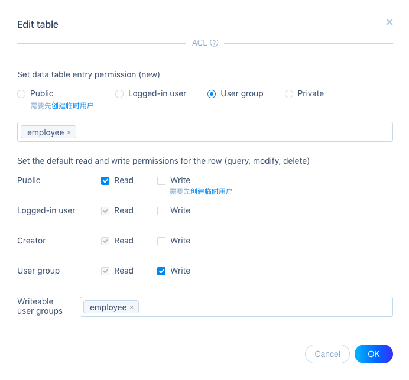


Next, remove the 'New' tab bar item (in `app.json`), and show its icon on the meals page ONLY for the manager. To do this we need to add view logic  (in  `index.wxml` )  to show buttons depending on the user role. 

Following similar steps for showing order state buttons, add the logic and bind to a function `addMeal` that navigates to the new page when clicked.


Solution:

```xml
<!--pages/index/index.wxml under the meals cards -->
<image wx:if="{{currentUser.role == 'manager'}}" class="add" bindtap="addMeal" src="/images/post.png"/>
```

```js
//index.js in Page()
addMeal() {
  wx.navigateTo({
    url: `/pages/new/new`
  });
},
```

Don't forget the `wxss` for `add` that will fix the button to the bottom right:

```css
.add {
  position: fixed;
  right: 10px;
  bottom: 10px;
  width: 65px;
  height: 65px;
}
```


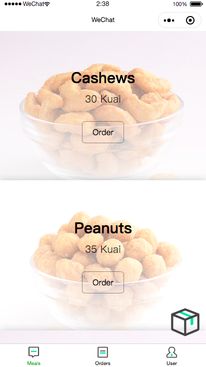


To edit a meal, we add an new "edit" icon to each meal card (download from iconfront.cn to your images folder as before).  Show it conditionally for role of `manager`. Can you write the view code following the same pattern as for adding meal?

Solution:

```xml
<!--pages/index/index.wxml -->

<block wx:for="{{meals}}" wx:for-item="meal">
  <view class="card-product" style="background-image: linear-gradient(rgba(255,255,255,0.3), rgba(255,255,255,0.9)), url('{{meal.photo}}'); background-size: cover;">
    <view class="card-product-infos">
      <!-- product info -->
    </view>
    <image wx:if="{{currentUser.role == 'manager'}}" class="edit" bindtap="editMeal" src="/images/edit.png"/>
  </view>
</block>

<image wx:if="{{currentUser.role == 'manager'}}" class="add" bindtap="addMeal" src="/images/post.png"/>
```


Fix the icon to the top right of each card. Hint: how many position values are there?

Solution:

```css
.edit {
  top: 20px;
  right: 20px;
  position: absolute;
  width: 32px;
  height: 24px;
}
```


Where does the editMeal click go? The same form for adding a meal can be used for editing! 

The value is already set in each form input:

```xml
<input name="name" value="{{meal.name}}" placeholder="please write your meal name" >
```


The form just need to get data from the existing meal when loading. Follow the same steps as for showing a restaurant from the previous exercise (in `show.wxml`).

Solution:

```js
//new.js in onLoad()
onLoad: function(options) {
  const id = options.id
  const page = this

  let Meal = new wx.BaaS.TableObject('meal')

  Meal.get(id).then(res => {
    page.setData({
      meal: res.data
    })
  })
},
```

`onLoad` needs an `id` passed to it as  `options`. If you remember from the show page, this is done through params in the navigation url. Create the `editMeal` function in `index.js` that navigates to the form with the `id` that from the data of the edit button click event.

Solution:

```js
editMeal(event) {
    const data = event.currentTarget.dataset;
    const id = data.id;

    wx.navigateTo({
      url: `/pages/new/new?id=${id}`
    });
  },
```

```xml
<!--pages/index/index.wxml on the edit button -->

<image wx:if="{{currentUser.role == 'manager'}}" data-id="{{meal.id}}" class="edit" bindtap="editMeal" src="/images/edit.png"/>
```

Now clicking on the edit button for a meal preloads its data into the form for you to edit! Sharing a form for both edit and new actions are ok for any table and is a standard practice.


Congratulations! You're done. A whole app to build in one day but you did it. No big deal, just many any small addition on what you've built and learned before. You have the knowledge and experience now to make more apps quickly and efficiently!


## Optional 1: `Destroy` actions

We haven't done any **deleting** yet. How would you implement these additional user stories?

- As a manager, I can delete a meal
- As a manager, I can delete an order


Can't delete for real - data is precious, also relationships demands on them. What happens to old orders for example if you delete the meal associated? How do you do accounting if an order is gone?

So instead, we hide them! Make a `boolean` field in the model for to be "deleted" items - let's call it `hidden` . 

Now create a delete button that will update this `hidden` field to `true` . What should its default value be?

Lastly, filter the queries by this `hidden` field before displaying the items - just like filtering orders for deliverers:


```js
var query = new wx.BaaS.Query()
var Order = new wx.BaaS.TableObject('order')

query.compare('hidden', '=',  true)

Order.setQuery(query).find().then(res => {
	// Handle returned orders from filtered request
})
```

Awesome! You have a bit more insight into the world of big data and its complexities!


## Optional 2 - UI Kit

You might've seen how the hardest work isn't always the most time-consuming. Much time is spent on styling content and common ui elements - buttons, cards, lists... 

There are UI kits can save much time. The frontend libraries you learned to use during design courses also works on WeChat Mini Programs, like [ColorUI](https://github.com/weilanwl/ColorUI):

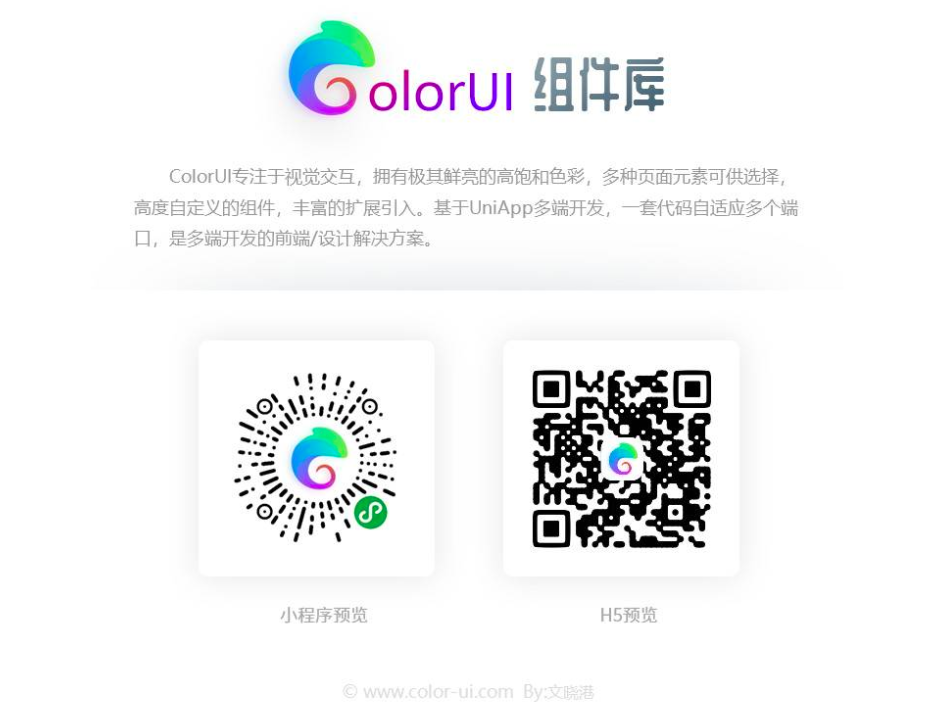

Try these in your app to improve function and style!


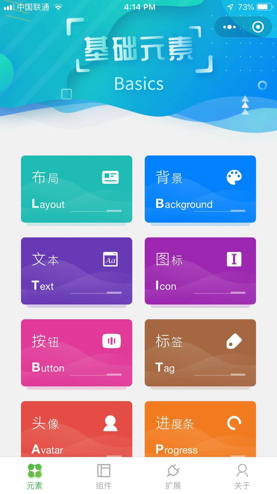


We can start by making the order list look nicer. Here are some lists with sliding actions to replace buttons:


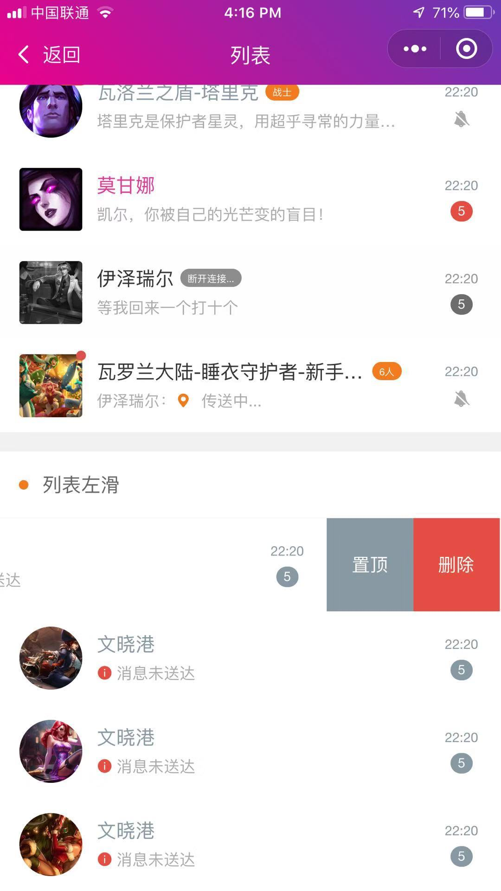


## Optional 3 - Map

WeChat also allows you to use its built-in UI and functions called [components](https://developers.weixin.qq.com/miniprogram/dev/component/). See if you can show all the delivery addresses on a [map](https://developers.weixin.qq.com/miniprogram/dev/component/map.html).

