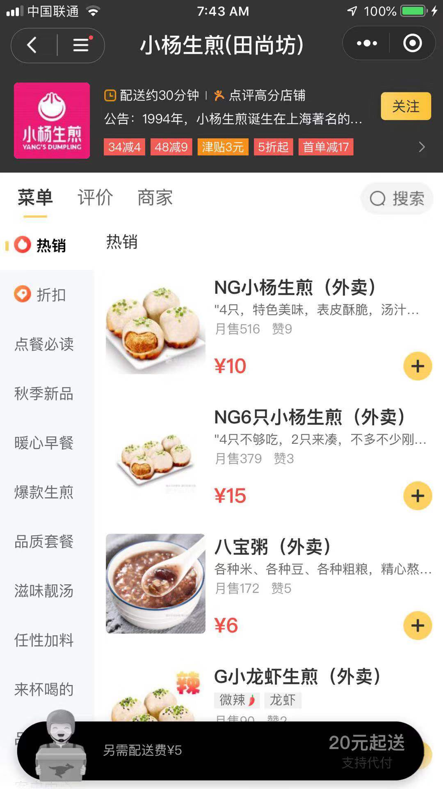
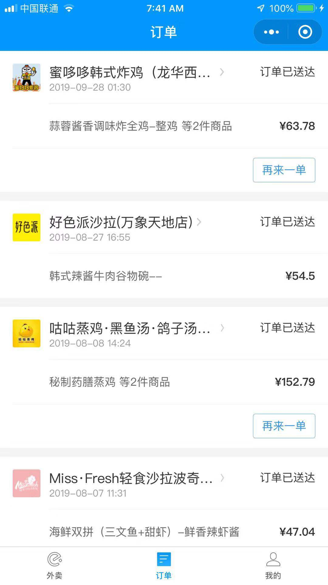
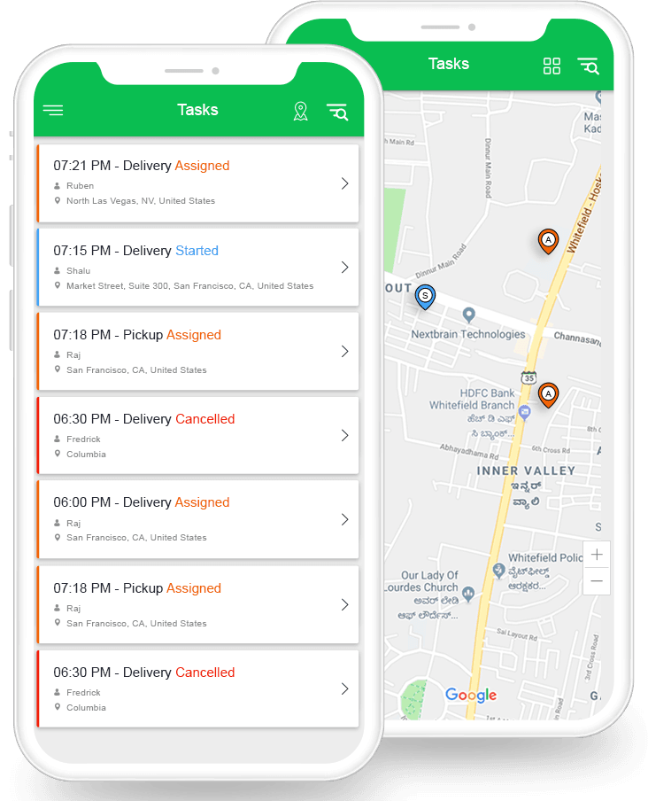

# Elema (or Meituan) Waimai

## Core User Journey

### Restaurant Index

## 

### Meals Index



### Orders



### 


For our challenge, we'll skip restaurants and use meals index as the landing page. You can add the restaurant index later on anytime by following the previous Dianping exercise.


### Delivery Management





Deliverer and Manager share the order index view. The manager can **assign** an order **opened** by the customer to a deliverer, who can mark it **delivered**. So the order states are "Opened," "Assigned," and "Delivered." 

Other states like "Cancelled," "Started" can be added too this way but for our exercise, we'll keep it simple to just three states mentioned above.


Time to build a Food Delivery program for a restaurant.

The software is designed for **one restaurant only**, so no need to cater (no pun intended 😉) for a multi-restaurant one (e.g. you don't need a `restaurants` table).

The main components are:

- **Employees** (managers, delivery guys)
- **Customers** of the Restaurant
- **Meals** that can be ordered
- **Orders** made by customers, and assigned to a given delivery guy.

## 1 - We need APIs!

We haven't launched our app code yet. To do this, we need a set of API endpoints. Review Restful Apis for inspiration:

When at a good spot, always `commit` and `push`!

## 2 - (`Meal`)

Your restaurant sells food, so you need a way to store the meals that can be ordered. Each meal has a name and a price. Make a diagram (schema) to model this, and create a BaaS that will read/write the meals from a table.

Then let's move to the api. Here are the **user actions** we want to implement:

- `List` all meals available in the restaurant
- `Add` a new meal

Done? Good! Time to `commit` and `push`.


## 3 - (`Customer`)

We need to keep a list of all our customers. When a new customer calls to order, the first thing we need to do is add them to our list. Each customer has a name and an address. Work on the tables,  and finally the api to implement the following user actions:

- `List` all customers available in the restaurant
- `Add` a new customer

Once your tables are implemented, test them with their API endpoints! Make sure your 4 user actions work before moving on to the next feature.

Done? Boom! Don't forget to `commit` and `push`.

## 4 - (`Employee`)

The restaurant has two types of employees, **managers** and **delivery guys**. We want to implement a **read-only** logic for `EmployeeRepository` from a CSV file that we fill manually (no need for an `add` action).

Open your `employees.csv` file and manually add some employees:

```bash
id,username,password,role
1,paul,secret,manager
2,john,secret,delivery_guy
```

With that information, we can implement a **login** logic in our app to have two dashboards in the router depending on the user role: one dashboard for the manager, and another dashboard for the delivery guy (with fewer user actions available).

To handle that, we'll introduce the notion of a **session**. At the router level, we'll store the logged-in user in a session.

You remember a typical login sequence in the old days:

```bash
> username?
paul
> password?
blablabla
Wrong credentials... Try again!
> username?
paul
> password?
secret
Welcome Paul!
```

Now when you run the food delivery app, the first thing you can do is to **sign in**. The dashboard that you then see should be **dependent on your role**:


Optional: At the moment, a user's password is stored straight in the database and is visible to anyone. Is that a good idea? What could we do instead?


Finished? Great work :) Remember to `commit` and `push`.

## 6 - (`Order`) Time to link all the tables!

An order is taken for a **customer**, containing a **meal** (to simplify things, let's say that an order can only contain **one meal**) and is then assigned to a given **delivery guy**. Finally, the `order` table needs to record whether or not the meal has been delivered.

Here's where our tables link up. First, write the `order` table and its repository.

Then, make sure that the following **user stories** are implemented in your program:

- As an employee, I can log in
- As a manager, I can add a meal
- As a manager, I can view all the meals
- As a manager, I can add a customer
- As a manager, I can view all the customers
- As a manager, I can view all the undelivered orders
- As a manager, I can add an order for a customer and assign it to a delivery guy
- As a delivery guy, I can view my undelivered orders
- As a delivery guy, I can mark an order as delivered


When an order is created, we need to give it an address. We ask for the user's address:


```js
wx.chooseAddress({
  success (res) {
    console.log(res.userName)
    console.log(res.postalCode)
    console.log(res.provinceName)
    console.log(res.cityName)
    console.log(res.countyName)
    console.log(res.detailInfo)
    console.log(res.nationalCode)
    console.log(res.telNumber)
  }
})
```


What if they want to chose another address? There's a WeChat function for that too you can use - to be covered in a later course.


## 7 - (Optional) - `Destroy` actions

We haven't done any **deleting** yet. How would you implement these additional user stories?

- As a manager, I can delete a meal 
- As a manager, I can delete a customer


Can't delete for real - data is precious, also relationships demands on them. What happens to old orders for example? How do you do accounting if order is lost?

So instead, we hide them! There's a flag you set to true for delete - let's call it `hidden` . Now you have a bit more insight into the world of big data and its complexities!  