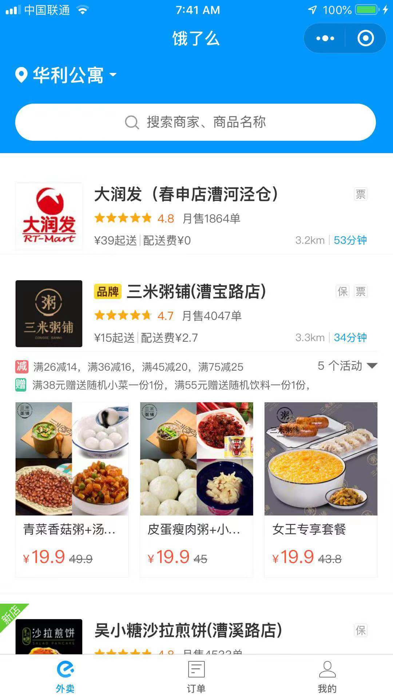
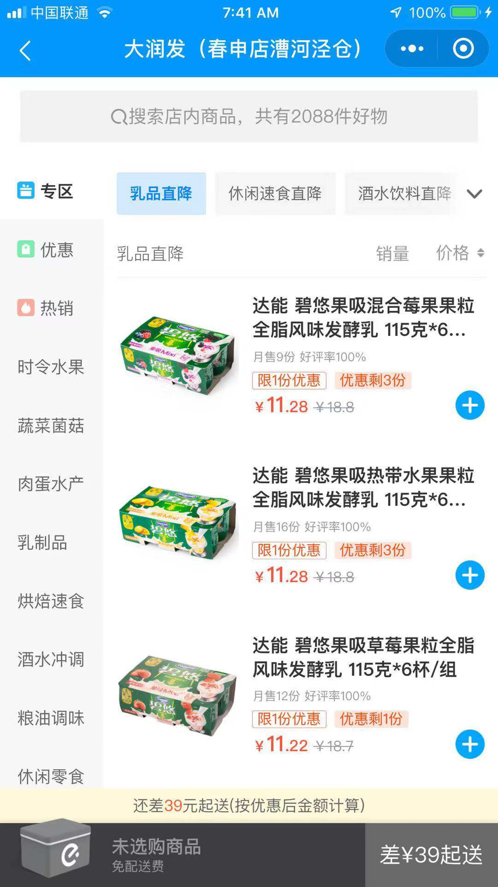

# Elema (or Meituan) Waimai

## Core User Journey

### Restaurant Index





### Meals Index


 


### Orders


Time to build a Food Delivery program for a restaurant.

The software is designed for **one restaurant only**, so no need to cater (no pun intended 😉) for a multi-restaurant one (e.g. you don't need a `restaurant` table).

So just for this challenge, we'll skip restaurants and use meals as the landing page. You can add restaurants anytime by following the previous Dianping exercise.


### Delivery Management


Deliverer and Manager share the order index view. The manager can **assign** an order **opened** by the customer to a deliverer, who can mark it **delivered**. So the order states are "Opened," "Assigned," and "Delivered."

Other states like "Cancelled," "Started" can be added too this way but for our exercise, we'll keep it simple to just three states mentioned above.


The main components are:

- **Employees** (managers, delivery guys)
- **Customers** of the Restaurant
- **Meals** that can be ordered
- **Orders** made by customers, and assigned to a given delivery guy.

## 1 - We need Backend (as a Service) !

Before diving into our app code . We first need a set of API endpoints made by our BaaS.  Review Restful APIs principles from the first DB lecture for inspiration.


Based on the user journey above, we design the schema to model the data and the relationships.

### Data schema:


The key to the design is that a `user` can have many `meals` through `orders`, and that a `meal` can be ordered by many `users`. This many-to-many relationship is like the `review` joint table from the previous exercise (Dianping).

In this case `order` is our joint table and the central part of the app that ties all the other data (and functions) together.


Once your tables are implemented, test them with the BaaS SDK! Make sure your 4 user actions work before moving on to the next feature. Follow this strategy of:

1. working on the BaaS tables

2. getting data in JS with the SDK

3. showing data in the views

4. add user interactions in views with data associated

5. handle interactions with JS - either or all of:

   - get user input
   - send data to BaaS
   - change page data to update view or show new interactions
   - navigate to another pace


Remember when at a good spot, always `commit` and `push`!

## 2 - (`Meal`)

Your restaurant sells food, so you need a way to store the meals that can be ordered. Each meal has a name and a price. Using the diagram (schema) above that model this,  create a BaaS that will read/write the meals from a table.


Let's add a table called `meal` in the BaaS. Then add `name` (string), `price` (integer), and `photo` (string) columns. Consult instructions on BaaS operations at beginning of previous exercises if you need a refresher.


Why is `price` an integer? Remember integers are countable things. Money is countable (in cents for example). Using regular numbers could cause rounding errors when stored!

Rule of thumb - **store money always as an integer**.


Now some meal data. Any meal for your waimai business. Match input to the field types you defined.


Then let's move to the app. Here are the **user actions** we want to implement:

- `List` all meals available in the restaurant
- `Add` a new meal


### List all meals

Starting with the index page in the previous exercise app (Dianping), substitute meals in place of restaurants.

When displaying price, remember to divide number cents by 100:
```xml
<view class="p">{{meal.price / 100}} Kuai</view>
```

Tweak the styling to make it look like a store!

Done? Good! Time to `commit` and `push` to your repo at every finished stage (e.g. code has to be fully working, though features are not fully completed). Good to get in the habit.


### Adding a new meal


Keeping on the strategy of following the template of the previous exercise, we use the new page to create a meal. Using the `meal` table for the data, modify the view, and js file correspondingly.


Forms take every input as string. So how do we get a number for the price? Use `parseInt` like so:

```js
// making meal data from form input in new.js
let data = {
  name: name,
  price: Number.parseInt(price),
  photo: photo,
}
```


## 3 - (`Customer`)

We need to keep a list of all our customers. Each customer has a name and an address.

We already have a `user` table in the BaaS ( stored as `_userprofile` and accessed with `User` object from the SDK). When a new customer signs up, the BaaS will create a user record for him.

We can add an `address` (string) column. Should it be required? (Hint: Does the customer have to add the address on signup, or only when he wants to order? What about other types of users, e.g. employees?)


## 4 - (`Employee`)

The restaurant has two types of employees, **managers** and **delivery guys**. They're both still `User` objects. We don't need to create them using the app either. The BaaS can add these directly with SDK or on its dashboard. Then we can manage them in the built in CRM in the BaaS dashboard.

Remember how you registered a user with JS?

```js
// in the WeChat IDE JS console
wx.BaaS.auth.register({ username: username, password: password }).then(user => { console.log(user)})
```

Manually add some employees:

```bash
id,username,password,role
1,paul,secret,manager
2,john,secret,deliverer
```


The `role` (string) column is to be added to the `_userprofile` table. Then the roles can be set on the BaaS dashboard or through the SDK - remember how we set user's photo in the previous exercise? Later this `role` will be used to customize the app for each type of user!

For now, check that we can sign up, log in, and log out of the app using the `user` page from the previous app!


## 6 - (`Order`) Time to link all the tables!

An order is taken for a **customer**, containing a **meal** (to simplify things, let's say that an order can only contain **one meal**) and is then assigned to a given **delivery guy**. Finally, the `order` table needs to record whether or not the meal has been delivered.

Here's where our tables link up. First, create the `order` table on the BaaS.

According to the schema order has `address` (string), `state` (string), `customer` (pointer), `deliverer` (pointer), and `meal` (pointer).

`state` should have a `default value` of  `opened` - the initial state when an order is created.

The two pointers are foreign keys to the `_userprofile` table, and the second pointer to the `meal` table. You can see that it's ok to have two pointers to the same table because a user can have many roles.


Then make sure that the following **user stories** for customers are implemented in your app:

- As a customer, I can log in - Done in previous app

- As a customer, I can view all the meals - Done above

- As a customer, I can order a meal

- As a customer, I can view all my orders (opened or delivered)


### Creating an order

We can put a customized order button on the meal cards on the `index` page:

```xml
<!-- index.wxml -->
<view data-id="{{meal.id}}" class="order" bindtap="orderMeal">Order</view>
```

```css
<!-- index.wxss -->
.order {
  background-color: transparent;
  border: 1px solid rgba(0, 0, 0, 0.4);
  text-align: center;
  padding: 10px;
  border-radius: 10%;
  margin-top: 30px;
  width: 62px;
  margin-left: auto;
  margin-right: auto;
}
```

Then following steps similar to creating a meal in the section above:

```js
//index.js in Page
orderMeal: function (event) {
  const data = event.currentTarget.dataset;
  let id = data.id

  let newOrder = {
    // To be figured out in the next step
  }

  let Order = new wx.BaaS.TableObject('order')
  let order = Order.create()
  order.set(newOrder).save().then(res => {
   // to be figured out in following steps
  })
}
```

Don't forget to remove `bindtap` on the `card-product` element from previous exercise if still there.

The customer is the currently logged in user.

In `onLoad` of `index.js`, check for `currentUser` with `wx.BaaS.auth.getCurrentUser()` like in previous exercise. Then `page.setData({ currentUser: user })` where user is either the returned logged in `user`, or `null`.

We can then check if `user` is `null` and redirect to the `user` page to log in.

```js
//index.js in orderMeal function
const data = event.currentTarget.dataset;
let meal_id = data.id
let currentUser = this.data.currentUser

if (!currentUser) {
  wx.switchTab({
    url: '/pages/user/user' // logged in
  });
} else {
  // create order
}


```

Do we need the `state`? Its `default value` configured in the BaaS will be set on creation, so we skip it!

For the address, we check for the user's address.

So we add this into the "create order step" above inside the `else` block

```js
//index.js in orderMeal function
wx.chooseAddress({
  success(res) {
    let address =
    res.userName + " " +
    res.postalCode + " " +
    res.provinceName + " " +
    res.cityName + " " +
    res.countyName + " " +
    res.detailInfo + " " +
    res.nationalCode + " " +
    res.telNumber

    let newOrder = {
      meal: meal_id,
      customer: currentUser.id.toString(),
      address: address
    }

    let Order = new wx.BaaS.TableObject('order')
    let order = Order.create()
    order.set(newOrder).save().then(res => {
      // to be figured out in the next step
    })
  }
})
```
There's a subtle but important part of this code in that we save the `order` in the response handling for getting the address.

This is again because async processes like requesting for addresses needs waiting, and we only want to create the order if the request comes back successfully.

What does the user want to see after an order? Probably the order status so he can check the order! So we go to the orders page.  `reLaunch` is used here so they cannot go back in history after ordering - a standard practice.

```js
order.set(newOrder).save().then(res => {
  wx.reLaunch({
    url: '/pages/user/user' // show list of orders
  });
})
```


Now we show all the orders in the user dashboard.

### List all orders (user dashboard)


Now when you run the food delivery app, you can see all the meals. But to order a meal, or see your dashboard (`orders index`), you need to **sign in**.


The dashboard that you then see should be **dependent on your role**.


We can implement a **login** logic in our app to have **three dashboards** depending on the user role: one dashboard for the **manager**, another dashboard for the **delivery guy** (with fewer user actions available), and lastly for the **customer**.

To handle that, we'll have different login **sessions** for different users. You've already seen that used when loggin and and out of the previous exericse app. We'll need those login forms still.


Screenshots of three types of dashboards


We start with the customer dashboard that shows all his address, and his orders.


Finished? Great work :) Remember to `commit` and `push`.


Then, make sure that the following **user stories** for employees are implemented in your app:

- As an employee, I can log in
- As a manager, I can add a meal
- As a manager, I can view all the meals
- As a manager, I can view all the orders (opened or delivered)
- As a manager, I can add an order for a customer and assign it to a delivery guy
- As a delivery guy, I can view my upcoming orders (opened, but not delivered)
- As a delivery guy, I can mark an opened order as delivered


When the manager assigns a deliverer to an order, we need to show the list of deliverers!

### List all deliverers

Very similar to list the meals! We can copy the whole page and apply to users.


Remember to only show users who have a role of deliverer


Done? Boom! Don't forget to `commit` and `push`.


Also only managers can add a meal, so disable that for the other users.


### Update order

#### Set deliverer

#### Set status delivered


## 7 - (Optional) - `Destroy` actions

We haven't done any **deleting** yet. How would you implement these additional user stories?

- As a manager, I can delete a meal
- As a manager, I can delete a customer


Can't delete for real - data is precious, also relationships demands on them. What happens to old orders for example? How do you do accounting if order is lost?

So instead, we hide them! There's a flag you set to true for delete - let's call it `hidden` . Now you have a bit more insight into the world of big data and its complexities!
