# Advanced Backend as a Service (BaaS)


Today  we will try building Dianping (or Meituan - both are review apps).

Consider reviews:


Users can post reviews on restaurants. So relationship-wise, each restaurant can be reviewed by many users, and each user can review many restaurants: a many-to-many relationship.


## Many to many relationships

## Excel++

Let's go further


## Consultations ?

- **One** doctor can have **many** patients
- **One** patient can see **many** doctors


George Abitbol (**id = 1**) has seen Doctor John Doe (**id = 3**)


## n:n relation (many to many)

A patient **has many** doctors and a doctor **has many** patients.

You can download this example: [consultations.xslx](https://kitt.lewagon.com/karr/assets/patients-doctors-56eaccffe9a741fbebec5b9c09922abdfd39055dcd1880eb5e0bbdc547e558b6.xlsx)

------

## Relational Database

### 1:n


### n:n ?


### n:n


## Vocabulary

- A schema is composed of **tables**.
- Each table has a set of **columns**.
- When inserting data in a table, you create a **record** in a new **row**.

## DB Schema Composer

[db.lewagon.com](http://db.lewagon.com/)

You can save/load schemas. Try with
[patients-doctors.xml](https://kitt.lewagon.com/karr/assets/patients-doctors-9aba2b9307abcf0650388a7cdfad252452ac4cb388234c0e9b0acfb8fa7e1f8b.xml)


## Dianping Core User Journey

### Restaurant Index


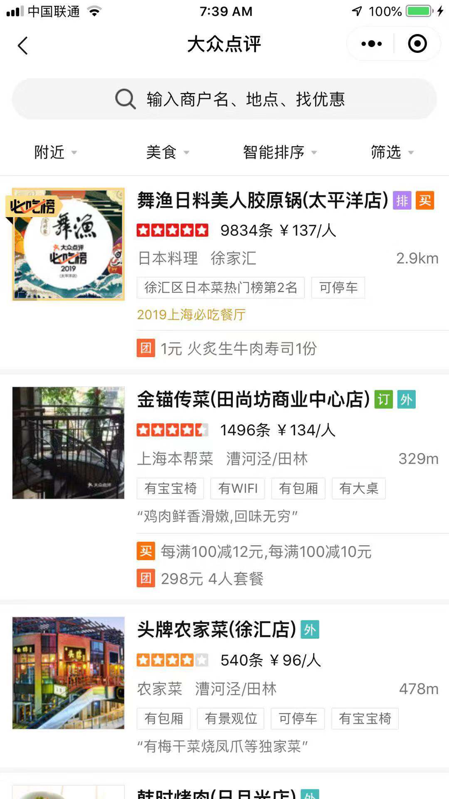

A restaurant has name, photo, overall rating, number of reviews, and description.

### Restaurant Page


Restaurant page shows individual reviews:


Each review has name, content, and rating.


## Dianping Data Schema

Review relationship is many-to-many


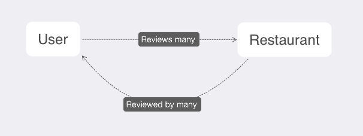


So review's relationship is its own (joint) table:


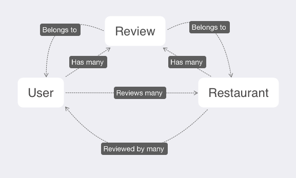


Schema:


## I Go, then Your Turn

For your **Exercise**, you will be making Dianping.

As with Toutiao, you can connect the backend to your Mini Program through using SDK!

Tip: Use your Toutiao frontend as starting point to save time. It is also similar!

### User login

Remember that the SDK allows user login. We'll use that now to store the user and allow login and logouts. No more entering the name every time for new posts!

Instead of using an anonymous user, replace that line with **registering** by username and password:

```js
// app.js
//... other configurations
wx.BaaS.init('c1e7a280f6d8c8646756')

wx.BaaS.auth.register({ username: 'ifanrx', password: 'ifanrx123' }).then(user => {
  console.log(user)
})
```

You'll see new user data in the BaaS:


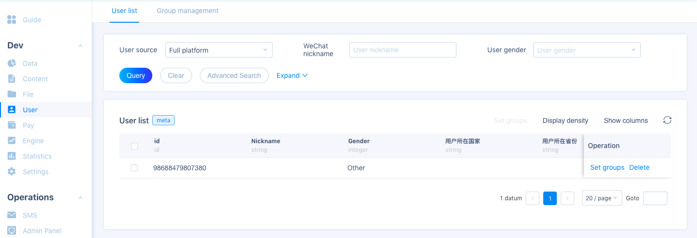


The user tables has fields for phone, email, WeChat info, as well as demographics.

We add a `photo` column to store the user photo url. What type should it be?


Note: not all of these fields are required, the table is ready to be store any common user info from standards methods like web, phone, or WeChat login.


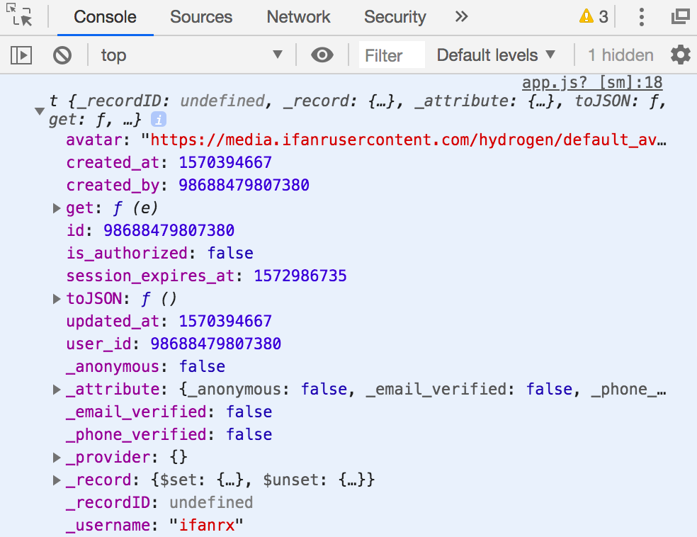


The user data is returned when the user is created. But if you try to register again by reloading, you'll see the same name can't be used again to register. We need to **log in**!


```js
wx.BaaS.auth.login({username: 'ifanrx', password: 'ifanrx123'}).then(user => {
  console.log(user)
}).catch(err=>{
  // HError
})
```


You'll see that we'll only get a successful response and the user data if the password is correct!


To get the user currently logged in:

```js
wx.BaaS.auth.getCurrentUser().then(user => {
  console.log(user) // user 为 currentUser 对象
}).catch(err => {
  if (err.code === 604) {
    console.log('用户未登录')
  }
})
```


Now remove the login code and reload our app. We still see the current user who is logged in! So once  logged in, no need to log in again - that's how logins work.

When you do want to log out, simply do this:

```
wx.BaaS.auth.logout()
```


We can use these with a form for our user to register, log in and out.


Now let's make our tables for restaurants and reviews , and then request them in our pages!

### Data Tables


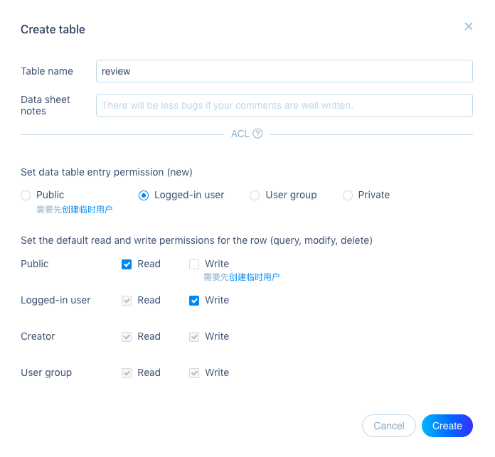

Add some columns for the Restaurant table

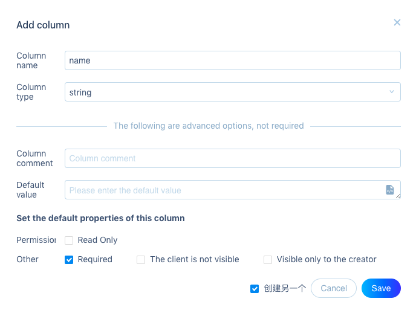

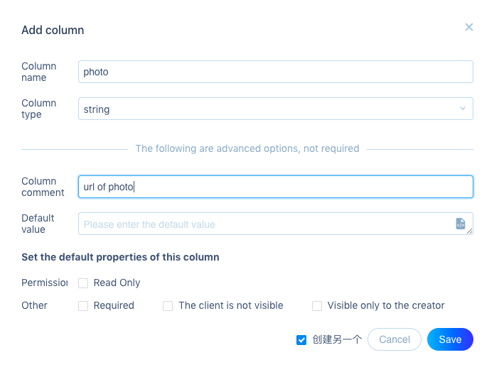


We'll learn to upload images in an upcoming class. Now we'll just use urls of an existing image.

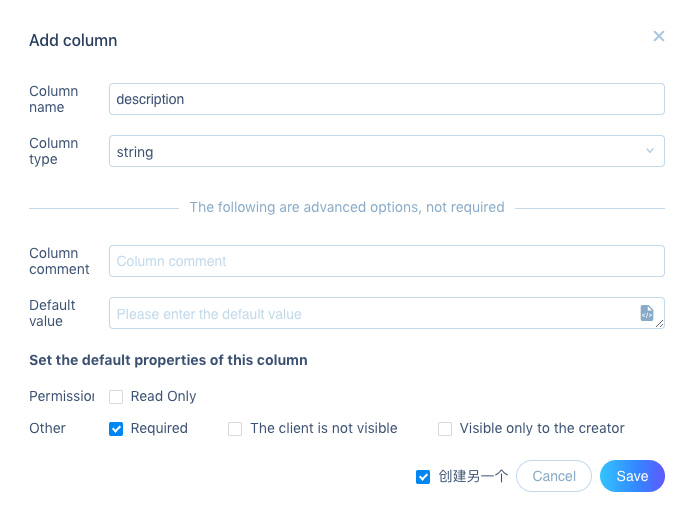

And the columns for Review table

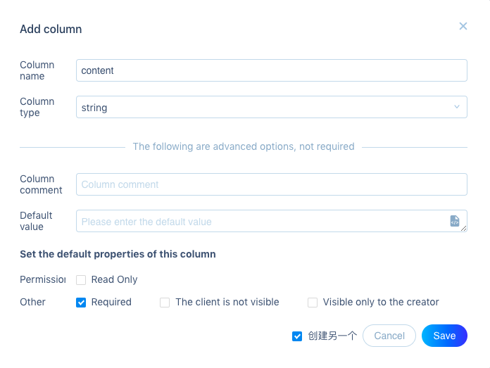

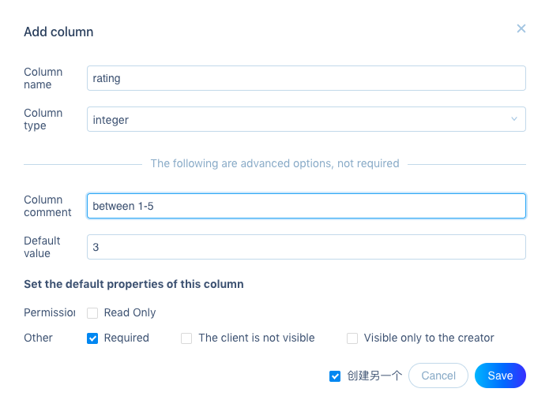

Why an integer and not a number? Hint: Is it countable?


Review has to have two foreign keys - pointers as they're called on this BaaS


They associate with the table these keys belong to (user and restaurant) as the schema shows, so we name them as such.

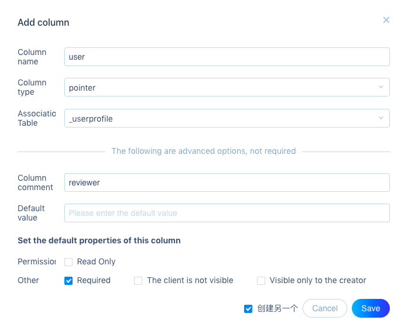

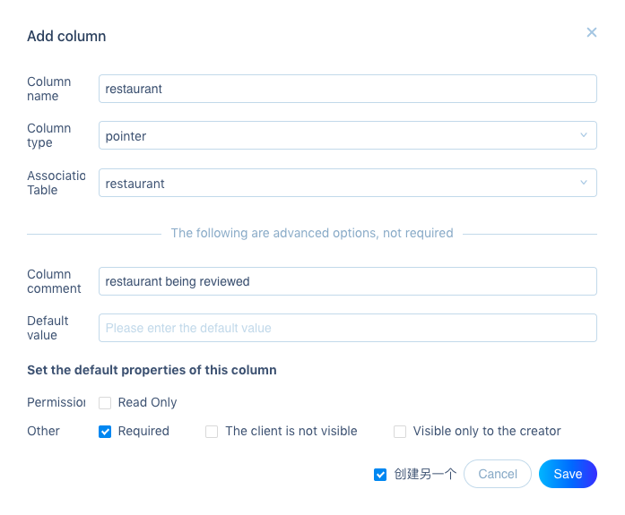

Let's add some data to our Restaurant table.

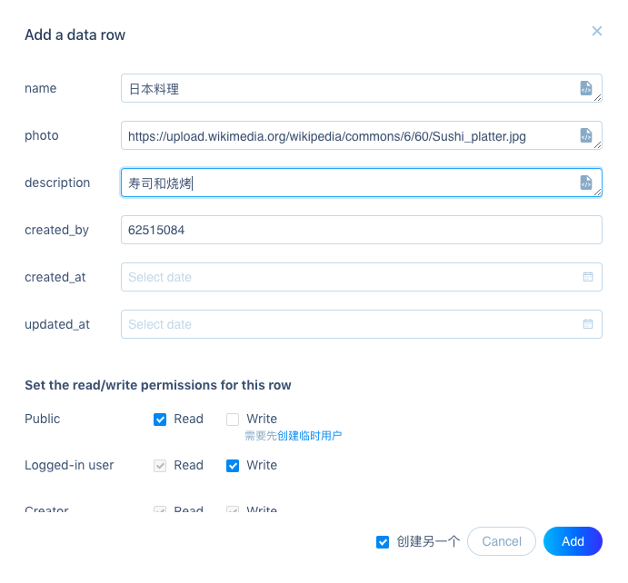


Add a few more like this will be all we need to get going.


Now we'll starting making the pages work with the data. Starting with the frontend from an existing app (Toutiao for example) is a good idea to save time!


### Restaurant Index

Request the all restaurant data from our BaaS the same way as for Toutiao stories index

```js
//index.js
onLoad: function () {
  const page = this

  let tableName = 'restaurant'

  let Restaurant = new wx.BaaS.TableObject(tableName)

  Restaurant.find().then(page.getRequestData)

}
```


What should `page.getRequestData` be? Don't forget to update this function for restaurants, and the view `index.wxml` as well - consult the previous exercise if you need!

We can make a card background with restaurant photo:


```xml
<!-- index.wxml -->
<block wx:for="{{restaurants}}" wx:for-item="restaurant">
  <view class="card-product" style="background-image: linear-gradient(rgba(255,255,255,0.3), rgba(255,255,255,0.9)), url('{{restaurant.photo}}'); background-size: cover;">
    <view class="card-product-infos" data-id="{{restaurant.id}}" bindtap="showRestaurant">
      <view class="h2">{{restaurant.name}}</view>
      <view class="p">{{restaurant.description}}</view>
    </view>
  </view>
</block>

```

WXSS is very similar to before!


### Restaurant Post

We'll update the form as well for restaurant data:

```xml
<form bindsubmit="bindSubmit">
  <view class="section">
    <view class="section__title">Your restaurant</view>
    <input name="name" value="{{restaurant.name}}" placeholder="please write your restaurant name" ></input>
  </view>

  <view class="section">
    <view class="section__title">Description</view>
    <textarea name="description" value="{{restaurant.description}}" placeholder="please write your restaurant description" ></textarea>
  </view>

  <view class="section">
    <view class="section__title">Photo</view>
    <input name="photo" value="{{restaurant.photo}}" placeholder="please add your restaurant photo" ></input>
  </view>

  <view class="btn-area">
    <button formType="submit">Submit</button>
  </view>
</form>
```

Don't forget to update variables in `new.js` to submit restaurant fields to the BaaS!


But remember a user has to log in for the post to work. So we'll check for the user currently logged in, or the user to log in!


```js
//app.js in onLaunch function
//... other BaaS configuration
wx.BaaS.auth.getCurrentUser().then(user => {
  // user 为 currentUser 对象
  console.log(user)
  page.setData({ currentUser: user })

}, error => {
  console.log(error)
  page.setData({ currentUser: null })
})
```


Redirect to User Profile page. Why log in here and not at beginning of app? It's good practice to always give some value to the user before you ask for something!


### User Profile

Add a `pages/user/user` page, and a third tab in our tab bar:

```json
// app.json
"tabBar": {
  "list": [
  // index and new page tab bars
  {
    "pagePath": "pages/user/user",
    "text": "User",
    "iconPath": "/images/user.png",
    "selectedIconPath": "/images/user.png"
  }
  ]
}
```


This login page has two function - to sign up or sign in, and then to display user profile.

So we check first if the user is currently signed in:

```js
//user.js
onLoad: function (options) {
  const page = this

  wx.BaaS.auth.getCurrentUser().then(user => {
      // user 为 currentUser 对象

      console.log(user)
      page.setData({ currentUser: user })

    }, error => {
      console.log(error)
      page.setData({ currentUser: null })
    })

}
```


Then show a profile edit form, or sign-in form:

```xml
<!--pages/user/user.wxml-->
<view class="profile">
  <view class="h2"> {{currentUser._username}} </view>
  <image class="avatar" src="{{currentUser.photo}}" />
</view>

<!--profile edit-->
<block wx:if="{{currentUser}}">
  <form bindsubmit="bindEditProfile">

    <view class="section">
      <view class="section__title">Photo</view>
      <input name="photo" value="{{currentUser.photo}}" placeholder="please add your photo url"></input>
    </view>

    <view class="btn-area">
      <button formType="submit">Submit</button>
    </view>
  </form>

  <view class="btn-area" id="logout">
    <button bindtap="bindLogout">Log Out</button>
  </view>
</block>

<!--sign up or sign in-->
<block wx:else>
  <form bindsubmit="bindLogin">
    <view class="section">
      <view class="section__title">Username</view>
      <input name="username" placeholder="please use yours or create one"></input>
    </view>

    <view class="section">
      <view class="section__title">Password</view>
      <input name="password" placeholder="please use yours or create one"></input>
    </view>

    <view class="btn-area">
      <button formType="submit">Submit</button>
    </view>
  </form>
</block>
```

```css
/* pages/user/user.wxss */
page {
  padding:30px;
  width:80vw;
  background-color: #fafafa;
}

.profile {
  display: flex;
  align-items: center;
  justify-content: center;
  flex-flow: row wrap;
}

.h2 {
  font-size: 30px;
  font-weight: bold;
  margin: 20px;
}

.avatar {
  width:200px;
  height:200px;
  border-radius:50%;
}

.section {
  background-color: white;
  margin: 20px 0px;
  padding: 5px;
  border-radius:4px;
  border-width: 2px;
  border-color: black;
}

.section__title {
  font-weight: bold;
}

textarea {
  padding: 10px 0px;
}

#logout {
  margin-top: 30px;
}
```


How does the login work?

1. User submits the username and password to **register** for an account.

2. If the user already has an account (with matchin user name), will try to **log in** using those same credentials:

```js
// user.js in bindLogin()
wx.BaaS.auth.register({ username: username, password: password }).then(user => {
  // user 为 currentUser 对象

  console.log(user)
  page.setData({ currentUser: user })

}).catch(err => {

  wx.BaaS.auth.login({ username: username, password: password }).then(user => {
    // user 为 currentUser 对象

    console.log(user)
    page.setData({ currentUser: user })
  }).catch(err => {
    console.log(err)
  })
})
```


To handle profile photo updates is as easy setting and updating the field on `currentUser`.

```js
//user.js in bindEditProfile()
let photo = event.detail.value.photo

let user = page.data.currentUser

user.set("photo", photo).update().then(res => {
  wx.reLaunch({
    url: '/pages/user/user',
  })
})
```


Let's not forget to logout. Just call the function and relaunch the page (usually users can't click back after loging out).

```js
//user.js in bindEditProfile()
wx.BaaS.auth.logout().then(() => {
  wx.reLaunch({
    url: '/pages/user/user',
  })
})
```


Now the user can sign in or register, give a avatar! Log out when done. That's it for this page!

Now we also need reviews, lets go to the show page.

### Restaurant Show


Modify the previous app's show page to server as a review app.


```xml
<!-- at top of show.wxml -->
<view class="card-product" style="background-image: url('{{restaurant.photo}}'); background-size: cover;" />

<view class="card-product-infos">
  <view class="h2">{{restaurant.name}}</view>
  <view class="p">{{restaurant.description}}</view>
</view>
```


```css
/* pages/show/show.wxss */

.card-product {
  overflow: hidden;
  height: 200px;
  background: white;
  border-radius: 20px;
  display: flex;
  align-items: center;
}

.h2 {
  font-size: 30px;
  font-weight: bold;
  margin: 0;
}

.p {
  font-size: 20px;
  line-height: 1.4;
  opacity: 0.7;
  margin-bottom: 0;
  margin-top: 8px;
}

.card-product-infos {
  padding: 5px;
  margin-bottom: 20px;
  width: 100%;
}
```


Getting data for our restaurant is as simple as before.

```js
let Restaurant = new wx.BaaS.TableObject('restaurant')

Restaurant.get(id).then(res => {
  page.setData({
    restaurant: res.data
  })
})
```

Remember `id` is passed into `onLoad(options)` from the url param by the navigator that linked to this show page.


Now let's make some reviews

### Reviews

#### Creating review


Do we still need the user name form input?

Just like in posting new restaurants, we can use the `currentUser`

All we have to do is show the review field when user is logged in, or ask them to do that first!


So get the `currentUser` and set it in page data in `onLoad` as in Restaurant Post.


Then check for `currentUser` in the view. Either show the form (changing previous app's from `comment` to `review`), or a link to the user login page.

```xml
<!-- at bottom of show.wxml -->
<form bindsubmit="createReview" wx:if="{{currentUser}}">
  <view class="section">
    <input name="content" placeholder=" put down your thoughts" class="footer" />
  </view>
  <button formType="submit" class="footer-btn">Submit</button>
</form>

<button bindtap="showUserPage" class="section" wx:else>
  Please Log In to Review
</button>
```


```js
//show.js in Page
//... other Page functions
showUserPage: function (event) {
  wx.switchTab({
    url: '/pages/user/user',
  })
}
```


Now we have the review  `user` from `currentUser`,  and `restaurant` from the restaurant show page data:

```js
//show.js in createReview function:
let user = page.data.currentUser;
let content = event.detail.value.content;
let restaurant = page.data.restaurant;

let data = {
  content: content,
  user: user.id.toString(),
  restaurant: restaurant.id.toString()
}
```

Adding user and restaurant as foreign keys to review data using their `id`.

We can create the review:

```js
//show.js in createReview function:
// review data defined above
let tableName = 'review'
let Review = new wx.BaaS.TableObject(tableName)
let review = Review.create()
```


We'll redirect back to the restaurants index after saving the review on the Baas, so user can keep browsing:

```js
//show.js in createReview function:
// review object created above
review.set(data).save().then(() => {
  wx.reLaunch({
    url: '/pages/index/index',
  })
})
```


#### Showing reviews

Changing the `comments` to `reviews`  from the previous app will display reviews on restaurant show page.

However, reviews are missing user info. For that, we need to [extend](https://doc.minapp.com/js-sdk/schema/query.html#pointer-查询) the user table so we can include the user's name and photo in the review!

```js
//show.js in onLoad function:
// review BaaS object and query defined above
Review.setQuery(query).expand(['user']).find().then(res => {
  page.setData({
    reviews: res.data.objects
  })
})
```


Adding these user elements into the reviews as cards

```xml
<!-- show reviews in middle of show.wxml, after restaurant info and before review form -->
<block wx:for="{{reviews}}" wx:for-item="review">
  <view class="card-review">

    <view class="card-review-user">
      <image class="avatar" src="{{review.user.photo}}"/>
    </view>

    <view class="card-review-infos">
      <view class="review-content">
        <view class="h2">{{review.content}}</view>
        <view class="x" data-id="{{review.id}}" bindtap="deleteReview"> x </view>
      </view>

      <view class="review-info">
        <view class="p"> {{review.user._username}} </view>
        <view class="ratings">
          *****
        </view>
      </view>
    </view>
  </view>
</block>
```

```css
/* pages/show/show.wxss */

.content {
  padding: 10px;
}

.card-product {
  overflow: hidden;
  height: 200px;
  background: white;
  border-radius: 20px;
  display: flex;
  align-items: center;
}

.h2 {
  font-size: 30px;
  font-weight: bold;
  margin: 0;
}

.p {
  font-size: 20px;
  line-height: 1.4;
  opacity: 0.7;
  margin-bottom: 0;
  margin-top: 8px;
}

.card-product-infos {
  padding: 5px;
  margin-bottom: 20px;
  width: 100%;
}

.card-review {
  display: flex;
  justify-content: space-between;
}

.card-review-user {
  flex: 0 0 100px;
}

.card-review-user .avatar {
  width:100px;
  height:100px;
  border-radius:50%;
}

.card-review-infos {
  padding: 15px;
  flex: 1;
}

.section {
  background-color: white;
  margin: 20px 0px;
  padding: 5px;
  border-radius: 4px;
}

.ratings, .review-content, .review-info {
  display: flex;
  justify-content: space-between;
}

.rating {
  font-size: 20px;
  font-weight: bold;
  padding: 7px 1px;
}

.review-content .x {
  font-size: 20px;
  font-weight: bold;
}

.review-content .h2 {
  font-size: 25px;
}

.review-content .p {
  font-size: 17px;
}

.footer {
  position: absolute;
  bottom: 10rpx;
  border: 1px solid black;
  border-radius: 10px;
  width: 70%;
  height: 30px;
}

.footer-btn {
  position: absolute;
  bottom: 10rpx;
  right: 20px;
  border: 1px solid black;
  border-radius: 3px;
  padding: -1px;
  height: 33px;
  margin: 0px;
}
```


#### Deleting review

Changing `comment` to `review` in the delete code will work! Very straight forward.


#### Rating

Rating is between 1-5 hearts on each review. User can update it by clicking on the hearts. In place of of the placeholder `*****` in `show.wxml`:

```xml
<!-- show.wxml -->
<view class="ratings">
  <view class="rating" data-id="{{review.id}}" data-rating="{{rating + 1}}" bindtap="rateReview" wx:for="{{review.rating}}" wx:for-item="rating">
    ❤️
  </view>

  <view class="rating" data-id="{{review.id}}" data-rating="{{review.rating + rating + 1}}" bindtap="rateReview" wx:for="{{5 - review.rating}}" wx:for-item="rating">
    🖤
  </view>
</view>
```

There is a **loop over the rating** to display number of red hearts equal to the rating. Another loop over the unawarded hearts (black) up to the maximum of 5 total hearts.

These hearts have `data-rating` from 1 to 5 following their position. When clicked, each will trigger the `rateReview` function that will change the `rating` of the review:

```js
//show.js in rateReview(event)
const page = this
const data = event.currentTarget.dataset;

const id = data.id
const rating = data.rating;

let Review = new wx.BaaS.TableObject('review')
let review = Review.getWithoutData(id)

review.set('rating', rating)
```

When updating the review on the BaaS is successful, we'll display new ratings on the review by update the show page review data, like we did in the previous app for updating votes in comments.

```js
//after the code above in rateReview(event)
review.update().then(res => {


  const new_review = res.data   // new review from BaaS response
  let reviews = page.data.reviews // reviews on the page

  // find the review in the page reviews matching the Baas response
  let review = reviews.find(review => review._id == new_review.id)

  // updating that matched review
  review.rating = new_review.rating

  // putting all the reviews back on the page
  page.setData({ reviews: reviews })
})
````


### Restaurant Rating

Finally we need the overall restaurant rating:

> average rating = sum of ratings / number of reviews
>


So calculate above when requesting all the restaurant reviews when loading restaurant show page:


```js
// in show.js onLoad function
// after query is defined for reviews
Review.setQuery(query).expand(['user']).find().then(res => {
  let reviews = res.data.objects
  let count = res.data.meta.total_count //Count is given by the request

  page.setData({
    reviews: reviews
  })

  // Using the JS reduce function to calculate sum
  let rating_sum = reviews.reduce((sum, review) => sum + review.rating, 0)

  page.setData({
    rating: rating_sum / count
  })
})
```

We also need to recalculate restaurant rating when a review rating is made:

```js
// in show.js rateReview function
let rating_sum = reviews.reduce((sum, review) => sum + review.rating, 0)

page.setData({
  rating: rating_sum / reviews.length
})
```

Note we use the `.reduce()` function over an array to calculate the sum. Review these data iteration functions from JS lectures if you need more tools for data processing.

```xml
<!-- in show.wxml after <content> -->
<view class="card-product-infos">
  <view class="restaurant-info">
    <view class="h2">{{restaurant.name}}</view>
    <view class="p">{{restaurant.description}}</view>
  </view>
  <view class="ratings">
    <view class="rating" wx:for="{{rating}}" wx:for-item="rating"> ❤️ </view>
    <view class="rating" wx:for="{{5 - rating}}" wx:for-item="rating"> 🖤 </view>
  </view>
</view>
```

```css
.card-product-infos {
  margin-bottom: 20px;
  width: 100%;
  display: flex;
  justify-content: space-between;
}
```


FYI, [queries](https://doc.minapp.com/js-sdk/schema/query.html) can also return only count like so:

```js
Product.setQuery(query).count().then(num => {
  // success
  console.log(num) // 10
})
```


Optionally:

On the index page too, we can show the average restaurant rating. 

Will leave you to find how that could be done! Hint - it might require either many requests, or much data processing. We'll learn an easier way to do this with new tools in a future exercise.

