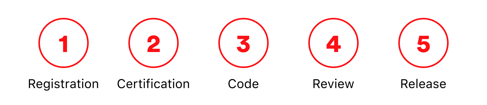
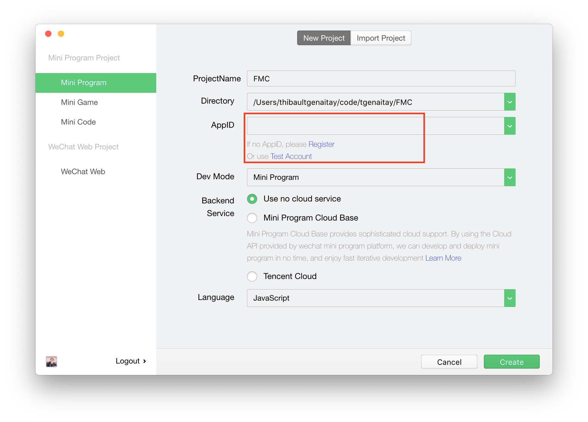

# WXMP Frontend: Part 1 - Lecture Source

WeChat’s easier-to-use alternative to stand-alone apps, which allows you to avoid the "tedious process” of downloading and managing apps on a smartphone.

---

## WeChat - Notable Stats


---

## WeChat - Industry Use


---

## WeChat - Technical Overview


---

## WeChat - Registration Process



---

## WeChat - MP Documentation

[Your new best friend, bookmark it!](https://developers.weixin.qq.com/miniprogram/dev/index.html)

---


---

### Agenda

We will be building our first WeChat Mini Program over the course of this week

**["F*** My Code"](https://www.fmylife.com/)**

---

[F**k My Code Preview](https://info.lewagon.com/hubfs/china/f-my-code.mov)

[https://info.lewagon.com/hubfs/china/f-my-code.mov](https://info.lewagon.com/hubfs/china/f-my-code.mov)

---

### Pretty Cool! Let's Get Started

---

We'll use WeChat's developer tools moving forward.

If you haven't already, [download the stable build now](https://developers.weixin.qq.com/miniprogram/dev/devtools/download.html)

---



---

### WeChat - Setting up a New Project

1. Choose `New Project`

2. Select your preferred `Directory`, this is where your WXMP will be built

3. Choose `Test Account` for your AppID. This will generate a random appID that you can use to develop, but not publish.

4. Choose `Use no cloud service`

5. Language is `JavaScript`!

6. `Create`

---


---

### Quick tour

Let's check out the `Simulator`, `Code Editor`, `Debugging Tools`, and some `settings`.

---

### WXMP Code Structure 🤔

There are 4 file types in a WeChat Mini Program:

- `.wxml` same as HTML
- `.wxss` same as CSS
- `.js` logic
- `.json` configuration

### Your app is ruled by the following files

- `app.js` Mini Program functions
- `app.json` Mini Program configuration
- `app.wxss` Global CSS stylesheet

---

### JSON files for configuration

- Customize your app (Eg: app/page title, navigation bar color)
- Setup tabs
- Setup components

[See all options here](https://developers.weixin.qq.com/miniprogram/dev/framework/config.html)

---

### Let's get rid of some unecessary code

You'll see that you currently have 2 pages in your `app.json`: `index` and `logs`.

```js
{
  "pages":[
    "pages/index/index",
    "pages/logs/logs"
  ],
  "window":{
    "backgroundTextStyle":"light",
    "navigationBarBackgroundColor": "#fff",
    "navigationBarTitleText": "Weixin",
    "navigationBarTextStyle":"black"
  },
  "style": "v2",
  "sitemapLocation": "sitemap.json"
}
```

---

Looking deeper at `index.js` we can see that Tencent has provided us with a lot of code as an example of how their framework works.

```js
//index.js
//获取应用实例
const app = getApp()

Page({
  data: {
    motto: 'Hello World',
    userInfo: {},
    hasUserInfo: false,
    canIUse: wx.canIUse('button.open-type.getUserInfo')
  },
  //事件处理函数
  bindViewTap: function() {
    wx.navigateTo({
      url: '../logs/logs'
    })
  },
  onLoad: function () {
    if (app.globalData.userInfo) {
      this.setData({
        userInfo: app.globalData.userInfo,
        hasUserInfo: true
      })
    } else if (this.data.canIUse){
      // 由于 getUserInfo 是网络请求，可能会在 Page.onLoad 之后才返回
      // 所以此处加入 callback 以防止这种情况
      app.userInfoReadyCallback = res => {
        this.setData({
          userInfo: res.userInfo,
          hasUserInfo: true
        })
      }
    } else {
      // 在没有 open-type=getUserInfo 版本的兼容处理
      wx.getUserInfo({
        success: res => {
          app.globalData.userInfo = res.userInfo
          this.setData({
            userInfo: res.userInfo,
            hasUserInfo: true
          })
        }
      })
    }
  },
  getUserInfo: function(e) {
    console.log(e)
    app.globalData.userInfo = e.detail.userInfo
    this.setData({
      userInfo: e.detail.userInfo,
      hasUserInfo: true
    })
  }
})
```

---

Let's **delete** all of it! 🤪

---

We want to start our WeChat Mini Program from a blank slate, so let's start removing some of this code.

---

### Code Removal - Step 1

Let's remove the `logs` page from our WeChat Mini Program. To do this, we go to our `app.json` file and remove the corresponding array item in `"pages"`

```js
 "pages":[
    "pages/index/index",
    "pages/logs/logs"
],
```

```js
 "pages":[
    "pages/index/index"
],
```

Don't forget to also delete the `logs` folder in your `pages` directory. This is the folder that stores all your files, remember?

---

### Code Removal - Step 2 WXML

Next, let's remove the code that's currently in our `index.wxml`, `index.js`, and `index.css`. 

```html
<!--index.wxml-->

<view class="container">
  <view class="userinfo">
    <button wx:if="{{!hasUserInfo && canIUse}}" open-type="getUserInfo" bindgetuserinfo="getUserInfo"> 获取头像昵称 </button>
    <block wx:else>
      <image bindtap="bindViewTap" class="userinfo-avatar" src="{{userInfo.avatarUrl}}" mode="cover"></image>
      <text class="userinfo-nickname">{{userInfo.nickName}}</text>
    </block>
  </view>
  <view class="usermotto">
    <text class="user-motto">{{motto}}</text>
  </view>
</view>
```

---

### Code Removal - Step 2 WXML (2)

```html
<!--index.wxml-->

<text>Hello World!<text>
```

---

### Code Removal - Step 2 WXSS

```css
/**index.wxss**/

.userinfo {
  display: flex;
  flex-direction: column;
  align-items: center;
}

.userinfo-avatar {
  width: 128rpx;
  height: 128rpx;
  margin: 20rpx;
  border-radius: 50%;
}

.userinfo-nickname {
  color: #aaa;
}

.usermotto {
  margin-top: 200px;
}
```

---

### Code Removal - Step 2 WXSS (2)

```css
/**index.wxss**/
```

---

### Code Removal - Step 3 JS

```js
//index.js
//获取应用实例
const app = getApp()

Page({
  data: {
    motto: 'Hello World',
    userInfo: {},
    hasUserInfo: false,
    canIUse: wx.canIUse('button.open-type.getUserInfo')
  },
  //事件处理函数
  bindViewTap: function() {
    wx.navigateTo({
      url: '../logs/logs'
    })
  },
  onLoad: function () {
    if (app.globalData.userInfo) {
      this.setData({
        userInfo: app.globalData.userInfo,
        hasUserInfo: true
      })
    } else if (this.data.canIUse){
      // 由于 getUserInfo 是网络请求，可能会在 Page.onLoad 之后才返回
      // 所以此处加入 callback 以防止这种情况
      app.userInfoReadyCallback = res => {
        this.setData({
          userInfo: res.userInfo,
          hasUserInfo: true
        })
      }
    } else {
      // 在没有 open-type=getUserInfo 版本的兼容处理
      wx.getUserInfo({
        success: res => {
          app.globalData.userInfo = res.userInfo
          this.setData({
            userInfo: res.userInfo,
            hasUserInfo: true
          })
        }
      })
    }
  },
  getUserInfo: function(e) {
    console.log(e)
    app.globalData.userInfo = e.detail.userInfo
    this.setData({
      userInfo: e.detail.userInfo,
      hasUserInfo: true
    })
  }
})
```

---

### Code Removal - Step 3 JS (2)

```js
// index.js

Page({})
```

---

Great! Now you're ready to start drawing on a blank canvas.

---

### WXML syntax (same same but different)

Before diving in, let's go over some basic differences between HTML & WXML.


---

### Livecode 1: Building our Landing Page

Let's dive into building our landing page! This will be the first page users see when they enter the Mini Program, so it's got to look good. 

---

### index.wxml

Let's start by adding some content to our `wxml`

1. Add a [header](https://developers.weixin.qq.com/miniprogram/en/dev/component/view.html)
2. Add a [subHeader](https://developers.weixin.qq.com/miniprogram/en/dev/component/view.html)
3. Add a [button](https://developers.weixin.qq.com/miniprogram/en/dev/component/button.html)
4. Add a background [image](https://developers.weixin.qq.com/miniprogram/en/dev/component/image.html)

Remember to use the [WeChat Developer Docs](https://developers.weixin.qq.com/miniprogram/en/dev/component/) as a reference when you code.

---

### index.wxml (2)

By the end, you should have something that looks like this...

```xml
<!-- index.wxml -->

<view class="background">
    <view class="header">F**k my Code</view>
    <view class="subheader">A unique platform for students and instructors to complain about their code. 🤪</view>
    <button type="primary">Submit a Story</button>
</view>

```

---

### index.wxss

```css
/* index.wxss */

.background {
  background: url(https://info.lewagon.com/hubfs/china/f-my-code-banner.png);
  background-size: cover;
  height: 100vh;
  width: 100vw;
}

.header {
  font-size: 80rpx;
  color: white;
  text-align: center;
  font-weight: 700;
  padding-top: 240rpx;
}

.subheader {
  font-size: 40rpx;
  color: white;
  text-align: center;
  margin-top: 120rpx;
}

button {
  margin-top: 480rpx;
}
```

---

### Livecode 2: Building our Stories Page

Alright! Now that we have our landing page built, let's move onto our stories page. 

---

### Step 1: Create a new page

New pages are easy to make! Just go to `app.json` and add another item to the `pages` array.

```js
"pages":[
    "pages/index/index"
]
```

```js
"pages":[
    "pages/index/index",
    "pages/stories/stories"
]
```

---

You'll notice that after you re-compile the Mini Program, a new folder called `stories` will appear in the pages directory.

---

### Step 2: Navigate to our new page

You'll also notice that our "Submit a Story" button on `index.wxml` doesn't navigate to the `stories` page like we want. Let's fix that.

---

### index.js

Let's add a new function to our `index.js`

However, you'll notice the syntax is not like normal javascript.

---

Our index.js is dominated by a `Page Object`, everything within it is a `key/value` pair.

We'll need to add our function as if it were a `key/value` pair like below.

```js
// index.js

Page({

  navigateToStories: function () {
    wx.navigateTo({
      url: '/pages/stories/stories'
    })
  }

})
```

---

Next, we'll need to add an `eventListener` to our `WXML`. Though, again it's not exactly like normal `HTML & JS`.

Instead, we'll have to add a `bindtap` to the element we'd like to listen to.

---

This bindtap takes the value of the function we're trying to call. Only functions that are available in the local `.js` file can be used. 

```xml
<!-- index.wxml -->

<button type="primary" bindtap="navigateToStories">Submit a Story</button>
```

---

### Step 3: Building our Stories Page

Next step is to build our `Stories` page.

We'll start by hard coding a card in the `wxml` and styling it in the `wxss`.

**Tip: You can customize the startup page with a new compilation mode.**

---

**Not challenging enough?** It was just the beginning...

Much more to come in the next few days and weeks.
