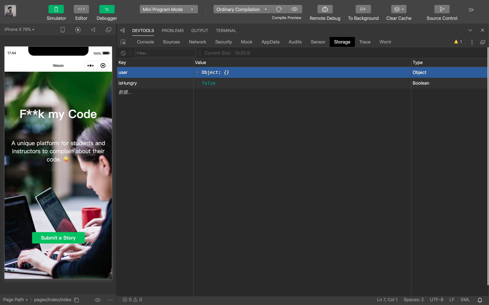

# WXMP Frontend: Part 2 - Lecture Source

---

## Let's Make our Pages Alive

Today we'll be covering the following:

- Life cycle
- Data stores
- Data binding
- Logic control

---

### WXMP - JS Structure

- 1 main function: **Page({...})** or **App({...})**
- 1 data store: **data: {key: value}** or **globalData: {key: value}**
- Lifecycle functions: **onLoad**, **onLaunch**,...
- Custom functions

---

### WXMP - JS Page Lifecycle

We can **console.log** the name of each function to see in which order they are called. Try with `onLoad`, `onShow`, `onReady` ... see the difference.

---

Life cycle functions = trigger code at specific time in the application


---

### Lifecycle Example

Remember how to create functions in our page's javascript?

We can create these functions and trigger them in our lifecycle functions. 

```js
//index.js

Page({
  
  testFunction: function() {
    console.log('test');
  },

  onReady: function() {
    this.testFunction()
  }

})
```

To access the function, do not forget the syntax: `this.functionName()`

---

#### Quick Detour

What is `this`? 🤯

---

It's a Javascript keyword used to reference the object to which a key/value pair belongs to.

---

So in our example

```js
  
  onReady: function() {
    this.testFunction()
  }

```

`this` references the `Page Object`

```js

Page({})

```

---

It's similar to how we were using `dot notation` during JS week to read values in our JS objects.

```js

let person = {name: 'Pavel', age: 18, hungry: false};

console.log(person.name) // 'Pavel'

```

---

Let's add another example that might help...

```js

let person = {
  name: 'Pavel',
  
  birthYear: 1991,
  
  getAge: function () {
    return 2020 - this.birthYear
  }
};

console.log(person.getAge()) // 29

```

Just as in our WeChat Mini Program, the `this` here is referencing the `person` object.

---

### Detour concluded, now back to LifeCycle Functions 😉

---

```js

Page({

  testFunction: function () {
    console.log('Lifecycles are great!')
  },

  onLoad: function () {
    // This will happen first
  },

  onReady: function () {
    // This will happen second
  },

  onShow: function () {
    // This happens last
  }
})

```

---

Last notes on Lifecycle Functions...

- They are critical for calling APIs when rendering dynamic data on your page

- They're like events that are triggered when your page loads

- You'll get a better sense of which to use when with practice

---

### WXMP - Data Storage

1. **local data**: lives only inside a page
2. **global data**: shared across the whole app
3. **cache**: persists in your user's phone
4. **server**: through APIs!

---

### WXMP - Local Data

We can store data inside a JS file and access it in WXML. This is called **data binding**.

```js
//index.js

Page({

  data: {
    title: 'Hello World',
    subTitle: 'This is my first app!'
  }

})
```

```xml
<!-- index.wxml -->
<view>{{title}}</view>
<view>{{subTitle}}</view>
```

WXML allows much more than HTML: it's a **"templating language"**!

---

### WXMP - Local Data: setData({ })

We can use `setData({})` in our `JS` to set and update our local data.

```js
//index.js

Page({

  data: {
    title: 'Hello World',
    subTitle: 'This is my first app!'
  },

  changeTitle: function() {

    this.setData({
        title: 'Hello Class'
    })
  },

  onLoad: function() {
      this.changeTitle();
  }
})
```

---

### WXMP - Local Data: this.data

We can also access local data inside our JS code

```js
//index.js

Page({
  
  data: {
    title: 'Hello World',
    subTitle: 'This is my first app!'
  },

  onLoad: function() {
    console.log(this.data.title); // 'Hello World'
    console.log(this.data.subTitle); // 'This is my first app!'
  }
})
```

---

### WXML is an advanced view layer

We can use special attributes on `<view>`

1. **wx:for** control attribute: let's us render a list of elements
2. **wx:if** conditional attribute: let's us conditionally render elements

These will be some of the most powerful tools you'll use throughout this course.

---

### WXMP - Looping with wx:for

Example 1: Simple version (`item` is default)

```xml
<!-- index.wxml -->
<view wx:for="{{['Restaurant 1','Restaurant 2','Restaurant 3']}}">
    <view>{{item}}</view>
</view>
```

Example 2: Full version with custom index and item

```xml
<!-- index.wxml -->
<view 
wx:for="{{['Restaurant 1','Restaurant 2','Restaurant 3']}}"
wx:for-index="index"
wx:for-item="restaurant">
  <view>{{index}}: {{restaurant}}</view>
</view>
```

---

We can also take the data directly from the page’s data!

```js
//index.js
Page({
  data: {
    people:
    [
        { name: "Alex", nationality: "USA" },
        { name: "Pavel", nationality: "Lithuania" },
        { name: "Audrey", nationality: "Canadian" },
        { name: "Renee", nationality: "Chinese" }
    ]
  },
})
```

```xml
<!-- index.wxml -->
<view wx:for="{{people}}" wx:for-item="person">
  <view>
    {{person.name}} | {{person.nationality}}
  </view>
</view>
```

---

### WXMP - Conditional Rendering with wx:if

We can use **wx:if** to hide or show card components

```xml
<!-- index.wxml -->
<view wx:if="{{true}}">This will show</view>
<view wx:if="{{false}}">This will NOT show</view>
```

---

### WXMP - Conditional Rendering with wx:if (2)

The logic can be directly in the WXML file

```xml
<!-- index.wxml -->
<view wx:if="{{true}}">F**k My Code 1</view>
<view wx:if="{{1 === 1}}">F**k My Code 2</view>
<view wx:if="{{1 === 2}}">F**k My Code 3</view>
```

---

### WXMP - Conditional Rendering with wx:if (3)

We can also take statements directly from the page's data object

```js
//index.js
Page({
  data: {
    trueStatement: true,
    falseStatement: false
  }
})
```

```xml
<!-- index.wxml -->
<view wx:if="{{trueStatement}}">F**k My Code 1</view>
<view wx:if="{{falseStatement}}">F**k My Code 2</view>
```

---

### Livecode 1: Improve the view (add multiple cards) 💪

We want to show more than one story in the **stories page** without repeating the same WXML markup.

---

### WeChat's Native [tabBar](https://developers.weixin.qq.com/miniprogram/en/dev/reference/configuration/app.html#tabbar)

Allows users to easily navigate between tabbar pages

---

The most basic version is a few lines of text which act as links to each page

```js
// app.json

{
  "tabBar": {
    "list": [
      {
        "pagePath": "pages/index/index",
        "text": "Landing",
      },
      {
        "pagePath": "pages/stories/stories",
        "text": "Stories",
      }
    ]
  }
}
```

---

But of course, WeChat offers more customizability...


---

### Global Storage

WeChat's built-in caching system.

---

### Data Persistence

Caching allows for data to persist over many user sessions. This means that if the user closes your app, you can still retain some data for their next session.

---

Your cache is visualized by a simple database in your `DEVTOOLS`



---

There are specific WeChat methods to read and write data to the global storage.

[wx.setStorageSync](https://developers.weixin.qq.com/miniprogram/en/dev/api/storage/wx.setStorageSync.html)

```js
wx.setStorageSync(key: "key", data: "value");
```

[wx.getStorageSync](https://developers.weixin.qq.com/miniprogram/en/dev/api/storage/wx.getStorageSync.html)

```js
wx.getStorageSync('key'); // will return that key's value
```

---

### Livecode 2: Add a Post Page

Now that we have our story cards, let's add way for users to post!

---

### Step by Step: Part 1

1. Add a new `post` page in the app.json

2. Add this new `post` page to our tabBar

3. Add a [form](https://developers.weixin.qq.com/miniprogram/en/dev/component/) component to the `post` page so users can input their story

4. Add a `bindsubmit` to the form which references a `submitForm` function in your `.js` file

---

### Step by Step: Part 2

5. Add the `submitForm` function in your `stories.js`

6. Create a `stories` array in your Global Storage
    > Hint: You can do this manually in your dev tools. Just create a new key value pair with the value being an empty array.

7. Save the story as an object in your Global Storage.

8. Make sure your stories page is referencing your Global Storage data. You can do so by retrieving the data with `wx.getStorageSync()` on the `onShow()` lifecycle function.

---

Phew, that was a lot of work! 😅

---

**Now Your Turn!**
