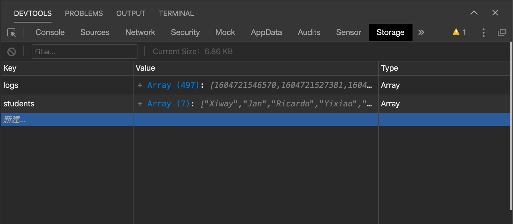

## Background & Objectives

In this challenge, you will learn to how **use the cache** to send data from page to page.

You will also discover new components such as a **form** and a **tab bar** for navigation!

## Specs

### 1. From Local to Cache

Each Page (e.g `stories.js`) has its own separate *local* data to render in its view.

Fortunately, the whole App shares a *local cache* storage we can access everywhere. That's where you want to save anything to re-use. Example: your user information!

Although the [documentation here](https://developers.weixin.qq.com/miniprogram/en/dev/framework/app-service/app.html) says very little about it, note that WXML can't directly access the *cache* data storage. You'll have to go through the *local* data first!

#### Setting Up Your Cache

1. Open your `Debugger` and choose the `storage` tab. You should see a simple database with several keys and their relative values.

    

2. Add a key called `stories`.

3. Change the `type` to `Array` on the right.

4. Add a couple story objects to the array in `Value`.

    Remember that each item in this array should be a `story` objects with two keys: `author` & `content`.

#### Getting your Cache Data in stories.js

1. Remove your stories data from your local page data and replace it with an `undefined` value.

2. On `onShow`, get your `stories` data from cache with the `wx.getStorageSync` method.

3. Set the returned `stories` value to your local page data.

```js
//stories.js

Page({

    data: {
        stories: undefined
    },

    onShow: function () {
        let stories = wx.getStorageSync('stories');
        this.setData({stories: stories})
    }
})
```

**Check the view again.**

If all goes well, your **WX:FOR** loop still renders all your stories!

### 2. Let's post new stories

You want to **add one new route** on your app to let users POST a new FMC story.

- Edit your `app.json` file to add one new "post" page.
- Still in `app.json`, create a new 'tabBar'! We'll use it to navigate between our 2 main tabs: **stories** on the left, **post** on the right. Check the [settings documentation](https://developers.weixin.qq.com/miniprogram/en/dev/framework/config.html) to implement the tabBar object correctly.

**Test it now!** In your simulator, now you should be able to switch tabs back & forth. Take the time to [set a nice icon](https://www.iconfont.cn/)?

**Let's design a nice form now** 🎨

- In your `post.wxml` view page, use the [form](https://developers.weixin.qq.com/miniprogram/en/dev/component/form.html) component and its **bindsubmit** attribute.
- We'll need two [inputs](https://developers.weixin.qq.com/miniprogram/en/dev/component/input.html) (name and content), and of course one button to submit the form!

Do you know how to **receive this form data** inside the logical layer `post.js`? it's via the `bindsubmit` of your form!

Create a function called **formSubmit**. This function receives an `event` argument with all your form data 😉

```js
Page({
  // ...
  formSubmit: function (event) {
    console.log(event.detail.value.name)
    console.log(event.detail.value.content)
  },
  //...
})
```

Go ahead and **implement the following functionality in formSubmit**:

- Get your input values from your form
- Format these values into a `story` object
- Get your `stories` array from your App's `cache`
- Push your new `story` object into this `stories` array
- Set your updated `stories` array to cache
- Redirect the user back to the 'stories' page with [`wx.switchTab`](https://developers.weixin.qq.com/miniprogram/en/dev/api/route/wx.switchTab.html) API

**Test and test again!** Use console.log at every step! 🤓