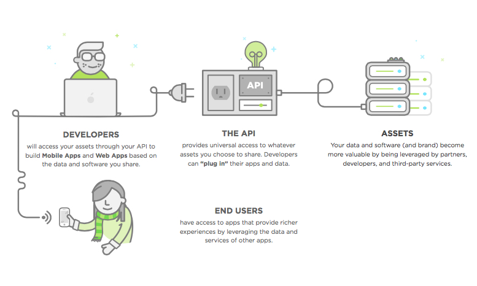
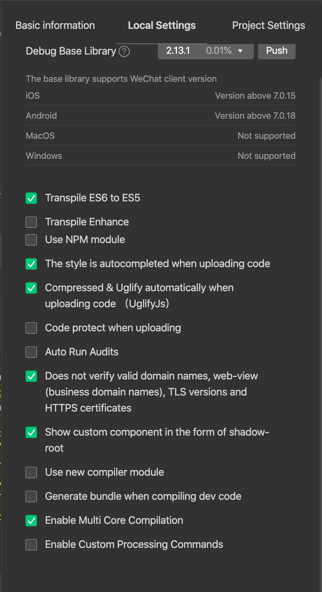

# Mini Programs 小程序 with API

API WITH DATA FOR WECHAT MPS

---

## What's an API



---

## APIs ALLOW YOU TO

- Provide data for client (e.g. an app: web, native, Wechat Mini Program)
- Provide service to customers (e.g. sms, payment): later course

---

### NO BIG DEAL

It's just a new set of **Endpoints**...

---

...which return **JSON** format for contents of cells

---

### THEN JSON => Mini Program

Mini Program makes **API Requests**...

---

…and uses **JSON** from API instead of static data (e.g globalData in app.js)

---

## JSON


---

## Our API for Today

[https://fml.shanghaiwogeng.com/api/v1/stories](https://fml.shanghaiwogeng.com/api/v1/stories)

Let's look at it in the browser...

---

## How to Interact with an API

```text
Purpose       Verb      URI Pattern

all stories   GET       /stories

create story  POST      /stories

one story     GET       /stories/:id

edit story    PUT       /stories/:id

delete story  DELETE    /stories/:id

```

---

## 5 STEPS OF USING API

1. Define the APIs URL

2. Attach request data (if necessary)

3. Send request and **wait** for response

4. Receive data from response

5. Handle the data

---

## Let's Get All Stories From Our API

---

### 1. Define the API URL

```js

let url = https://fml.shanghaiwogeng.com/api/v1/stories

```

---

### 2. Attach request data (if necessary)

Data can be sent with request as a JSON object

In general, for GET requests, we won't need to attach any data.

---

### 3. Send request and **wait** for response

---

```js
let url = "https://fml.shanghaiwogeng.com/api/v1/stories"

wx.request({
  url: url,
  success: (res) => {
    console.log(res)
  }
})
```

Our `success` function will automatically run once our request has returned successfully.

---

#### The Arrow Function

You'll notice we're using an `arrow function` for our `success` function. This is so we can continue using the original `this` keyword to reference our Page object.

---

Not Working? -> Need WeChat permission

Wechat IDE Menu: Settings -> Project Settings:



---

### 5. Hanlde the Response Data

Use `console.log()` to check your response data. Dig through this to understand how your JSON response is structured and how to get the data you want.

---

### 6. Handle the data

```js

onShow: function () {
  let url = "https://fml.shanghaiwogeng.com/api/v1/stories"

  wx.request({
    url: url,
    success: (res) => {
      let apiStories = res.data
      this.setData({stories: apiStories})
    }
  })
}
```

---

#### Why put this in onShow

Remember that onLoad is only triggered when the page loads. Because our page is a Tabbar page, it is always loaded for ease of navigation.

But putting this in onShow, it allows us to trigger this request whenever the user navigates to this tabbar page.

---

## Let's POST data to our API

---

### 1. Define the APIs URL

```js

let url = https://fml.shanghaiwogeng.com/api/v1/stories

```

It's the same URL! But, we'll use a different `method` this time.

---

```js
let url = "https://fml.shanghaiwogeng.com/api/v1/stories"

wx.request({
  url: url,
  method: 'POST',
  success: (res) => {
    console.log(res)
  }
})
```

---

### 2. Attach request data

We need to send the API *something*. Let's provide it the story our user just wrote.

---

```js
// post.js

Page({
  
  formSubmit: function (event) {

    let name = event.detail.value.name;
    let text = event.detail.value.text;
    let story = {name: name, text: text};

    this.sendData(story);
  },

  sendData: function (story) {

    let url = "https://fml.shanghaiwogeng.com/api/v1/stories"

    wx.request({
      url: url,
      method: 'POST',
      data: story,
      success: (res) => {
        console.log(res)
      }
    });

  }
```

---

### 4. Send request and **wait** for response

Just as we did before...

---

### 5. Receive data from response

Check the `res` to make sure the request was successful. Once received, re-route the user back to the stories page to resend a request to the API and see your updated stories page.

---

## Mini Program functions with API

Read more about how Mini Programs can work with APIs

- [Wechat Doc on Network Requests (English)](http://open.wechat.com/cgi-bin/newreadtemplate?t=overseas_open/docs/mini-programs/development/api/network-request)

---

## API resources

What APIs can I use? Where to find them?

---

### Global

- rapidapi.com

- programmableweb.com

- apiforthat.com

---

### China

- ai.baidu.com/ai-doc

- shenjian.io

- juhe.cn

---

## B2D - API Economy

Revenue through api’s

50% => Salesforce.com
60% => eBay.com
90% => Expedia.com

---

## API Strategy

- APIs are key to prototyping - great for entrepreneurs

- Focus on unique functionalities for business
delivering initial product quickly & less expensively

- APIs are vital to digital transformation

- Use infrastructure so you don't build from scratch or reinvent the wheel

---

## HAPPY API-ING
