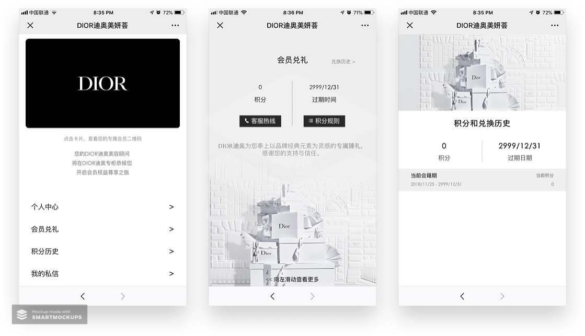
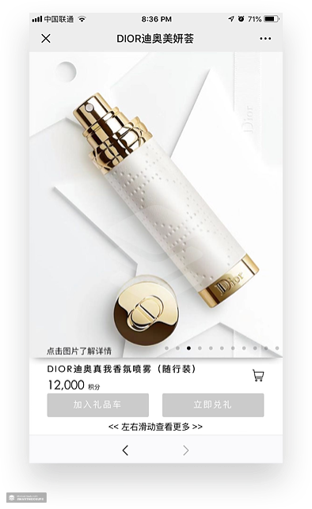

# WeChat Login

Your goal is to add login and membership to the eCommerce app built for last weekend's challenge (Waimai app)


## Step 1 - Setup the BaaS

**1. Configure your BaaS** on Minapp.com. 

An account might have to be verified with a real WeChat entity (personal or business) to allow WeChat Login to work.


From left menu: Dev > Settings, scroll down to "Login method" and enable "微信小程序登陆" 


## Step 2 - Update your Mini Program

Use the BaaS [SDK login](https://doc.minapp.com/js-sdk/wechat/signin-signout.html):

Add a login button to your `user.wxml` page. You decide where to put it so it looks appropriate:

```html
<button open-type="getUserInfo" bindgetuserinfo="userInfoHandler">微信 Login</button>
```

**Note:** do not forget `open-type="getUserInfo"`. This magically tells WeChat to ask users for their info. 


Now add the binded user data handling function `userInfoHandler` in `user.js`:

```js
//user.js, after onLoad()
userInfoHandler(data) {
  wx.BaaS.auth.loginWithWechat(data).then(user => {
    console.log(user);
    // user 包含用户完整信息，详见下方描述
  }, err => {
    // **err 有两种情况**：用户拒绝授权，HError 对象上会包含基本用户信息：id、openid、unionid；其他类型的错误，如网络断开、请求超时等，将返回 HError 对象（详情见下方注解）
  })
},
```


You can add a relaunch at the users page when successful, and log the error if failed. Consult previous login code if you need.

Before you click the login button, log in as a user with password (without WeChat login). Go to the Network tab of the console - you'll find the request that your page made. It looks something like this. Note it doesn't have much data.


After you click login, a POST request is made to the BaaS authentication endpoint.


And it returns user data from your WeChat account mixed in with your existing user data  (and any customized form info like `photo`). Your accounts are combined.

The POST is called every time the button is clicked as WeChat info is retrieved and saved to the BaaS. 

But if you want to retrieve user info from the BaaS after the login, then just a GET request to the BaaS is ok. You've done this with: `wx.BaaS.auth.getCurrentUser()`:


Remember this is saved to the `page.data.currentUser` through your login code ` page.setData({ currentUser: user })`. 

See if you can show the WeChat avatar, if the user-defined photo isn't present. Hint: you can use conditions like `||` , `&&`, or even the ternary `condition ? true : false`  in the view logic:

Solution:

```xml
<image class="avatar" src="{{currentUser.photo || currentUser.avatar}}" />
```


You might remember we don't popup the login page when the user first opens the app. This is why:

⚠️From 2019, WeChat MP's are not allowed to have a `open-type="getUserInfo"` button **on the landing page**. 

> **Solution:** The `getUserInfo` button should not be on the landing page of the app. The philosophy of Tencent is, that a user should be able to enter the app without giving you their WeChat profile info. This allows users to see value before deciding whether to allow you access to their info. 


## Step 3 - Test it

Refresh your app and login out and login again (you can clear previous login permission, and user data storage in Data Settings) and look at the OpenID in the `console`:


Make sure the login form with the password and customized fields works still. 

And you're done implementing WeChat Login! Try logging out and then in again, with and without WeChat. Everything should work the same as before. 


# Dior Membership: User Journey







Select gifts for services to exchange points for! 


## Optional: Storing login user centrally

**1. Getting the code and exchanging everytime can be too slow**

**Solution**: Store the user ID in the phone storage, and check for user ID before using `wx.login`


## Optional: Combine User Logins

Sometimes the user can deny request to give his WeChat info. You can still merge the user who logged in with password to his WeChat account, but **not** get his Wechat user info like nickname or avatar. Then you can still  use WeChat to log him in and ask him from your app to provide more user info. You can also track who he is across WeChat products like official accounts for analytics. 

Use the [SDK combined login](https://doc.minapp.com/js-sdk/wechat/signin-signout.html#关联微信小程序):

1. The same form submit `button` is used to send customized user info. But adding a `user.linkWechat()` allows these info to be merged.

```js
// in bindLogin, in wx.BaaS.auth.register().catch(err => {
wx.BaaS.auth.login({ username: username, password: password }).then(user => {
        // user 为 currentUser 对象
        console.log(user)
        page.setData({ currentUser: user })

        return user.linkWechat()
      }).then(res => {
        // success
        // 用户可以通过微信授权登录同一个账户了
      })
}
```

This and other ways to combine logins from other mini program ecosystems and web and native apps can be done with the SDK in the documentation above. 


## Optional: Login with phone number

Add a Login with [Log In with phone button](https://developers.weixin.qq.com/miniprogram/dev/framework/open-ability/getPhoneNumber.html):

```html
<button open-type="getPhoneNumber" bindgetphonenumber="getPhoneNumber">Phone Login </button>
```


And then in the handler `getPhoneNumber` function, put the phone number into the login/singup form. Then when the user submits, [login with phone](https://doc.minapp.com/js-sdk/auth.html#通过手机号注册):

```js
wx.BaaS.auth.register({phone: phone, password: password}).then(user => {
  console.log(user)
  //store user data
})
```


You can also combine with [SMS phone verification](https://doc.minapp.com/js-sdk/sms.html):

```js
wx.BaaS.verifySmsCode({phone: '132888888', code: 123456}).then(res => {
    // success
    console.log(res.data) // { "status": "ok" }
}).catch(e => {
    // err
    console.log(e.code) // 错误状态码
})
```


