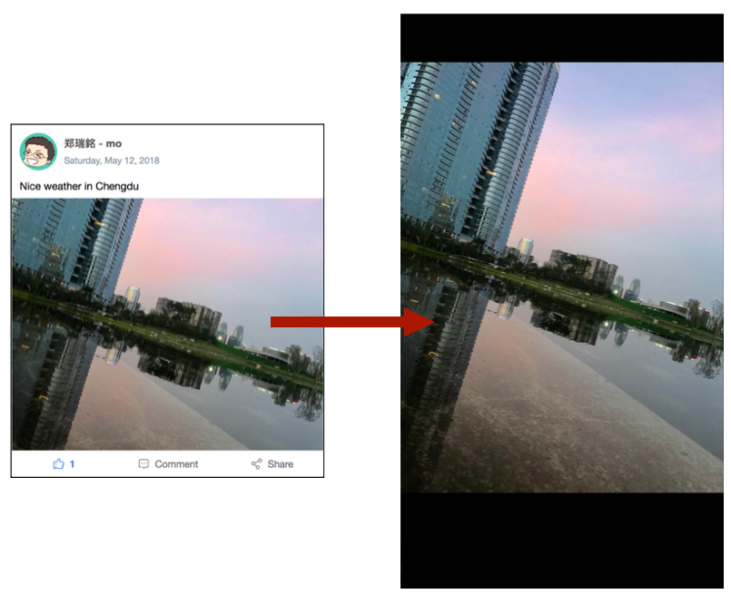

# Photo Uploading

## Take a picture or choose one from an album

Use [WeChat Image Upload](https://developers.weixin.qq.com/miniprogram/dev/api/media-picture.html#wxchooseimageobject) with the following settings:

- `count`: max 9 images 
- `sizeType`:  `original` or `compressed`
- `sourceType`:  `album` or `camera`

```javascript
// index.js
 takePhoto: function() {
    wx.chooseImage({
      count: 1,
      sizeType: ['original'],
      sourceType: ['album', 'camera'],
      success: function (res) {
        var tempFilePaths = res.tempFilePaths
        console.log(tempFilePaths)
      }
    })
  }
```


Then get the image from the successful upload, find `fileTempPaths` from the result `res`

```javascript
// console.log(tempFilePaths)
["http://tmp/wx6545a117799ef0b5.o6zAJs-Qx9fK6n67eUMn….fDk8Xlh5QYnOa097c96f52f8ed30f0970bc0d5bd4774.jpg"]
```


How do you see this image?

## Preview images



Use the [Image Preview](https://developers.weixin.qq.com/miniprogram/dev/api/media-picture.html#wxpreviewimageobject) with these settings:

- `current`: defines which image should show first
- `urls`: an array of image paths

```javascript
// index.js
 previewMyImage: function(files) {
    wx.previewImage({
      current: '',  // number of index or file path
      urls: files  // Array of temp files
    })
  }
```


## Store your images on Minapp BaaS

### Configure SDK  (optionally hide app secret)

Remember you need the Minapp SDK. That's imported in `app.json`:

```js
//app.json
"plugins": {
  "sdkPlugin": {
    "version": "2.7.0",
      "provider": "wxc6b86e382a1e3294"
  }
},
```

Then the SDK is setup in `app.js`

```js
//app.js
App({
  onLaunch: function () {
    //...
    wx.BaaS = requirePlugin('sdkPlugin')
    wx.BaaS.init('CXBycRIiDtxxxxxxxxx')
    //...
```

Here the value in `init()` is an app "secret."  It's the key to your backend. We don't always want to commit that to Git where **everyone can see it**. 

For added security (optional):

Save your app secret as a `AppKEY` to a separate js file, and add its name to your `.gitignore` file. Any file listed there will not be uploaded to github.

```javascript
// app.js
const AV = require('./utils/av-weapp-min.js')
const config = require('./key')

App({
  onLaunch: function () {
    //...
    wx.BaaS = requirePlugin('sdkPlugin')
    wx.BaaS.init(config.appKey)
    //...
```

```javascript
// key.js
module.exports = {
  appKey : 'CXBycRIiDtxxxxxxxxx'
}
```

in `.gitignore` (create it if you don't have it in your project root folder)
```
# .gitignore
key.js
```


### Upload files with SDK

To [upload to the SDK](https://doc.minapp.com/js-sdk/file/file.html#文件上传):

```js
wx.chooseImage({
  success: function(res) {
    let MyFile = new wx.BaaS.File()
    let fileParams = {filePath: res.tempFilePaths[0]}
    let metaData = {categoryName: 'SDK'}

    MyFile.upload(fileParams, metaData).then(res => {
      // 上传成功
      let data = res.data  // res.data 为 Object 类型
    }, err => {
      // HError 对象
    })
  }
})
```

`fileParams` contains the `path` to your image as explained in the first section. `metaData` contains any labels you want for file on the SDK. 

The saved file url is in `res.data`. Use this in your app and save it to your data!


To debug,  you can find a request to the BaaS at `upload/`  "Network" console, and a response in the call after.  


You can manage your file on the the BaaS dashboard under "File":


To have the file work in the real world (e.g. not just dev but production mode), you'll need to add the file server to the WeChat MP configuration!

## Whitelist the LeanCloud domain for your MP

1. **[Find the servers on the BaaS dashboard](https://cloud.minapp.com/dashboard/#/app/30749/settings/domain/)**: (Yours might be different than example below)


2. **Add `uploadFile` and `downloadFile` to the whitelist in WeChat Admin Dashboard:**

Under "开发" > "开发设置" and scroll to "服务器域名". 


Tip: all backend servers (where you or Minapp SDK makes requests) need to be configured in this panel. You can many servers configured and change them up to 5 times a month.


