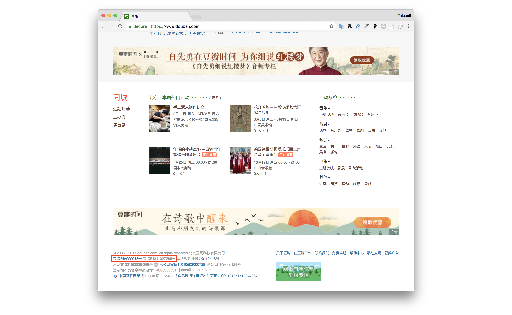
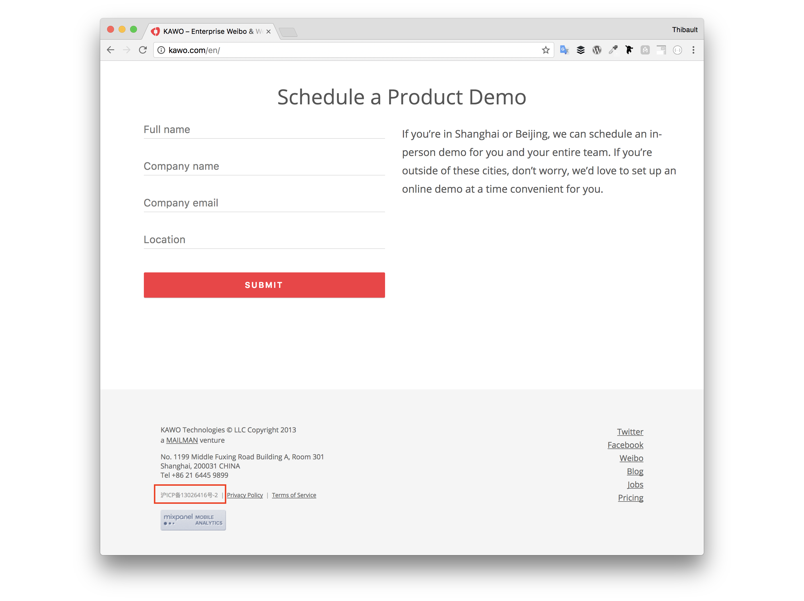
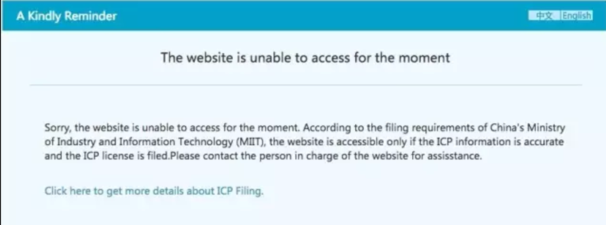
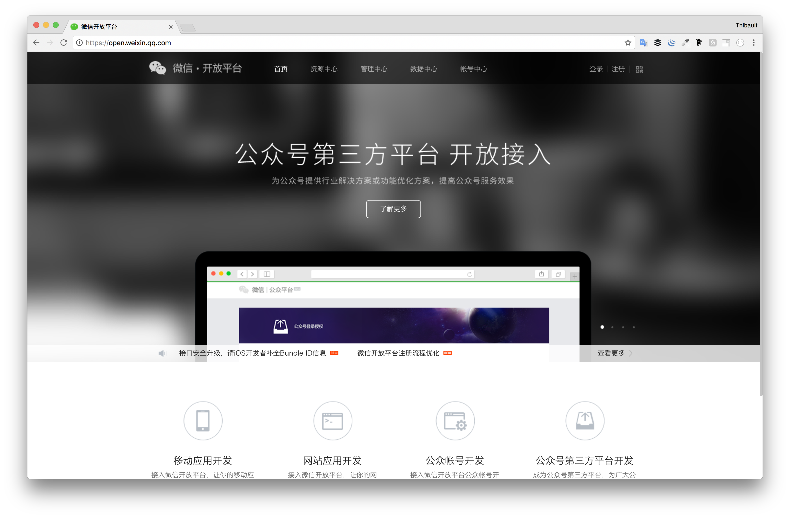
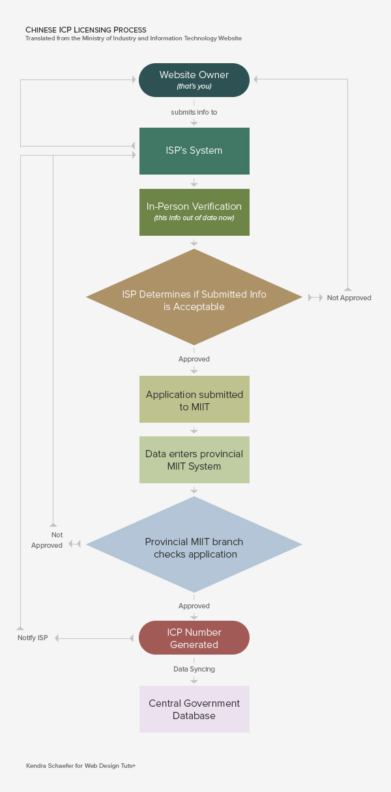
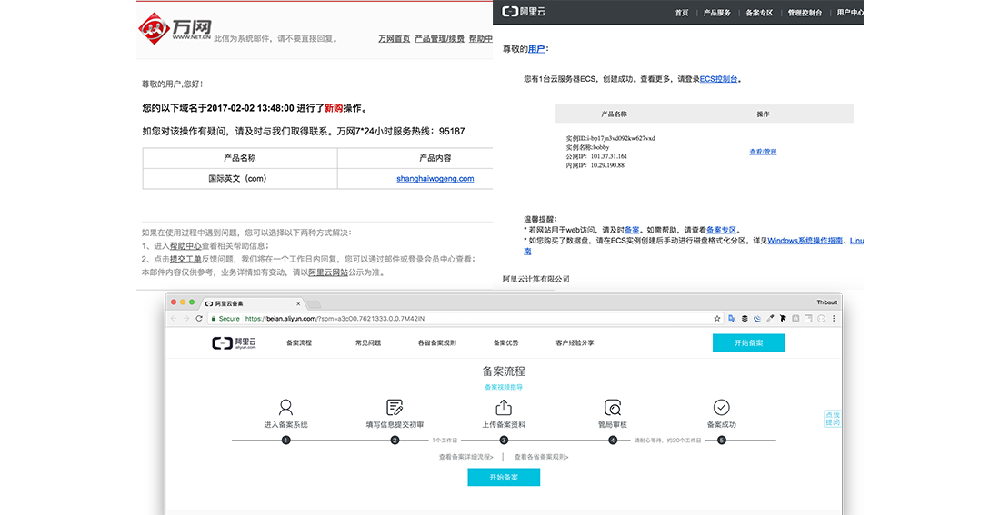
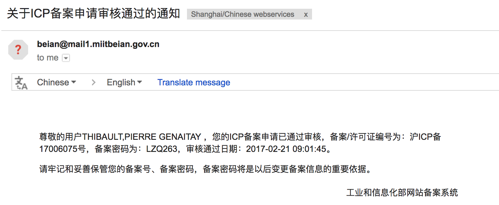

## ICP 备案 - WTF?

- 什么
- 为什么
- 如何

------

## 什么

“ICP 备案” 代表获取业务 ICP 注册号的过程，该编号允许您在 **中国大陆服务器**上托管您的网站。

- ICP 代表"互联网内容提供商"
- 备案(Bei An) 意为"注册/申请"。

## 我需要 ICP 备案吗?

### 是 #1

## 我需要 ICP 备案吗?

### 是 #2

------

## 谁?

工业和信息化部 ([MIIT](https://en.wikipedia.org/wiki/Ministry_of_Industry_and_Information_Technology))

------

## 如何?

**要求**

1. 您租用了中国大陆服务器。
2. 您拥有域名。
3. 您拥有中国公司营业执照。
4. 您填写所有申请表格 - 仅使用中文！

## 如何?

😕

## 如何?

### 😙 https://beian.aliyun.com/

## 如何?

## 如何?

- **ICP 许可证** 与在中国注册的 **特定 IP**和 **特定域名** 绑定
- 您必须在备案过程中提供服务器**IP和域名**

## 时间

- 😏 官方说明: 30 个工作日
- 😅 现实中: 3-4 天

## 费用!

- 自己操作: 免费!
- 通过代理操作: 约2千 到 1万 RMB

------

## 关键信息

- 依据法律, 网站在中国服务器上托管必须获得ICP备案。
- 没有 ICP 备案, 没有 支付宝/微信支付.
- 贵公司应该在中国注册

### 更多信息

[阅读该教程](https://webdesign.tutsplus.com/articles/chinese-icp-licensing-what-why-and-how-to-get-hosted-in-china--cms-23193) 🚀

